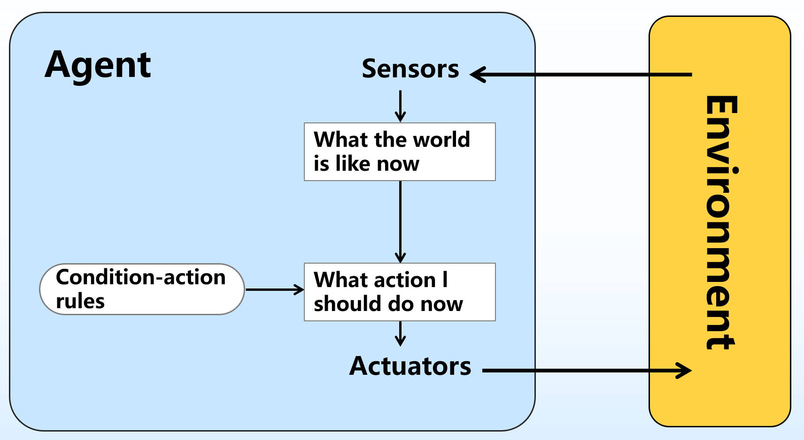
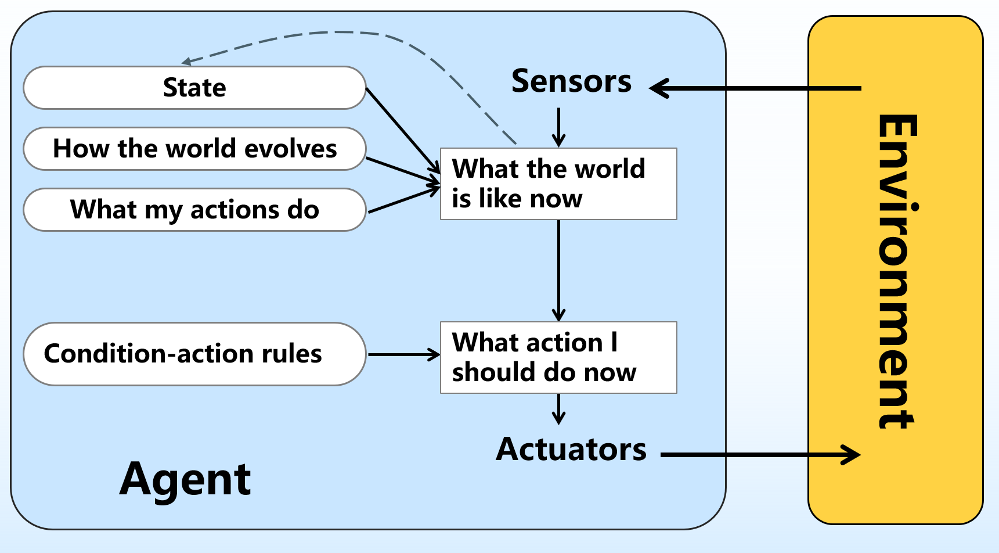
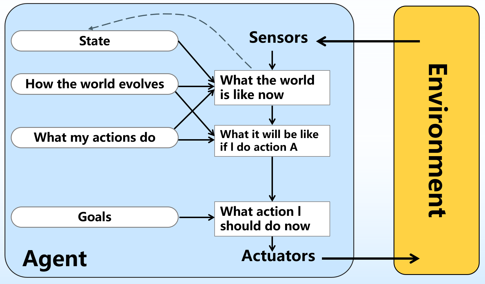
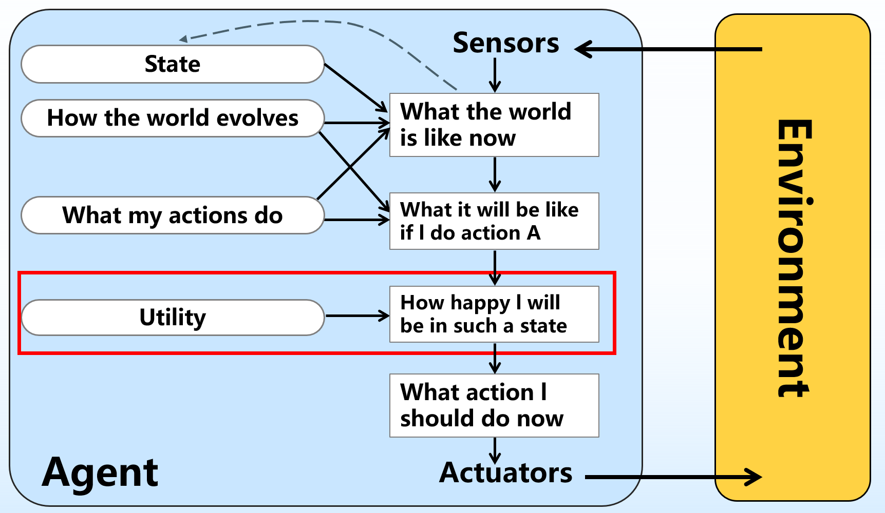
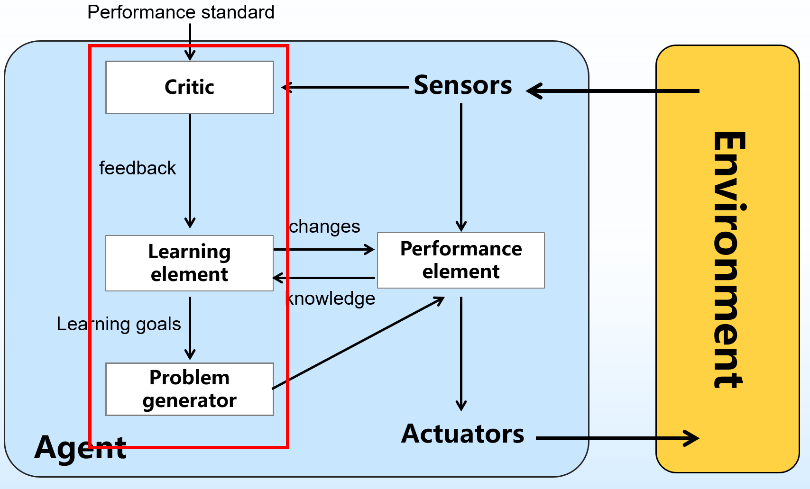

# Agent

## 1.基础概念

Agent：凡是能够跟环境交互的事物都可以称为 Agent

Agent 能通过传感器感知环境并通过执行器对所处环境产生影响

Agent 函数：描述 Agent 行为的抽象数学表示，从感知序列到行为的映射, 但并非每个 Agent 函数都可以准确地用程序/机器组合实现

Agent 程序：Agent 函数的具体实现，从函数到程序，理想到现实的失真，一个 Agent 函数可能对应多个 Agent 程序

理性 Agent：探索，学习，自主，根据已知。对每一个可能的感知序列，根据已知的感知序列提供的证据和Agent具有的先验知识，理性Agent应该选择能使其**性能度量最大化**的行动

## 2.环境

任务环境的规范描述：PEAS 描述：

* performance measure 性能评价指标
* environment 环境
* actuators 行为器
* sensors 感知器

## 3.Agent 的结构

### 3.1 简单反射 Agent

存在的问题：**无法处理动态的、随机的、延续的、部分可观察的任务环境**

### 3.2 基于模型的反射 Agent

部分可观察、动态的、片段式的

**更新当前环境状态**：

* 世界本身是如何变化的
* Agent 的动作将如何影响世界的变化
* 当前的感知如何

### 3.3 基于目标的 Agent

部分可观察、动态的、连续式的

* 主要用在搜索和规划问题中：Agent 需要一个目标来了解期望达到什么状况
* 随着达到目标所需要的动作数目的增多，问题越来越难求解

### 3.4 基于效益的 Agent

**部分可观察、动态的、连续式的**

### 3.5 学习 Agent

学习 Agent 的构成：

* 评判元件：探查环境状态的改变，给出正或负反馈
* 学习元件：根据评判元件的反馈对知识做出适当调整
* 性能元件：根据当前感知和学习元件提供的知识做出动作选择
* 问题生成元件：建议探索性实验