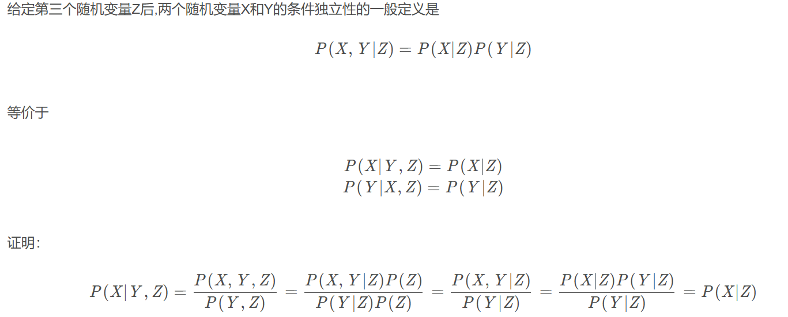

# 不确定性的量化

## 1.不确定性环境下的行动

逻辑Agent相信每个语句是正确的或错误的，或不做评价

概率Agent为每条语句赋予一个0到1之间的数值作为其信念度，从而解决限制问题

## 2.基本概率符号

* 逻辑断言：考虑的是要排除所有那些使断言不成立的世界，例如 Cavity ⇒ Toothache
* 概率断言：考虑的是各种可能世界的可能性有多大，例如 P(toothache|cavity) = 0.8
* 随机变量：随机实验的结果可以用随机变量描述，变量名以大写字母开头，每个随机变量有一个定义域，定义域由若干值组成，值总是小写
* 样本空间：样本空间的大小是可能世界的个数
* 事件：每个可能世界具有一个0到1之间的概率，且样本空间中的可能世界的**总概率**是1。随机实验可能结果的集合称为事件$P(\varphi)=\sum_{\omega\in\varphi}P(\omega)$
* 无条件概率/先验概率：不知道其他信息的情况下对命题的信念度
* 条件概率/后验概率：知道某些信息的情况下对命题的信念度
* 概率分布：随机变量每个可能取值的概率
* 条件概率分布：P(X|Y)给出每个可能的i、j组合下的值P(X=x~i~|Y=y~j~)
* 概率密度：一个连续随机变量X在值x处的概率密度P(X = x)或P(x) 
* 联合概率分布：两个及以上随机变量组成的随机向量的概率分布，用逗号代表联合概率，P(AB) = P(A,B) = P(A∩B),P(Weather, Cavity)= P(Weather|Cavity) P(Cavity)
* 乘法规则：$P(a|b)=\frac{P(a\wedge b)}{P(b)}\quad P(a\wedge b)=P(a|b)P(b)$
* 概率公理：P(¬a) = 1 − P(a)，P(a∨b) = P(a) + P(b) – P(a∧b)

## 3.使用完全联合分布进行推理

* 概率推理：根据已观察到的证据计算查询命题的后验概率
* 先验概率的计算：基于概率的求和；边缘化（求和消元）
* 归一化常数和边缘化
* 一个通用推理过程:$\mathbf{P}(X|\mathbf{e})=\alpha\:\mathbf{P}(X,\mathbf{e})=\alpha\sum_\mathbf{y}\mathbf{P}(X,\mathbf{e},\mathbf{y})$
* 即，任何条件概率都可以通过将完全联合概率分布中的某些项相加而计算得到

## 4.独立性

* 天气是独立于牙病问题的”这样的特性称为独立性，也称为边缘独立性或绝对独立性
* 两个命题a和b之间独立可以写作：
  P(a|b) = P(a)  or  P(b|a) = P(b)  or  P(a∧b) = P(a)P(b)    
  
  

## 5.贝叶斯规则及其应用

* 贝叶斯规则 $P(b|a)=\frac{P(a|b)P(b)}{P(a)}$, $P(a∧b)=P(a∣b)P(b)=P(b∣a)P(a)$
* 以某个背景证据e为条件的情况：$P(Y|X,e)=\frac{P(X|Y,e)P(Y|e)}{P(X|e)}$
* 通常，我们将未知因素cause造成的结果effect看作是证据，而确定那个未知因素cause。这种情况下，贝叶斯规则变成：$P(cause|effect)=\frac{P(effect|cause)P(cause)}{P(effect)}$

