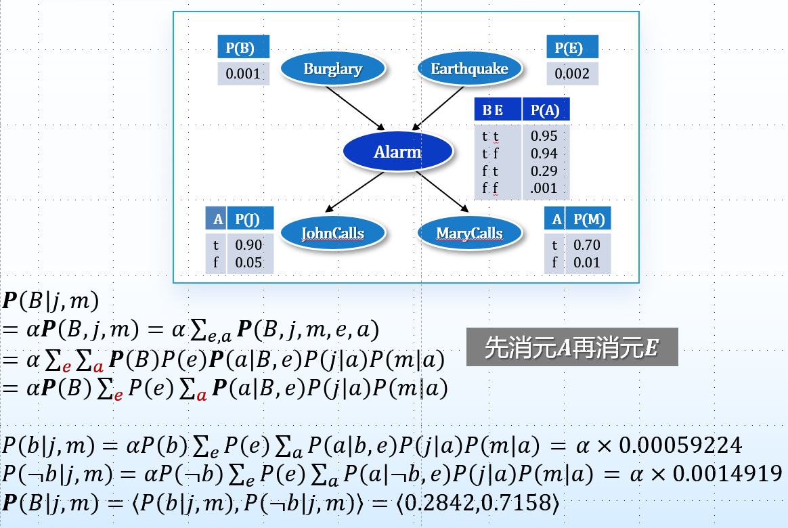

# 贝叶斯网络

## 1.定义

* 贝叶斯网络用来表示变量之间的依赖关系
* 每个结点对应一个随机变量，这个变量可以是离散的或者连续的
* 一组有向边或箭头连接结点对。如果有从结点 X 指向结点 Y 的箭头，则称 X 是 Y 的一个父结点。图中没有有向回路（因此被称为有向无环图，或简写为 DAG）
* 每个结点 Xi 有一个条件概率分布 P(Xi | Parents(Xi))，量化其父结点对该结点的影响
* 节点的排序：
  * 𝑃(𝑥_1, ⋯, 𝑥_𝑛) = 𝑃(𝑥_𝑛 |𝑥_(𝑛−1), ⋯, 𝑥_1 ) 𝑃(𝑥_(𝑛−1) |𝑥_(𝑛−2), ⋯, 𝑥_1 ) ⋯ 𝑃(𝑥_2 |𝑥_1 ) 𝑃(𝑥_1)
  * 或者 𝑃(𝑥_𝑛, ⋯, 𝑥_1) = 𝑃(𝑥_𝑛 |𝑥_(𝑛−1), ⋯, 𝑥_1 ) 𝑃(𝑥_(𝑛−1) |𝑥_(𝑛−2), ⋯, 𝑥_1 ) ⋯ 𝑃(𝑥_2 |𝑥_1 ) 𝑃(𝑥_1)
  * 若 𝑃𝑎𝑟𝑒𝑛𝑡𝑠(𝑋_𝑖 )⊆{𝑋_(𝑖−1), ⋯, 𝑋_1}，即序列 𝑋_1, ⋯, 𝑋_𝑛 中 𝑋_𝑖 的父节点都排在它的前面，序列 𝑋_𝑛, ⋯, 𝑋_1 中 𝑋_𝑖 的父节点都排在它的后面，即父节点是序号小的
* 贝叶斯网络的独立性：𝑷(𝑋_𝑖 | 𝑋_(𝑖−1), ⋯, 𝑋_1) = 𝑷(𝑋_𝑖 | 𝑃𝑎𝑟𝑒𝑛𝑡𝑠(𝑋_𝑖))
* 从而 $P(x_1,\ldots,x_n)=\prod_{i=1}^nP(x_i|parents(X_i))$

## 2.贝叶斯网络的精确推理

任何条件概率都可以通过将完全联合概率分布中的某些项相加而计算得到

$\boldsymbol{P}(X|\mathrm{e})=\alpha\boldsymbol{P}(X,\mathrm{e})=\alpha\sum_\text{y}{\boldsymbol{P}}(X,\mathrm{e},\mathrm{y})$

## 3.贝叶斯网络的近似推理

大规模多连通网络中的精确推理是不实际的。随机采样算法（也称为蒙特卡洛算法），能够给出一个问题的近似解，精度依赖于所生成的采样点的多少

* 直接采样：
  * 按照拓扑顺序依次对每个变量进行采样。变量值被采样的概率分布依赖于父结点已得到的赋值
* 马尔科夫链蒙特卡洛算法MCMC：
  * 在特定的当前状态，每个变量的取值都已确定，然后随机修改当前状态，从而生成下一个状态
  * Gibbs采样是一种特殊形式的MCMC算法，它特别适合贝叶斯网络