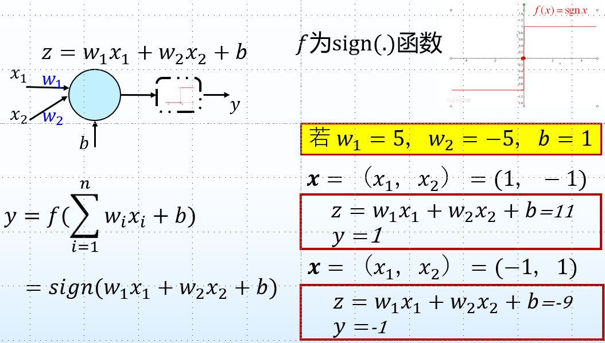
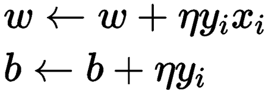

# 神经网络基础

## 1.神经元模型

* 神经网络：由神经元按照一定的层次结构连接起来

* 输入：来自其他 n 个神经元传递过来的输入信号

* 处理：输入信号通过带权重的连接进行传递, 神经元接受到总输入值将与神经元的阈值 b 进行比较

* 输出：通过激活函数的处理以得到输出

* 激活函数：

  * 理想激活函数是阶跃函数：0表示抑制神经元;1表示激活神经元
  * 阶跃函数具有不连续、不光滑等不好的性质
  * 如果不用激励函数，每一层输出都是上层输入的线性函数，无论神经网络有多少层，输出都是输入的线性组合，无法直接进行非线性分类

* 具有激活函数的功能神经元：

  

## 2.单层前馈神经网络

* 也称作感知机
* 仅有两层神经元组曾：输入层，输出层
* 感知机学习：给定训练数据集, 权重𝑤与阈值𝑏可以通过学习得到
* 若感知机对训练样例预测正确, 则感知机不发生变化；否则根据错误程度进行权重的调整
* 求解最优化问题：$\min_{w_ib}L(w,b)=-\sum_{\mathbf{x}_i\in M}y_i(w^Tx_i+b)$
* 随机选取误分类点更新：
* 其中$\eta$为学习率（learning rate)
* 

## 3.多层前馈神经网络

* 多层 ：包含隐含层的网络
* 增强模型的表征能力：
  * 增加隐层神经元的数目 (模型宽度)
  * 增加隐层数目（模型深度）
  * 增加隐层数目不仅增加了拥有激活函数的神经元数目, 还增加了激活函数嵌套的层数，增加隐层的数目比增加隐层神经元的数目更有效
* 梯度就是分别对每个变量进行微分，然后用逗号分割开，梯度是用<>包括起来，说明梯度其实一个向量。在单变量的函数中，梯度其实就是函数的微分，代表着函数在某个给定点的切线的斜率。在多变量函数中，梯度是一个向量，向量有方向，梯度的方向就指出了函数在给定点的上升最快的方向
* 𝜂：学习率，控制着算法每一轮迭代中的更新步长
* 反向传播：将神经网络的梯度反向传播到神经网络的输入端，并以此来更新神经网络中各个连接的权重
* 深度神经网络的训练流程：
  * 定义一个多层的神经网络
  * 对数据集的预处理并准备作为网络的输入
  * 将数据输入到网络
  * 计算网络的损失函数
  * 反向传播，计算梯度
  * 更新网络的梯度参数
* 多层前馈网络局限：神经网络由于强大的表示能力, 经常遭遇过拟合
  * 过拟合：训练误差小，测试误差大，神经网络参数增多时，易出现过拟合的情况
  * 欠拟合：训练误差大
* 缓解过拟合的策略：
  * 早停：在训练过程中, 若训练误差降低, 但验证误差升高, 则停止训练 
  * 正则化：在误差目标函数中增加一项描述网络复杂程度的部分, 例如，连接权值与阈值的平方和
