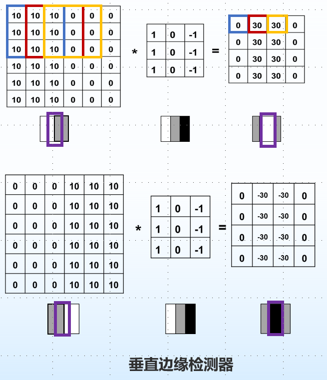

# 卷积神经网络 Convolutional Neural Network，CNN

## 1.卷积操作

* 每个神经元只关注特定特征模式

* 每个神经元只关注局部区域

* 卷积核/滤波器（filter）：在输入上多个局部区域重复的一个权值模式

* 卷积操作：将卷积核施加到图像的像素上的操作，即用权值向量对局部区域的像素进行线性组合

  

* 单通道卷积操作：对单通道输入图像，将卷积核放置在输入图像的一个位置，与覆盖区域做点乘并求和，得到输出的一个元素。将卷积核在输入图像上移动，即可得到完整的输出特征

  

* 卷积操作的实际意义：一个卷积核对应提取图片中一种局部特征

* 举例：垂直边缘检测器；人脸图片中眼睛的识别

  

* 多核多通道卷积操作

  

* 卷积操作的输出特征大小：

  * 填充 padding：在输入特征边缘进行填充（一般为零填充,向外填充），从而改变输出特征的大小
  * 步长 stride：规定了卷积核在输入特征上的移动方式（一次跳跃多少个元素），从而改变输出特征的大小。通常用来令输出特征大小小于输入特征

  

* 卷积操作的特点：

  * 卷积核起到局部感受野的作用，同时减少参数数量
  * 图像的每个位置都会被同一组卷积核处理，即实现了权值共享机制，同时也保证了**平移等变**的特性

## 2.池化操作

* 现实场景中，卷积核很多，特征图也非常多，这会带来一些问题：维度过高，过拟合

* 池化操作：对特征图进行特征提取，将其中最具有代表性的特征提取出来，可以起到减小过拟合和降低维度的作用

* 常见的池化操作：

  * 最大池化
  * 平均池化

  

* 池化操作的优点：

  * 减少参数量的同时，还保留了原图像的原始特征
  * 有效防止过拟合
  * 为卷积神经网络带来**平移近似不变性**

## 3.卷积神经网络结构

* 全连接层：对卷积层和池化层处理过的数据进行进一步的加工，输出最终结果。经过卷积层和池化层的降维，全连接层的计算成本大大下降，计算效率大幅提高
* 卷积神经网络结构 = （卷积层+非线性激活层+池化层）* k + 全连接层 + 分类层

## 4.卷积神经网络常见应用

* 图像分类与图像检索
* 图像检测与图像分割
* 自动驾驶与医疗辅助
* 骨骼识别与视频处理
* 图片风格迁移

## 5.卷积神经网络特性

* 参数共享
* 局部感知
* 平移等变