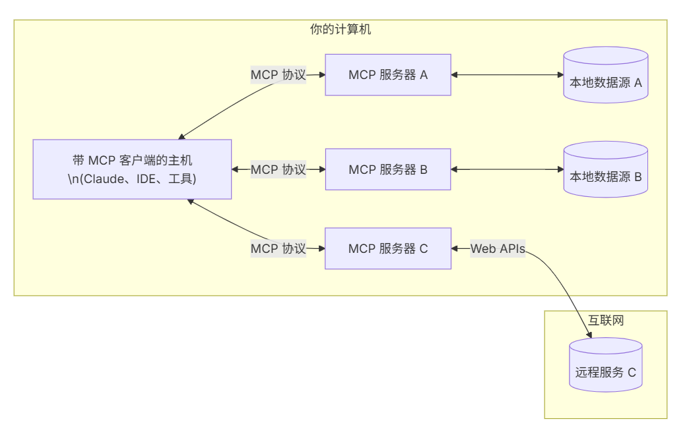

# MCP

## 1.基础

MCP CS 架构：

- MCP 主机是面向用户的 AI 应用程序，比如 Claude Desktop、IDE 以及其他支持 MCP 的 AI 工具（如 Cline 插件）
- MCP 客户端是驻留在 MCP 主机内部的中间组件，每个客户端与一个 MCP 服务器 保持 1:1 连接
- MCP 服务器是个轻量级程序，通过 标准化协议 提供特定功能，如数据访问、工具调用或 Prompts
  - Resources：结构化数据（如文件、API 响应）
  - Tools：可执行函数（如查询数据库、发送邮件）
  - Prompts：预定义的交互模板



MCP 协议类型：

- stdio（标准输入/输出）：客户端 (Cline) 将 MCP 服务器作为子进程启动，通信通过进程流进行：客户端写入服务器的 STDIN，服务器通过 STDOUT 响应
- sse（服务器发送事件）：通过 HTTP 协议实现服务器到客户端的实时单向数据推送，使用 HTTP POST 用于客户端到服务器的消息发送。client 与server 运行在不同的节点上

MCP调用流程：

- 模型生成一个“调用工具”的请求（包括参数）
- MCP 客户端接收请求并转发给 MCP 服务器
- MCP 服务器执行相应逻辑（如访问 API、查询数据库）
- 结果通过 MCP 返回给模型
- 模型用这些结果继续推理或生成回复


## 2.开发

Windows：

```bash
# 为我们的项目创建一个新 directory
uv init weather
cd weather

# 创建 virtual environment 并激活它
uv venv
.venv\Scripts\activate

# 安装 dependencies
uv add mcp[cli] httpx

# 创建我们的 server file
new-item weather.py
```

Linux：

```bash
# 为我们的项目创建一个新 directory
uv init weather
cd weather

# 创建 virtual environment 并激活它
uv venv
source .venv/bin/activate

# 安装 dependencies
uv add "mcp[cli]" httpx

# 创建我们的 server file
touch weather.py
```

调试工具：https://github.com/modelcontextprotocol/inspector

```bash
npx @modelcontextprotocol/inspector
```