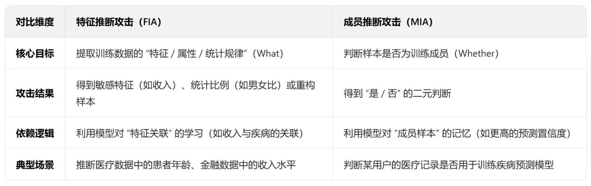

# 模型隐私攻击

## 1.成员推理攻击

攻击者的核心目标：判断一个特定的数据点是否被用来训练某个机器学习模型

关键漏洞：模型"背书"

攻击步骤：攻击者（通常）无法直接看到目标模型的内部参数。他们能做的是向模型发送数据并观察其输出（即“黑盒”攻击）。为了区分“成员”和“非成员”，攻击者会训练一个**“攻击模型”（Attack Model）**。这个“攻击模型”的输入不是原始数据（比如照片），而是目标模型的输出（比如预测的概率向量，也叫 posteriors）。 这个“攻击模型”的输出是一个简单的二分类：“是成员” 或 “不是成员”

整个过程如下：

* 步骤 1：训练“影子模型”
  * 收集数据： 攻击者找到一个和目标模型类似的数据集。例如，如果目标模型是识别人脸的，攻击者就去网上爬取大量人脸照片。
  * 划分数据： 攻击者将自己的数据集分成两半：一半作为“影子训练集”（Shadow Training Set），另一半作为“影子测试集”（Shadow Test Set）
  * 训练影子模型： 攻击者用“影子训练集”训练一个（或多个）“影子模型”。这个影子模型的结构、任务都和“目标模型”尽可能一致。
* 步骤 2：为“攻击模型”准备训练数据，现在，攻击者扮演“上帝”的角色，因为他完全知道哪些数据是影子模型的“成员”，哪些是“非成员”。
  * 获取“成员”数据： 攻击者将“影子训练集”（成员）喂给影子模型，收集所有的输出概率。并给这些输出打上标签：1 (是成员)。
  * 获取“非成员”数据： 攻击者将“影子测试集”（非成员）喂给影子模型，收集所有的输出概率。并给这些输出打上标签：0 (不是成员)。
  * 现在，攻击者有了一个全新的数据集：(模型输出A, 1), (模型输出B, 0), (模型输出C, 1) ...
* 步骤 3：训练“攻击模型”
  * 攻击者使用上一步创建的 (模型输出, 成员标签) 数据集，训练一个简单的二元分类器（比如逻辑回归、小型神经网络）。
  * 这个分类器就是最终的“攻击模型”。它的任务是：“给我一个模型的输出概率，我来告诉你这个输出是来自一个‘成员’数据还‘非成员’数据。”
* 步骤 4：执行攻击
  * 攻击者拿出他真正关心的数据点（例如，你的照片）。
  * 他将这张照片喂给“目标模型”（那个他不拥有但可以查询的“受害者”模型）。
  * “目标模型”返回一个输出概率，例如 [0.01, 0.99]。
  * 攻击者将这个 [0.01, 0.99] 喂给 他自己训练好的“攻击模型”。
  * “攻击模型”预测结果：0.85（即 85% 的概率是“成员”）。
  * 攻击完成： 攻击者得出结论，你的这张照片很可能被用于训练这个目标模型。

## 2.属性推理攻击

这种攻击比成员推理更“贪婪”，它不仅想知道“你是否在数据集中”，更想知道“关于你的一个我不知道的秘密是什么？”

攻击者的目标是：已知某个数据点（例如，一个特定的用户）在训练集中，攻击者想猜测（或推断）这个数据点某个缺失的、敏感的属性（例如，用户的收入、性取向或邮政编码）。

属性推理攻击之所以能成功，核心漏洞是模型在学习主要任务时，无意中也学会了数据属性之间的“相关性”

例子来解释：

- 目标模型（受害者）： 一个公司训练了一个模型，用于预测员工的“工作表现”（高或低）。
- 训练数据： 包含 年龄、部门、薪水 等字段。
- 假设： 在这个公司的训练数据中，薪水 和 工作表现 恰好存在某种强相关性（例如，薪水高的人，工作表现也倾向于“高”）。
- 漏洞： 模型为了在“预测工作表现”这个主要任务上做得更准，它会被迫去学习 薪水 和 工作表现 之间的这种隐藏关系。

模型“记住”了这个偏见：薪水 高 -> 更可能是 工作表现高。

整个过程如下：

* 训练影子模型： 攻击者使用自己的（包含薪水属性的）数据集，训练一个和目标模型类似的“影子模型”。

* 准备“攻击模型”的训练集：

  * 攻击者从他的影子数据集中取出数据。

  - 输入 (X)： 将数据喂给“影子模型”，获取其输出的概率向量（posteriors）。

  - 标签 (Y)： 这条数据对应的敏感属性（例如 薪水: 高）。

* 训练“攻击模型”：

  * 攻击者训练了一个新的分类器。
  * 这个分类器的任务是：学习 “从模型输出概率” -> “反推原始属性” 之间的映射关系。
  * （例如，输入 [高表现: 0.99] -> 预测 薪水: 高；输入 [高表现: 0.7] -> 预测 薪水: 低）

* 执行攻击：

  * 攻击者获取 Alice 的部分数据。

  - 他将这些数据喂给“目标模型”（受害者）。

  - “目标模型”返回一个概率向量（例如 [高表现: 0.98]）。

  - 攻击者将这个 [高表现: 0.98] 喂给他训练好的“攻击模型”。

  - “攻击模型”输出预测结果：薪水: 高。

  - 攻击完成。

## 3.两种攻击的区别

