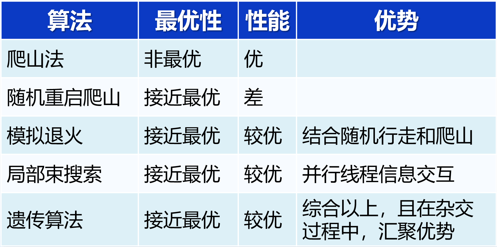
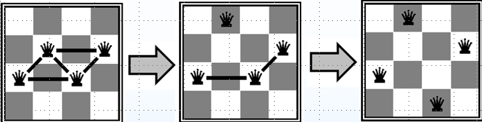

# 局部搜索与复杂环境搜索

> 经典搜索问题 vs. 局部搜索问题:
>
> 返回一个行动序列 vs. 返回一个状态
>
> 路径搜索 vs.状态搜索

## 1.局部搜索

### 1.1 爬山算法

随机选择初始状态，局部的贪心搜索算法

N 皇后问题：

改进：随机爬山算法：在上山移动中，随机选择下一步，有一定概率跳出局部最优解，探索更大的搜索空间

随机重启爬山法：克服传统爬山算法容易陷入局部最优解的问题。通过多次从不同的随机初始状态开始爬山搜索，可以增加找到全局最优解的概率

### 1.2 模拟退火算法

对于一个当前最优解附近的非最优解，爬山算法直接舍去了这个解。而很多情况下，我们需要去接受这个非最优解从而跳出这个局部最优解，即为模拟退火算法

我们定义当前温度为 T，新状态 S' 与已知状态 S（新状态由已知状态通过随机的方式得到）之间的能量（值）差为 △E (△E≥0)，则发生状态转移（修改最优解）的概率为

$P(\Delta E)=\left\{\begin{matrix}1,&S^{\prime}\text{ is better than }S,\\\mathrm{e}^{\frac{-\Delta E}{T}},&\text{otherwise.}\end{matrix}\right.$

模拟退火时我们有三个参数：初始温度 T0 ，降温系数 d ，终止温度 Tk。其中 T0 是一个比较大的数，d 是一个非常接近 1 但是小于 1 的数，Tk 是一个接近 0  的正数。

首先让温度 T0 ，然后按照上述步骤进行一次转移尝试，再让 T = T0*d 。当 T < Tk 时模拟退火过程结束，当前最优解即为最终的最优解

随着温度的降低，跳跃越来越不随机，最优解也越来越稳定

如果 T 下降的速度足够慢，那么模拟退火搜索将以接近 1 的概率求得全局最优解

### 1.3 局部束搜索算法

动机：同时追踪k个状态，以内存换效率，一种改进的启发式搜索算法，它同时维护多个候选解（称为束）

基本思路：

- 随机产生k个状态开始搜索
- 每次迭代产生k个状态的所有后继
- 如果这些后继中存在目标状态，则算法终止；
- 否则，从所有后继列表中选择k个最佳状态重复以上操作

优点：

* 不仅仅是并行地运行k个随机重启搜索
* 有用的信息在并行的搜索线程之间传递

缺点：容易陷入局部最优

随机束搜索：随机选择k个后继状态，其中选择给定后继状态的概率是状态值的递增函数

### 1.4 遗传算法

随机束搜索的一个变形

- 个体（Individual）：每个候选解被称为一个个体，通常用一个字符串或数组表示。
- 种群（Population）：由多个个体组成的集合。
- 适应度函数（Fitness Function）：用于评价每个个体的优劣。
- 选择（Selection）：根据适应度函数，从当前种群中选择个体进行繁殖。
- 交叉（Crossover）：选择的个体对之间交换部分基因，生成新的个体。
- 变异（Mutation）：对个体的基因进行随机修改，以增加多样性

## 2.不确定搜索

之前的搜索问题假定环境是完全可观察的、确定的

而不确定搜索问题的解不是一个序列，而是一个应急规划（也称作策略）

形式化问题，推广转移模型

* 函数𝑅𝐸𝑆𝑈𝐿𝑇(𝑠,𝑎):在状态𝑠下执行行动𝑎后到达的状态
* 函数𝑅𝐸𝑆𝑈𝐿𝑇(𝑠,𝑎):在状态𝑠下执行行动𝑎后到达的一组可能的状态

## 3.联机搜索

脱机搜索：面对已知环境，先对实际问题计算出完整的解决方案，然后再涉足现实世界执行解决方案

联机搜索Agent交替地计算和行动来完成任务：它先采取某个行动，然后观察环境变化并且计算出下一行动。联机搜索适用于动态或半动态的问题领域——停留不动或者计算时间过长都会带来负面影响。联机搜索同样有助于在不确定性领域进行问题求解，因为联机搜索使得Agent可以将计算精力集中在实际发生的事件上，而不需要考虑那些也许会发生但很可能不会发生的事件。但是需要折中考虑，越提早规划，越少陷入困境

术语“联机”通常用于计算机科学，说明算法是边接受输入数据边处理的，而不是等到整个输入数据集都可用以后再处理
