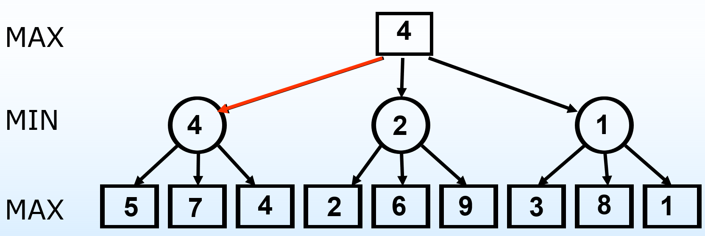

# 博弈搜索

## 1.博弈问题描述

零和博弈

* 两人对弈，轮流行动 
* 完全可观察，完整信息(perfect information)
* 确定
* 游戏者有输有赢，一方所赢正是另一方所输，游戏的总成绩永远是零
* 有时间限制(time-constrained)
* 效率很重要
* 对手 Agent (Min) 和我们的 Agent (Max) 对抗
* 不确定性(Uncertainty) 源自对手的行动未知

## 2.极小极大算法

* 以当前状态作为初始状态，构造从它出发到所有终止状态的博弈树
* 计算叶结点对应的(终止)状态的效用值
* 将叶结点的效用值回传(backed up)到根结点，通过递归计算每个结点的极小极大值
* 选择到达具有最大分值的子结点的行动

 

本质上是一种深度优先策略

* 深度：树的最大深度为 𝑚
* 分支因子：每个结点可考虑的行棋选择有 𝑏 种选择
* 时间复杂度：𝑶(𝒃^𝒎)
* 空间复杂度:
  * 一次性生成所有后继：𝑂(𝑏𝑚)
  * 每次生成一个后继：𝑂(𝑚)

## 3.alpha-beta 剪枝

MAX 层每一个节点维护一个 α 值, MIN 层每一个节点维护一个 β 值

* α = 到目前为止路径上发现的 MAX 的最佳选择的值, 初始值为-∞
* β = 到目前为止路径上发现的 MIN 的最佳选择的值, 初始值为+∞

Alpha 剪枝：

* 作用在 MAX 层
* 当前 MAX 节点的某个 MIN 后继的 β 值小于当前 MAX 节点的 α 值时，丢弃该 MIN 后继还未展开的其它后继

Beta 剪枝：

* 作用在MIN层
* 当前MIN节点的某个MAX后继的α值大于当前MIN节点的β值时，丢弃该MAX后继还未展开的其它后继

剪掉的结点最多：

* 对于MAX结点，其子结点从左到右由大到小排列；
* 对于MIN结点，其子结点从左到右由小到大排列。 

## 4.不完美的决策

截断搜索：

* 深度受限搜索
* 在Alpha-Beta剪枝的基础上，设置深度限制limit
* 当节点深度大于limit时，返回节点的评估函数值

评估函数：

* 评估函数通常是特征加权和
* 评估函数的计算本身不能花费太长时间

