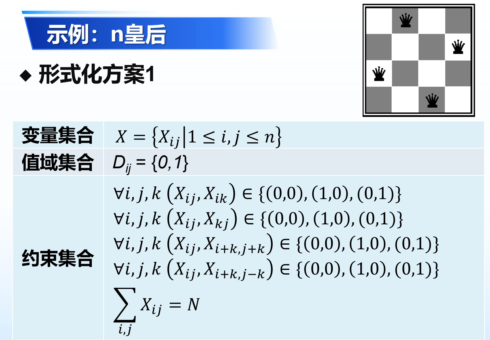
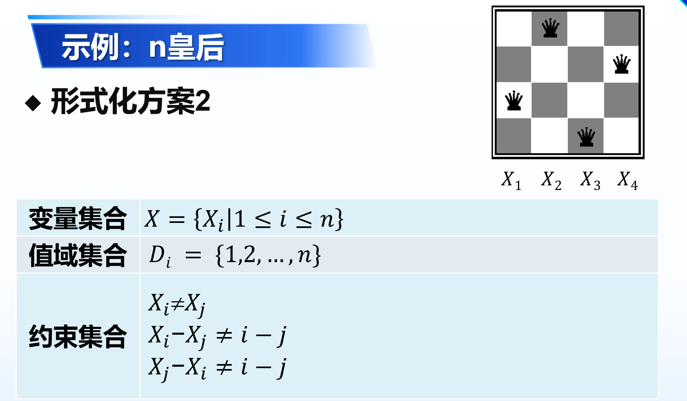

# 约束满足问题

## 1.约束满足问题形式化

约束满足问题(Constraint satisfaction problem，CSPs)包含三部分：

* 变量集合 X： {X1，…，Xn}。
* 值域集合 D： {D1，…，Dn}，每个变量的值域
* 约束集合 C：描述变量取值的约束

求解：

* 状态：部分或全部变量的赋值
* 目标测试：变量取值是否满足约束
  * 赋值是否相容(consistent)或合法(legal)：不违反任何约束条件
  * 完整(complete)赋值：每个变量都已赋值
* 问题的解：相容的、完整的赋

约束图：

* 二元(Binary) CSP ：每个约束最多涉及的两个变量
* 约束图以变量为结点，以约束为边
* 利用图结构特点加速搜索

## 2.约束满足问题求解：回溯搜索

| 初始状态 | 以部分变量的赋值集合作为状态，初始状态为{}  |
| -------- | ------------------------------------------- |
| 行动     | 将某个变量的赋值var value加入到赋值集合中   |
| 转移模型 | RESULT(s, var = value） = s U {var = value} |
| 目标测试 | 是否为每个变量赋值且满足所有约束            |
| 路径代价 | 单步代价为1，整个解路径的代价为路径的步数   |

搜索空间巨大：

* 𝑛个变量，每个变量𝑑个取值
* 各层分支因子：𝑛𝑑, (𝑛−1)𝑑,…
* 搜索树有𝑛!·𝑑^𝑛个叶结点
* 可能的完整赋值只有𝑑^𝑛个

CSP问题的深度优先搜索：

* 每一步只考虑对一个变量赋值
* 每一步只考虑合法的赋值
* 当没有合法的值赋给某个变量的时候就回溯

## 3.回溯搜索的启发式函数

变量的选择：

* 最小剩余值(MRV, Minimum Remaining Values)：

  * 选择值域最小的约束变元

  * 选择“合法”取值最少的变量

  * “失败优先”(fail-first)启发式：选择最可能很快导致失败的变量，实现对搜索树的剪枝，缩小分支因子

* 度启发式(Degree heuristic)：

  * 选择与其它未赋值变量约束最多的变量
  * 试图降低未来选择的分支因子

* 最少约束值（Least constraining value)：

  * 优先选择给约束图中的相邻变量留下更多选择的值

## 4.约束满足问题的推理：向前检测

思想：跟踪未分配变量的剩余合法值，当某个变量没有合法值时回溯