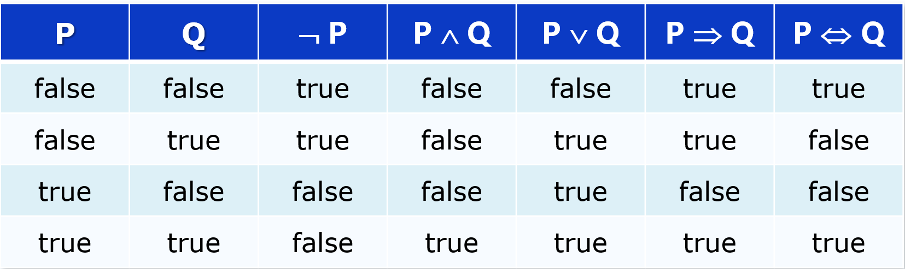
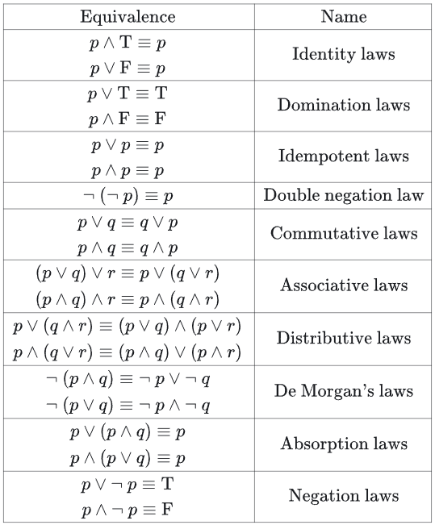
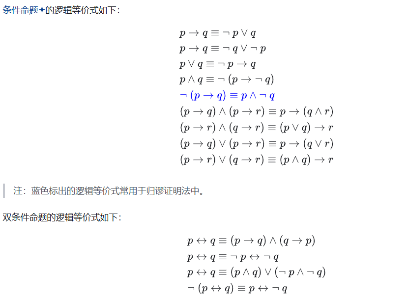
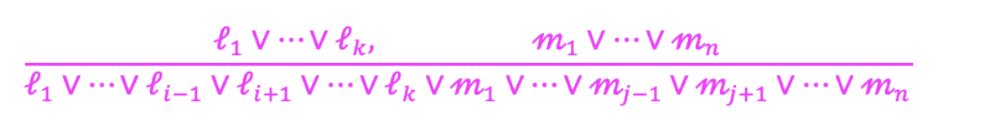

#   命题逻辑

## 1.逻辑

逻辑是陈述式语言: 利用声明的语句推断问题空间中其它语句所代表的事件的真假，声明的语句代表问题空间中能够成立的事实

语法定义语句的形式，合法语句的规范

语义定义语句的意义，及语句在可能世界中的真值

**模型**：当对语句 s 中所有变量的赋值使得语句 s 的真值为 true 时，这个赋值被称为语句 s 的模型

**知识库** 是语句的集合，记为 KB

m 是知识库的模型 当且仅当 m 是知识库中所有语句的模型

M(a) 表示语句 a 的模型的集合，M(KB)表示 KB 的模型的集合

一个知识库/语句是可满足的 当且仅当 它有至少一个模型

一个知识库/语句是永假的 当且仅当 它没有模型

一个知识库/语句是永真的 当且仅当 它对可能世界都为真

知识库 KB 逻辑蕴含语句 a 当且仅当 当 KB 为真时，a 总是为真: KB ╞ a

KB ╞ a 当且仅当 M(KB) ⊆ M(a)：

* M(a) 是 a 的模型的集合
* M(KB)是 KB 的模型的集合

## 2.命题逻辑

* 若 S 是一个语句, 则 ¬ S 是一个语句（否定式)
* 若 S1 和 S2 是语句, 则 S1 ∧ S2 是语句 (合取式)
* 若 S1 和 S2 是语句, S1 ∨ S2 是语句 (析取式)
* 若 S1 和 S2 是语句, S1 ⇒ S2 是语句 (蕴含式)
* 若 S1 和 S2 是语句, S1 ⇔ S2 是语句 (双向蕴含式）

逻辑连词真值表：

逻辑连接词的运算优先级:

* ¬ 的优先级最高，其它没有定论
* 为了避免歧义，括号不能少
* ∀, ∃, ¬ 强于 ∧, ∧ > ∨ > → > ↔

逻辑等价：

$\text{命题“若P,则Q": }P\to Q\text{,其逆否命题为“若非Q,则非P" }\neg Q\to\neg P$

演绎定理：对任意语句 α 和 β，α ╞ β 当且仅当语句 α ⇒ β 永真

推论：对任意语句 α 和 β，α ╞ β 当且仅当语句（α ∧ ¬β）永假

归结（消解）推理规则：

合取范式：由有限个简单析取式构成的合取式，形如(¬A ∨ B) ∧ (¬B ∨ C )  

析取范式：由有限个简单合取式构成的析取式

前束范式：（1）所有量词均非否定地出现在公式的最前面；（2）所有量词的辖域为整个公式

Skolem 范式：（1）前束范式；（2）所有的存在量词都在全称量词之前

## 3.一阶逻辑

一阶逻辑假设知识可以用对象和对象之间的关系描述

* 常量（个体常元）：a，b，2
* 变量（个体变元）：x，y
* 函词：返回一个对象
* 谓词：返回 true/false
* 连接词：¬，∨，∧，⇔，⇒
* 量词：∀，∃
* 嵌套量词：一个量词出现在另一个量词的作用域内
  * ∀x ∀y 等同于 ∀y ∀x
  * ∃x ∃y 等同于 ∃y ∃x 
  * ∃x ∀y 不等同于 ∀y ∃x

量词的二相性：可以相互表示

* ¬∀xP(x) ⇔ ∃x¬P(x)

* ¬∃xP(x) ⇔ ∀x¬P(x)
* ¬∀xP(x) 表示的是“不是所有的 x 都满足 P(x)”，即“存在一个 x 不 满足 P(x)”，即 ∃x¬P(x)
* 同理，也可以表示成 ∀xP(x) ⇔ ¬∃x¬P(x)

一阶逻辑的表示：

* **当变量用 ∀ 修饰时, 用 ⇒ 作为连接词**
* **当变量用 ∃ 修饰时，用 ∧ 作为连接词**

置换：SUBST({v/g},α)，将α中的变量v替换成对象或对象的逻辑表达式g

一阶逻辑语句的实例化：

* 全称量词实例化规则：用任意可能基项代替变量

  * $\frac{\forall\mathrm{v~a}}{\mathrm{SUBST}(\{\mathrm{v/g}\},\alpha)}$
  * 其中 A(x/y) 表示将 A 中约束 x 的量词辖域内的所有 x 替换成 y 得到的公式
* 存在量词实例化规则：用一个未出现在知识库中其它位置的常元或函数符号代替变量

  * ("x1)…(" xk-1)($xk)(Qxk+1)…(Qxn)M(x1, …, xk, …, xn)

    嵌套的存在量词实例化：f(x1, …, xk-1) 代替 xk

    ("x1)…(" xk-1)(Qxk+1)…(Qxn)M(x1,…, f(x1,…, xk-1),…, xn)

  * 存在量词实例化只能使用一次

合一：

* 发现使不同的逻辑表示变得相同的置换（合一置换）的过程
* 要求：
  * 只能用常量、函数或变量置换变量
  * 不能用变量置换常量和函数
  * xi 不能出现在 ti 中，如 g(x)/x 不是置换
  * 不能循环置换，如{y/x, x/y}不是一个置换
* UNIFY 算法： 输入两个句子并返回其合一置换
* UNIFY(p, q)= θ where SUBST(θ, p)= SUBST(θ, q)
* 一个公式集的合一一般不唯一
* UNIFY(Knows(John, x), Knows(x, Elizabeth))= Fail
  失败原因： x 不能同时被赋予两个不同的值
  但是“John 认识每个人”， “每个人认识 Elizabeth” 不应该合一失败
  必须对语句进行标准化以避免变量的重复使用
  UNIFY (Knows(John, x), Knows(x1, Elizabeth))

归结（消解）：

* 一阶逻辑语句转化为合取范式：不包含蕴含，不包含量词，子句形式
* 删除蕴含符号
* 否定内移，双重否定，量词转换
* 标准化变量：去重用的变量
* skolem 化：去存在量词
* 将所有量词移到左边
* 丢掉所有全称量词
* 利用分配律合取外移，析取内移

反证法：对合取范式 使用归结推理规则，并发现矛盾(或空子句)