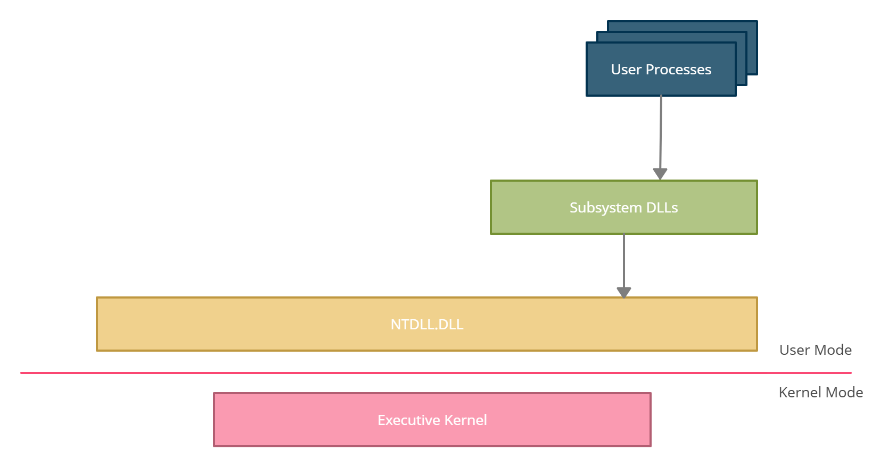

# Windows 基础

## 1.概述

Windows 学习网站：https://www.vergiliusproject.com/；https://learn.microsoft.com/en-us/windows/win32/api/_base/

常用工具：https://github.com/winsiderss/systeminformer/；https://github.com/hasherezade/pe-bear

Windows 恶意软件开发形势在过去几年中发生了转变，现在高度关注于规避基于主机的安全解决方案，如防病毒 (AV，Anti-Virus) 和端点检测和响应 (EDR, Endpoint Detection and Response)

Malware development life cycle：

1. 开发：开始恶意软件的功能开发或改进
2. 测试 ：执行测试以发现迄今为止开发的代码中的隐藏 bug
3. 离线 AV/EDR 测试 ：在尽可能多的安全产品上运行已开发的恶意软件。该测试应在离线状态下进行，以确保不向安全供应商发送样本。使用 Microsoft Defender，可以通过禁用自动样本提交和云交付保护选项来实现这一点
4. 在线 AV/EDR 测试 ：在具有互联网连接的安全产品上运行已开发的恶意软件。云引擎通常是 AV/EDR 的关键组件，因此，针对这些组件测试的恶意软件对于获得更准确的结果至关重要。但是，因为这一步可能会导致将样本发送到安全解决方案的云引擎中
5. IoC（入侵指标）分析 ：身份转变成为了威胁猎人或恶意软件分析师，分析恶意软件并提取潜在可用于检测或签名恶意软件的 IoC


## 2.Windows 结构

Windows 处理器运行模式：用户模式和内核模式

应用程序在用户模式下运行，而操作系统组件在内核模式下运行。当应用程序想要执行一项任务（例如创建文件）时，它无法自行完成。唯一能完成这项任务的实体是内核，因此应用程序必须遵循特定的函数调用流程

1. 用户进程：由用户执行的程序/应用程序
2. 子系统 DLL：包含用户进程调用的 API 函数的 DLL。例如，kernel32.dll 导出了 Windows API (WinAPI) 函数，其他常见的子系统 DLL 是 ntdll.dll、advapi32.dll 和 user32.dll
3. Ntdll.dll： Windows NT 内核级文件，一个系统范围的 DLL，它是用户模式中可用的最低层。这是一个特殊的 DLL，可从用户模式过渡到内核模式。这通常称为本机 API 或 NTAPI
4. 执行内核：Windows 内核，它调用内核模式中可用的其他驱动程序和模块来完成任务。Windows 内核部分存储在 "C:\Windows\System32" 下名为 ntoskrnl.exe 的文件中




## 3.Windows 内存管理

Windows 内存管理：使用虚拟内存和分页进行管理

进程的虚拟地址空间中的页面状态可以处于以下三种状态之一：

- 空闲：页面既未提交也未保留。该页面对进程不可访问。它可被保留、提交或同时保留和提交。尝试从空闲页面读取或写入内容会导致访问冲突异常
- 已保留：该页面已保留以备将来使用。该地址范围不能被其他分配函数使用。该页面不可访问，并且没有与之关联的物理存储。它可被提交
- 已提交：已从 RAM 总大小和磁盘中的页面文件中分配内存费用。该页面可被访问，并且访问受一个内存保护常量控制。系统仅在首次尝试读取或写入该页面时，才会初始化并将其加载到物理内存中。当进程终止时，系统将释放提交页面的存储空间

页面保护选项：

- PAGE_NOACCESS：禁用对已提交页面区域的所有访问。尝试读取、写入或执行已提交区域将导致访问冲突
- PAGE_EXECUTE_READWRITE：启用读取、写入和执行。强烈建议不要使用此选项，通常是 IOC(入侵指标，Indicators of Compromise)，因为内存同时具有可写性和可执行性并不常见
- PAGE_READONLY：启用对已提交页面区域的只读访问。尝试写入已提交区域将导致访问冲突

内存保护机制：

- 数据执行保护 (DEP，Data Execution Prevention)：DEP 是从 Windows XP 和 Windows Server 2003 开始内置到操作系统中的系统级内存保护功能。如果页面保护选项设置为 PAGE_READONLY，DEP 将阻止代码在该内存区域中执行
- 地址空间布局随机化 (ASLR)：ASLR 是一种内存保护技术，用于防止利用内存损坏漏洞。ASLR 随机排列进程关键数据区域（包括可执行文件的基地址以及堆栈、堆和库的位置）的地址空间位置

内存分配：

```c
PVOID pAddress = malloc(100);

PVOID pAddress = HeapAlloc(GetProcessHeap(), 0, 100);

PVOID pAddress = LocalAlloc(LPTR, 100);
```

内存写入：

```c
PVOID pAddress    = HeapAlloc(GetProcessHeap(), HEAP_ZERO_MEMORY, 100);
CHAR *cString      = "MalDev Academy Is The Best";
memcpy(pAddress, cString, strlen(cString));
```

内存释放：

- 使用 malloc 分配需要使用 free 函数
- 使用 HeapAlloc 分配需要使用 HeapFree 函数。
- 使用 LocalAlloc 分配需要使用 LocalFree 函数


## 4.Windows API

Windows API:

https://learn.microsoft.com/zh-cn/windows/win32/apiindex/windows-api-list

Windows 数据类型：

https://learn.microsoft.com/zh-cn/windows/win32/winprog/windows-data-types

Windows API 允许开发者直接声明一个数据类型或数据类型的指针，这体现在数据类型名称中，以“P”开头的名称代表指向实际数据类型的指针，而不以“P”开头的名称代表实际数据类型本身

大多数 Windows API 函数都有两个版本，分别以“A”或“W”结尾。以“A”结尾的函数表示“ANSI”（8 位），而以“W”结尾的函数表示 ”Unicode“ 或 “Wide”（16 位）

- PVOID：32 位系统上任何数据类型的 32 位或 4 字节指针。或者，64 位系统上任何数据类型的 64 位或 8 字节指针
- HANDLE：指定操作系统正在管理的特定对象（如文件、进程、线程）的值
- HMODULE - 模块的句柄。这是模块在内存中的基址。MODULE 的一个示例可以是 DLL 或 EXE 文件
- LPSTR/PSTR：与 LPCSTR 和 PCSTR 相同，唯一的区别是 LPSTR 和 PSTR 不指向常量变量，而是指向可读写的字符串。这两个数据类型等效于 char*
- LPCWSTR\PCWSTR：指向 16 位 Windows Unicode 字符（Unicode）的常量空终止字符串的指针。这两个数据类型等效于 const wchar*
- PWSTR\LPWSTR：与 LPCWSTR 和 PCWSTR 相同，唯一的区别是 PWSTR 和 LPWSTR 不指向常量变量，而是指向可读写的字符串。这两个数据类型等效于 wchar*
- wchar_t： wchar 相同，用于表示宽字符
- ULONG_PTR：表示无符号整数，其大小与指定架构上的指针相同，ULONG_PTR 通常用于处理包含指针的算术表达式（如 PVOID）。在执行任何算术运算之前，指针将被强制转换为 ULONG_PTR，此方法用于避免直接操作指针


## 5.DLL

DLL：Dynamic Link Library，可执行函数或数据的共享库，DLL 文件不能单独执行代码，相反，DLL 库需要被其他程序调用才能执行代码

导出函数：DLL 可以导出函数以供调用应用程序使用。要导出函数，需要使用关键词 extern 和 __declspec(dllexport) 进行定义：

```c
#include "pch.h"
#include <Windows.h>

extern __declspec(dllexport) void HelloWorld() {
    MessageBoxA(NULL, "Hello, World!", "DLL 消息", MB_ICONINFORMATION);
}

BOOL APIENTRY DllMain( HMODULE hModule, // 指向自身的句柄
                       DWORD  ul_reason_for_call, // 调用原因
                       LPVOID lpReserved // 静态加载为非 NULL，动态加载为 NULL
                     )
{
    switch (ul_reason_for_call)
    {
    case DLL_PROCESS_ATTACH: //进程创建的时候调用
    case DLL_THREAD_ATTACH: //线程创建的时候调用
    case DLL_THREAD_DETACH: //线程结束的时候调用
    case DLL_PROCESS_DETACH: //进程结束的时候调用
        break;
    }
    return TRUE;
}
```

