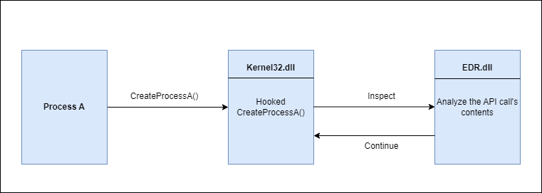

# 检测机制

## 1.静态检测

- 特征码检测：
  - 一段字节或字符串，用于唯一标识恶意软件
  - YARA 是通常用于构建检测规则的工具之一：https://github.com/VirusTotal/yara
  - 特征码检测很容易绕过，避免在恶意软件中硬编码即可，尽量使用动态检索或者计算这些值
- 哈希检测：直接计算恶意软件的哈希值与数据库中的哈希值进行匹配即可

## 2.启发式检测

- 静态启发式分析：将可疑程序的代码片段与启发式数据库中的恶意软件进行比较，如果有一定比例的源码与启发式数据库中的内容匹配，则会进行标记
- 动态启发式分析：将可疑程序放在虚拟环境或者沙箱中，又安全解决方案对其进行分析，查找任何的可疑行为

## 3.基于行为检测

- 恶意软件运行时，安全解决方案将查找运行中的进程所产生的可疑行为
- 一旦检测到可疑行为，将会对正在运行的进程内存执行扫描，如果是恶意的，则将其终止
- 避免基于行为的检测方法是让进程表现为良性，可以使用内存加密来绕过内存扫描

## 4.API HooKing

- 主要是 EDR 使用
- 主要原理是拦截和分析常被滥用的 API，这就允许它在 API 被混淆或加密后查看其传递内容

## 5.IAT 检查

IAT 检查：

- PE 结构中的导入地址表 IAT，包含了 PE 在运行是所使用的函数名
- 规避 IAT 的一种解决方案是使用 API 哈希