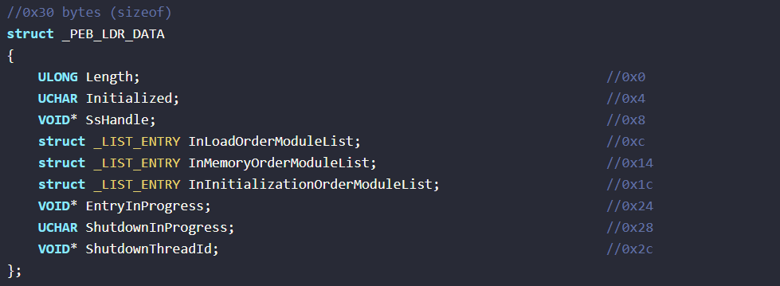

# Windows 进程

## 1.概述

Windows 进程：

Windows 进程是由一个或多个正在运行的线程组成，进程的线程间可以通信和共享数据，又操作系统统一调度

进程的内存类型：

- 私有内存：专用于单个进程，无法被其他进程共享
- 映射内存：可以由多个进程共享，用于在进程之间共享数据，映射内存对其他进程是可见的，但是不能被其他进程所修改
- 镜像内存：存储可执行文件的代码和数据


## 2.PEB

进程环境块 PEB：一个数据结构，包含了进程的参数、启动信息、堆信息、加载的 dll 等

winternl.h：

```c
typedef struct _PEB {
  BYTE                          Reserved1[2];
  BYTE                          BeingDebugged;
  BYTE                          Reserved2[1];
  PVOID                         Reserved3[2];
  PPEB_LDR_DATA                 Ldr;
  PRTL_USER_PROCESS_PARAMETERS  ProcessParameters;
  PVOID                         Reserved4[3];
  PVOID                         AtlThunkSListPtr;
  PVOID                         Reserved5;
  ULONG                         Reserved6;
  PVOID                         Reserved7;
  ULONG                         Reserved8;
  ULONG                         AtlThunkSListPtr32;
  PVOID                         Reserved9[45];
  BYTE                          Reserved10[96];
  PPS_POST_PROCESS_INIT_ROUTINE PostProcessInitRoutine;
  BYTE                          Reserved11[128];
  PVOID                         Reserved12[1];
  ULONG                         SessionId;
} PEB, *PPEB;
```

64 位的如下：

```c
typedef struct _PEB {
    BYTE Reserved1[2];
    BYTE BeingDebugged;
    BYTE Reserved2[21];
    PPEB_LDR_DATA LoaderData;
    PRTL_USER_PROCESS_PARAMETERS ProcessParameters;
    BYTE Reserved3[520];
    PPS_POST_PROCESS_INIT_ROUTINE PostProcessInitRoutine;
    BYTE Reserved4[136];
    ULONG SessionId;
} PEB;
```

- BeingDebugged：用来判断进程是否被调试，如果是 1，则被调试，否则是 0

- LDR：指向 _PEB_LDR_DATA 的结构体指针，用来记录已加载的动态库信息

  

- ProcessParameters：进程创建时传入该进程的命令行参数

- PostProcessInitRoutine：用于存储一个函数指针，该函数在进程中所有线程的 TLS（线程本地存储）初始化完成后由操作系统调用。这个函数可用于执行进程所需的任何其他初始化任务


## 3.TEB

线程环境块 TEB

```c
typedef struct _TEB {
  PVOID Reserved1[12];
  PPEB  ProcessEnvironmentBlock;
  PVOID Reserved2[399];
  BYTE  Reserved3[1952];
  PVOID TlsSlots[64];
  BYTE  Reserved4[8];
  PVOID Reserved5[26];
  PVOID ReservedForOle;
  PVOID Reserved6[4];
  PVOID TlsExpansionSlots;
} TEB, *PTEB;
```

- ProcessEnvironmentBlock：指向 PEB 结构的指针，该结构包含整个进程的信息
- TlsSlots：线程存储本地数据，使用 TlsGetValue 来访问


## 4.句柄

句柄就是一个标识符，只要获得对象的句柄，我们就可以对对象进行任意的操作，句柄不是指针，操作系统用句柄可以找到一块内存，这个句柄可能是标识符，map 的 key，也可能是指针，看操作系统怎么处理的，windowns 中是 handle，liunx 类似的是 fd

进程和线程句柄：

在 Windows 操作系统中，每个进程都有一个独特的进程标识符或进程 ID (PID)，由操作系统在创建进程时分配。PID 用于区分正在运行的不同进程。相同的概念适用于正在运行的线程，其中正在运行的线程具有一个唯一 ID，用于将其与系统中其他所有线程（在任何进程中）区分开来

可以使用以下 WinAPI 打开进程或线程的句柄：

- OpenProcess：通过标识符打开一个现有的进程对象句柄。
- OpenThread：通过标识符打开一个现有的线程对象句柄。

打开的句柄可用于对其相对 Windows 对象执行进一步操作，例如挂起进程或线程

一旦不再需要使用句柄，就应该始终关闭句柄，以避免句柄泄露


## 5.未记录的结构

Windows 文档中有关结构的信息时，可能会看到结构中有一些保留成员。这些保留成员通常以 BYTE 或 PVOID 数据类型的数组形式呈现。这是 Microsoft 为保证机密性并防止用户了解结构而避免其修改这些保留成员而采用的一种做法

确定 PEB 的保留成员所包含内容的一种方法是通过 WinDbg 中的 ! peb 命令