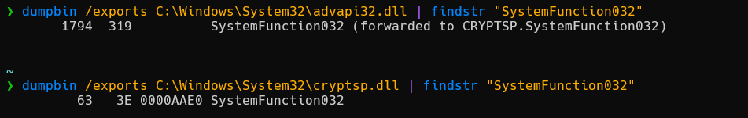
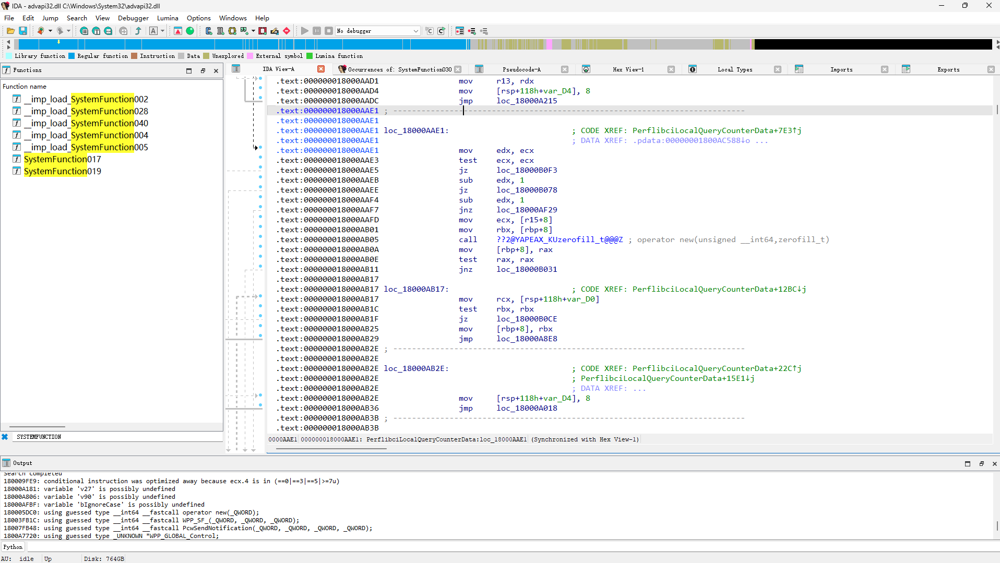
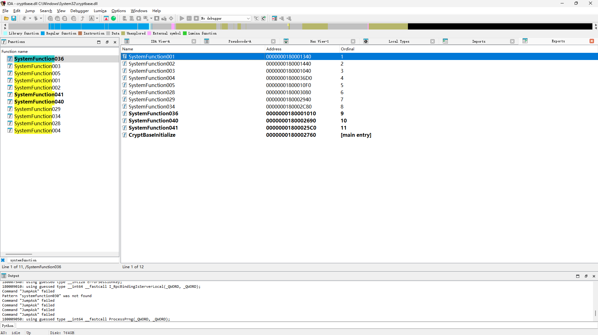

# payload 加解密

## 1.简述

当使用签名代码和有效载荷时，加密可帮助规避基于签名的检测，但对于其他形式的检测可能无效，例如运行时和启发式分析

但文件中加密的数据越多，其熵就越高。熵值较高的文件可能会导致安全解决方案标记文件或至少将其视为可疑并对其进行进一步审查


## 2.密钥存储方式

```c
unsigned char* key = "maldev123";

unsigned char key[] = {
	0x6D, 0x61, 0x6C, 0x64, 0x65, 0x76, 0x31, 0x32, 0x33
};

unsigned char* key = "\x6D\x61\x6C\x64\x65\x76\x31\x32\x33";

unsigned char key[] = {
	'm', 'a', 'l', 'd', 'e', 'v', '1', '2', '3'
};
```


## 3.XOR

最为简单轻量，并且不需要任何额外的库或使用 Windows API。此外，它是一种双向加密算法，允许使用同一个函数进行加密和解密

单字节异或运算：

```c
VOID XorByOneKey(IN PBYTE pShellcode, IN SIZE_T sShellcodeSize, IN BYTE bKey) {
	for (size_t i = 0; i < sShellcodeSize; i++){
		pShellcode[i] = pShellcode[i] ^ bKey;
	}
}
```

但是密钥可能会被暴力破解，从而导致 shellcode 泄露，增加密钥空间来防止暴力破解：

```c
VOID XorByiKeys(IN PBYTE pShellcode, IN SIZE_T sShellcodeSize, IN BYTE bKey) {
	for (size_t i = 0; i < sShellcodeSize; i++) {
		pShellcode[i] = pShellcode[i] ^ (bKey + i);
	}
}
```

进一步强化：使用密钥串

```c
VOID XorByInputKey(IN PBYTE pShellcode, IN SIZE_T sShellcodeSize, IN PBYTE bKey, IN SIZE_T sKeySize) {
	for (size_t i = 0, j = 0; i < sShellcodeSize; i++, j++) {
		if (j > sKeySize){
			j = 0;
		}
		pShellcode[i] = pShellcode[i] ^ bKey[j];
	}
}
```


## 4.RC4

RC4 算法的核心思想是利用伪随机数生成器和密钥共同生成一个密钥流，该密钥流与明文进行异或运算得到密文

```c
#include <Windows.h>
#include <stdio.h>

typedef struct
{
	unsigned int i;
	unsigned int j;
	unsigned char s[256];
} Rc4Context;

void rc4Init(Rc4Context* context, const unsigned char* key, size_t length)
{
	unsigned int i;
	unsigned int j;
	unsigned char temp;

	//Check parameters
	if (context == NULL || key == NULL)
		return ERROR_INVALID_PARAMETER;

	// Clear context
	context->i = 0;
	context->j = 0;

	// Initialize the S array with identity permutation
	for (i = 0; i < 256; i++)
	{
		context->s[i] = i;
	}

	// S is then processed for 256 iterations
	for (i = 0, j = 0; i < 256; i++)
	{
		j = (j + context->s[i] + key[i % length]) % 256;
		temp = context->s[i];
		context->s[i] = context->s[j];
		context->s[j] = temp;
	}
}

void rc4Cipher(Rc4Context* context, const unsigned char* input, unsigned char* output, size_t length) {
	unsigned char temp;

	// Restore context
	unsigned int i = context->i;
	unsigned int j = context->j;
	unsigned char* s = context->s;

	// Encryption loop
	while (length > 0)
	{
		// Adjust indices
		i = (i + 1) % 256;
		j = (j + s[i]) % 256;

		// Swap the values of S [i] and S [j]
		temp = s[i];
		s[i] = s[j];
		s[j] = temp;

		// If the input and output are valid
		if (input != NULL && output != NULL)
		{
			*output = *input ^ s[(s[i] + s[j]) % 256];
			input++;
			output++;
		}
		length--;
	}
	// Save context
	context->i = i;
	context->j = j;
}

unsigned char shellcode[] = {
	"This is very spooky stuff, doing rc4 encryption !"
};

unsigned char key[] = {
	0x00, 0x01, 0x02, 0x03, 0x04, 0x05, 0x06, 0x07, 0x08, 0x09, 0x0A, 0x0B, 0x0C, 0x0D, 0x0E, 0x0F
};

int main() {
	// Intializing the struct
	Rc4Context ctx = { 0 };
	rc4Init(&ctx, key, sizeof(key));

	// Encryption
	unsigned char* Ciphertext = (unsigned char*)malloc(strlen(shellcode) * sizeof(int));
	ZeroMemory(Ciphertext, strlen(shellcode) * sizeof(int));
	rc4Cipher(&ctx, shellcode, Ciphertext, strlen(shellcode));
	printf("[i] Ciphertext : 0x%p \n", Ciphertext);
	for (int k = 0;k < sizeof(Ciphertext);k++) printf("%02X ", Ciphertext[k]);
	printf("[#] Press <Enter> To Decrypt...");
	getchar();


	// Intializing the struct, in case of any errors / changes in the structure's bytes
	rc4Init(&ctx, key, sizeof(key));

	// Decryption
	unsigned char* PlainText = (unsigned char*)malloc(strlen(shellcode) * sizeof(int)); // Allocating and cleaning [this is the output of the decryption]
	ZeroMemory(PlainText, strlen(shellcode) * sizeof(int));
	rc4Cipher(&ctx, Ciphertext, PlainText, strlen(shellcode));

	// Printing the shellcode's string
	printf("[i] PlainText : \"%s\" \n", (char*)PlainText);

	// Exit
	printf("[#] Press <Enter> To Quit ...");
	getchar();
	free(Ciphertext);
	free(PlainText);
	return 0;
}
```

利用未公开函数 SystemFunction032，它提供了 RC4 算法的一种更快、更小的实现

```c
 NTSTATUS SystemFunction032
 (
  struct ustring*       data,
  const struct ustring* key
 )

typedef struct
{
	DWORD	Length;         // 要加密/解密的数据的大小
	DWORD	MaximumLength;  // 要加密/解密的数据的最大大小，尽管此大小通常与 Length 相同
	PVOID	Buffer;         // 要加密/解密的数据的基地址
} USTRING;
#include <Windows.h>
#include <stdio.h>

typedef struct
{
	DWORD	Length;
	DWORD	MaximumLength;
	PVOID	Buffer;

} USTRING;

typedef NTSTATUS(NTAPI* fnSystemFunction032)(
	struct USTRING* Data,
	struct USTRING* Key
	);

BOOL Rc4EncryptionViSystemFunc032(IN PBYTE pRc4Key, IN PBYTE pPayloadData, IN DWORD dwRc4KeySize, IN DWORD sPayloadSize) {
	NTSTATUS	STATUS = NULL;

	USTRING		Key = { .Buffer = pRc4Key, 		.Length = dwRc4KeySize,		.MaximumLength = dwRc4KeySize },
				Data = { .Buffer = pPayloadData, 	.Length = sPayloadSize,		.MaximumLength = sPayloadSize };

	fnSystemFunction032 SystemFunction032 = (fnSystemFunction032)GetProcAddress(LoadLibraryA("Advapi32"), "SystemFunction032");

	if ((STATUS = SystemFunction032(&Data, &Key)) != 0x0) {
		printf("[!] SystemFunction032 FAILED With Error: 0x%0.8X \n", STATUS);
		return FALSE;
	}
	return TRUE;
}

unsigned char shellcode[] = {
	"This is very spooky stuff, doing rc4 encryption !"
};

unsigned char key[] = {
	0x00, 0x01, 0x02, 0x03, 0x04, 0x05, 0x06, 0x07, 0x08, 0x09, 0x0A, 0x0B, 0x0C, 0x0D, 0x0E, 0x0F
};

int main() {
	if (!Rc4EncryptionViSystemFunc032(key, shellcode, sizeof(key), sizeof(shellcode))) {
		return -1;
	}
	for (int k = 0;k < sizeof(shellcode);k++) printf("%02X ", shellcode[k]);

	printf("[#] Press <Enter> To Decrypt ...");
	getchar();

	if (!Rc4EncryptionViSystemFunc032(key, shellcode, sizeof(key), sizeof(shellcode))) {
		return -1;
	}
	printf("[i] shellcode : \"%s\" \n", (char*)shellcode);

	printf("[#] Press <Enter> To Quit ...");
	getchar();
	return 0;
}
```

实现 RC4 算法的另一种方法是使用 SystemFunction033 函数，它与之前展示的 SystemFunction032 函数采用相同的参数，代码中只需要把函数名替换即可

分析 advapi32.dll，查看导入函数，发现 SystemFunction0xx 函数都是在 cryptbase.dll 中，手册搜索：https://source.winehq.org/WineAPI/advapi32.html

命令行查看：



IDA 定位发现该位置并未识别成一个函数：

 并且在 IDA 中也无法看到该导出函数：



根据 GetProcAddress 的性质，那么我们也可以把该函数的调用改为通过导出序号而非函数名来调用

```c
fnSystemFunction032 SystemFunction032 = (fnSystemFunction032)GetProcAddress(LoadLibraryA("cryptsp"), MAKEINTRESOURCE(63));
```


## 5.AES

对称密钥算法，加密和解密都使用相同的密钥。AES 加密有数种类型，如 AES128、AES192 和 AES256，它们按密钥大小有所不同

实现方法：

- bCrypt 库（bcrypt.h) 来执行 AES 加密（使用密码 WinAPI 会导致它们出现在二进制文件的导入地址表 (IAT) 中，可能会被检测出来）
- 使用第三方加密库 tiny-AES-c，该库能执行 AES 加密而无需使用 WinAPI；但是该库使用的签名数组可能会被签名然后被识别，可以先加密然后在初始化函数 AES_init_ctx_iv 之前在运行时对其进行解密