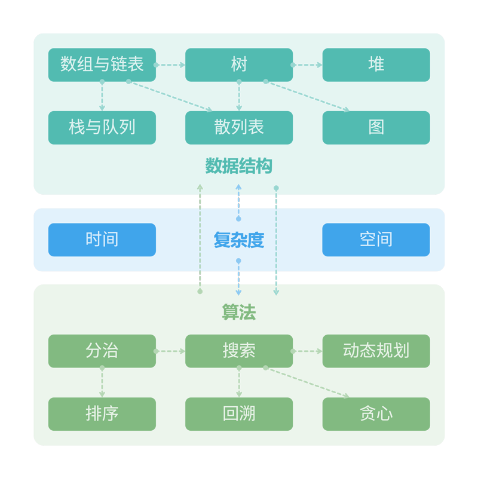

# 导言

## 1.学习的整体框架

## 2.算法的定义

> `algorithm`是指在有限时间内解决特定问题的一组指令或操作步骤

特性：

* 问题是明确的，包含清晰的输入输出
* 具有可行性，有限时间空间内完成
* 具有确定性，相同的输入和运行下，输出始终相同

## 3.数据结构的定义

> `data structure`是计算机组织和存储数据的方式

设计目标：

* 空间占用尽量少，节省内存
* 数据操作尽可能快
* 简洁的数据表示和逻辑信息，以便高效运行
* **数据结构设计是一个充满权衡的过程**。如果想要在某方面取得提升，往往需要在另一方面作出妥协

## 4.数据结构与算法的关系

二者高度相关，紧密结合

- 数据结构是算法的基石
- 算法是数据结构发挥作用的舞台

## 5.Py和C++区别

* Py：基于解释，逐行运行
* C++：基于编译（要经过编译器预处理，编译，汇编，生成可执行的二进制文件）