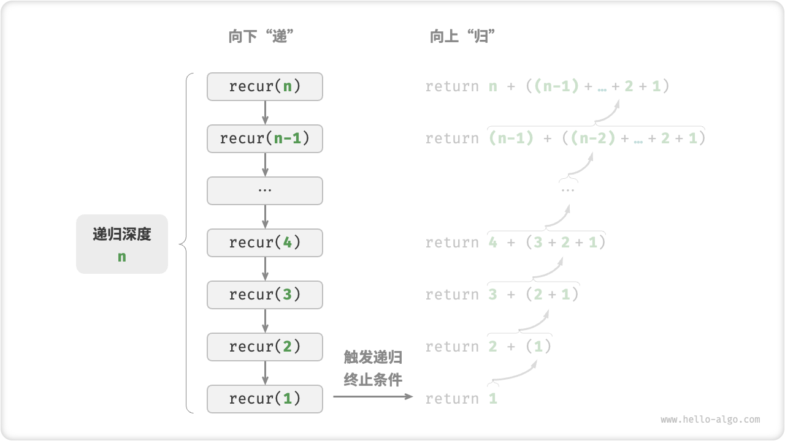
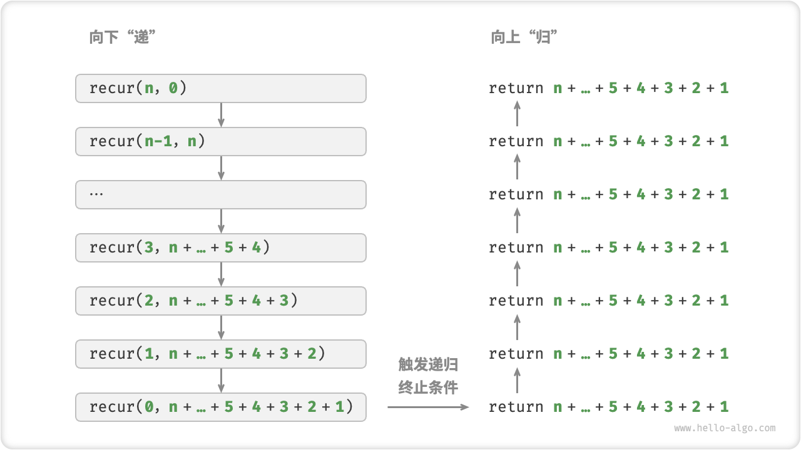
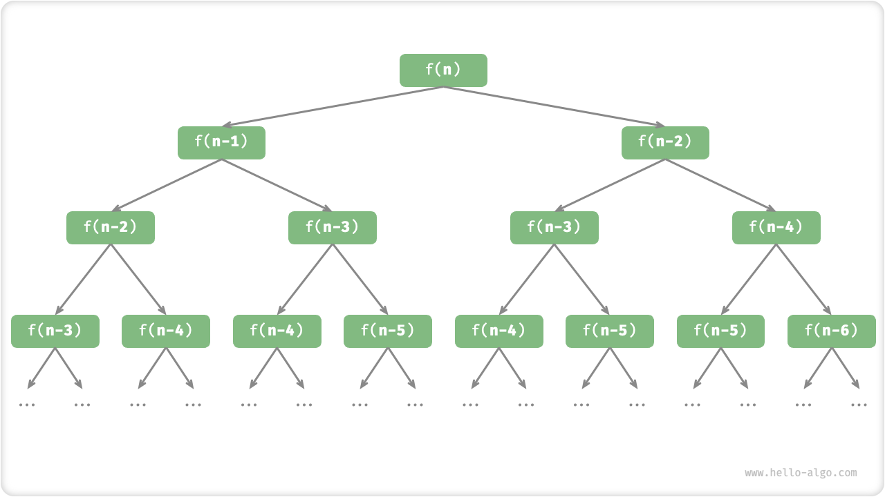

# 迭代和递归

> 在算法中，重复执行某个任务通常会选用两种基本的结构：迭代和递归


## 1.迭代

> `iteration`是一种执行某个任务的控制结构，在迭代中，程序会在一定的条件下重复执行某代码，直到条件不满足

### （1）for循环

* 最常见的迭代形式，适合预先知道迭代次数时使用

### （2）while循环

* 程序每轮都会先检查条件，若为真则继续执行，否则结束循环
* for循环的代码更加紧凑，while循环更加灵活

### （3）嵌套循环

- 在一个循环结构里嵌套另一个循环结构


## 2.递归

> `recursion`通过函数调用自身来解决问题

recursion的两个阶段：

* 递：程序不断深入的调用自己，传入更小或更简化的参数，直到终止条件
* 归：触发终止条件后，程序从最深层开始逐层返回，汇聚每一层的结果

### （1）调用栈

递归函数每次调用自身时，系统都会为新开启的函数分配内存，用以存储局部变量，调用地址和其他信息，这就导致了两方面的结果：

* 函数返回后才会被释放，故递归函数通常比迭代更加耗费内存空间
* 递归调用函数会产生额外的开销，因此递归通常比循环的时间效率更低



因此在实际中，编程语言允许的的递归深度通常是有限的，过深的递归可能会导致栈溢出报错

### （2）尾递归

如果函数在返回前的最后一步才进行递归调用，则该函数可以被编译器优化或解释器优化，使其在空间效率上与迭代相当

```cpp
/* 尾递归 */
int tailRecur(int n, int res) {
    // 终止条件
    if (n == 0)
        return res;
    // 尾递归调用
    return tailRecur(n - 1, res + n);
}
tip：
许多编译器或解释器并不支持尾递归优化。例如，Python 默认不支持尾递归优化，因此即使函数是尾递归形式，但仍然可能会遇到栈溢出问题
```



### （3）递归树

当处理与“分治”相关的算法问题时，递归往往比迭代的思路更加直观、代码更加易读，例如处理斐波那契额数列

```cpp
/* 斐波那契数列：递归 */
int fib(int n) {
    // 终止条件 f(1) = 0, f(2) = 1
    if (n == 1 || n == 2)
        return n - 1;
    // 递归调用 f(n) = f(n-1) + f(n-2)
    int res = fib(n - 1) + fib(n - 2);
    // 返回结果 f(n)
    return res;
}
```



本质上看，递归体现“将问题分解为更小子问题”的思维范式，这种分治策略是至关重要的。

- 从算法角度看，搜索、排序、回溯、分治、动态规划等许多重要算法策略都直接或间接地应用这种思维方式。
- 从数据结构角度看，递归天然适合处理链表、树和图的相关问题，因为它们非常适合用分治思想进行分析。

### （4）迭代和递归的区别

虽然迭代和递归都可以得到最后的结果，但他们代表了两种完全不同的思考和解决问题的范式

* 迭代：自下而上地解决问题，从最基础的步骤开始，然后不断重复或累加这些步骤，直到任务完成
* 递归：自上而下地解决问题，将原问题分解为更小的子问题

