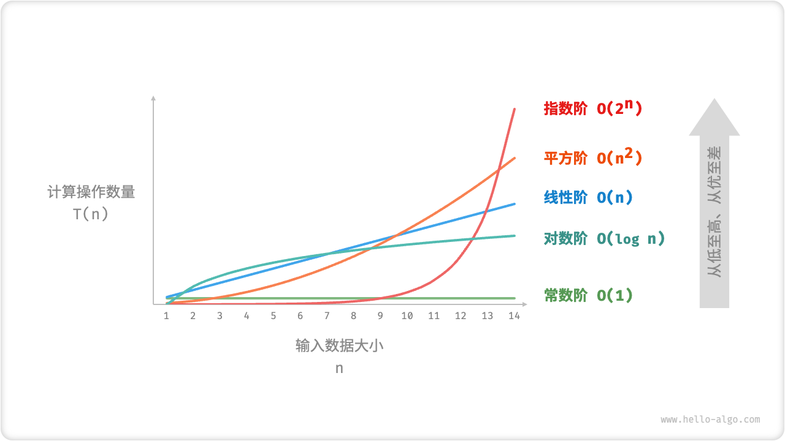

# 时间复杂度


## 1.统计时间增长趋势

时间复杂度分析并不是算法的运行时间，而是==算法运行时间随数据量变大时的增长趋势，他应该是算法中各个语句执行时间之和==

* 时间复杂度能有效评估算法效率
* 时间复杂度推算方法更简便
* 同时也存在一定的局限性


## 2.函数渐进上界

> 定义：若存在正实数$ c $和实数$ n0$ ，使得对于所有的$ n>n0$ ，均有 $T(n)≤c⋅f(n)$ ，则可认为$ f(n) $给出了$ T(n)$ 的一个渐近上界，记为 $T(n)=O(f(n)) $

给定一个输入大小为n的函数

```cpp
void algorithm(int n) {
    int a = 1;  // +1
    a = a + 1;  // +1
    a = a * 2;  // +1
    // 循环 n 次
    for (int i = 0; i < n; i++) { // +1（每轮都执行 i ++）
        cout << 0 << endl;    // +1
    }
}
```

算法的操作数量是一个关于输入数据大小 n 的函数，记为 T(n) ，则以上函数的的操作数量为：$T(n)=3+2n$

可以看出$T(n$)是一次函数，说明运行时间的增长趋势是线性的，因此它的时间复杂度是线性阶


## 3.推算方法

### （1）统计操作数量

* 忽略T(n)的常数项

* 省略所有系数

* 循环嵌套使用乘法

  ```cpp
  void algorithm(int n) {
      int a = 1;  // +0（技巧 1）
      a = a + n;  // +0（技巧 1）
      // +n（技巧 2）
      for (int i = 0; i < 5 * n + 1; i++) {
          cout << 0 << endl;
      }
      // +n*n（技巧 3）
      for (int i = 0; i < 2 * n; i++) {
          for (int j = 0; j < n + 1; j++) {
              cout << 0 << endl;
          }
      }
  }
  完整统计：T(n)=2n*(n+1)+(5n+1)+2=2*n**2+7n+3
  偷懒统计：T(n)=n**2+n
  ```

### （2）判断渐近上界

**时间复杂度由多项式 T(n)中最高阶的项来决定**。这是因为在 n 趋于无穷大时，最高阶的项将发挥主导作用，其他项的影响都可以被忽略


## 4.常见类型

`O(1)常数阶 < O(logn)对数阶 < O(n)线性阶 < O(nlogn)线性对数阶 < O(n^2)平方阶 < O(n^3)立方阶 < O(2^n)指数阶 < O(n!)阶乘阶`



### （1）常数阶

操作数量与输入数据大小无关，即不随着n的变化而变化

```cpp
/* 常数阶 */
int constant(int n) {
    int count = 0;
    int size = 100000;
    for (int i = 0; i < size; i++)//size是固定大小
        count++;
    return count;
}
尽管操作数量 size 可能很大，但由于其与输入数据大小n无关，因此时间复杂度仍为 O(1)
```

### （2）线性阶

线性阶的操作数量相对于输入数据大小 n 以线性级别增长。线性阶通常出现在单层循环中，遍历数组或列表等操作时间复杂度均为O(n),n为长度

### （3）平方阶

平方阶通常出现在嵌套循环中

### （4）指数阶

以典型的生物学的细胞分裂为例，常出现在递归函数（递归一分为二）中

```cpp
/* 指数阶（递归实现） */
int expRecur(int n) {
    if (n == 1)
        return 1;
    return expRecur(n - 1) + expRecur(n - 1) + 1;
}
```


### （5）对数阶

与指数阶相反，对数阶反映了“每轮缩减到一半”的情况

```cpp
/* 对数阶（循环实现） */
int logarithmic(float n) {
    int count = 0;
    while (n > 1) {
        n = n / 2;
        count++;
    }
    return count;
}
```

也常出现于递归函数中

```cpp
/* 对数阶（递归实现） */
int logRecur(float n) {
    if (n <= 1)
        return 0;
    return logRecur(n / 2) + 1;
}
```

对数阶常出现于基于分治策略的算法中，体现了“一分为多”和“化繁为简”的算法思想。它增长缓慢，是仅次于常数阶的理想的时间复杂度

### （6）线性对数阶

线性对数阶常出现于嵌套循环中，两层循环的时间复杂度分别为O(logn)和O(n)

```cpp
/* 线性对数阶 */
int linearLogRecur(float n) {
    if (n <= 1)
        return 1;
    int count = linearLogRecur(n / 2) + linearLogRecur(n / 2);
    for (int i = 0; i < n; i++) {
        count++;
    }
    return count;
}
```

### （7）阶乘阶

对应数学的全排列问题


## 5.针对递归方程的计算方法

### （1）递归方程求解/迭代法

* 迭代之前还可以采取换元（常用：$n=2^k$)

### （2）递归树法

* 将带$T(n)$的递归项进行拆分（或者是已经拆分好的，把自由项当作整个树的根）,如下例：

  ```
  T(n)=2T(0.5n)+n^2
  T(n)=T(n/3 + 2n/3)+n
  ```

* 每一棵递归树所有结点的值之和都等于$T(n)$：
  * 先横向求出每层结点值之和
  * 再根到叶逐层相加即得时间复杂度

### （3）特征方程法

$k$阶常系数线性递归方程可定义为：

$\begin{cases}f(n)=a_1 f(n-1)+a_2 f(n-2)+...+a_k f(n-k)\\ f(i)=b_i \end{cases}$

利用$x^n$代替$f(n)$,即可得到递归方程的递归方程：

$x^n=a_1 x^{n-1}+a_2 x^{n-2}+...+a_k x^{n-k}$

最后得到的通解：

$k$个不同的根时

$f(n)=c_1 q^n_1+c_2 q^n_2+...+c_k q^n_k$

重根：

$f(n)=(c_1 +c_2 n)q^n$

* 先求出特征方程的根，得到递归方程的通解，再利用递归方程的初始条件确定同届的待定系数，从而得到递归方程的解
