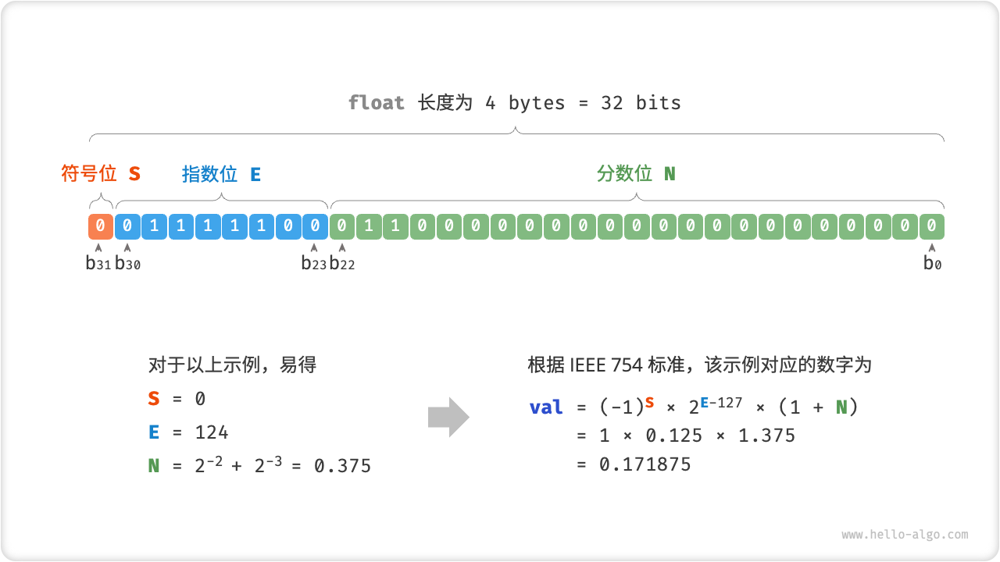

# 数字编码

## 1.整数编码

> 从上一节表格可以发现，所有的整数类型能表示的负数都比正数多一个，这其中内在原因涉及原码，反码，补码的知识

==数字是以补码的形式存储在计算机中的==

计算机内部的硬件电路主要是基于加法运算设计的

### （1）原码

将数字的二进制表示的最高位视为符号位，0表示正数，1表示负数，其余位表示数字的值（局限性，负数的原码不能直接用于计算）

### （2）反码

正数的反码与原码相同，负数的反码是对其原码除符号位外所有位取反

### （3）补码

正数的补码与原码相同，负数的补码是在反码的基础上加1（解决正负0的歧义问题，这样八位的0的补码都是0000 0000，但计算机规定这个特殊的补码1 0000 0000代表-128）

## 2.浮点数编码

> 虽然int和float长度相同都是4bytes，但float的取值范围远大于int，这是因为float采用了不同的表示方法

记一个 32-bit 长度的二进制数为：

b~31~b~30~...b~2~b~1~b~0~

根据 IEEE 754 标准，32-bit 长度的 `float` 由以下三个部分构成。

- 符号位 S ：占 1 bit ，对应 b~31~ 
- 指数位 E ：占 8 bits ，对应 b~30~b~29~…b~23~ 
- 分数位 N ：占 23 bits ，对应 b~22~b~21~…b~0~ 

双精度 `double` 也采用类似 `float` 的表示方法