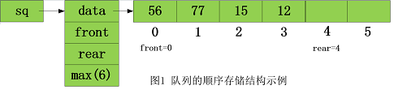
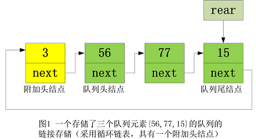

# 队列

> 「队列 queue」是一种遵循先入先出规则的线性数据结构。顾名思义，队列模拟了排队现象，即新来的人不断加入队列的尾部，而位于队列头部的人逐个离开

## 1.队列的实现

* 使用数组实现队列的顺序存储：
  * data：队列存储空间的起始位置
  * front,rear：头，尾指针
  * max：最多可存储元素个数

* 使用链表实现队列的链接存储：
  * 为空队列时，附加头结点数据为0，rear指向头结点

## 2.循环队列

顺序队列中，由于数组申请的空间大小有限，当进行一系列的入队出队操作后，队尾指针可能增加到所分配的连续空间之外，此时队列无法再插入新的元素，但这时往往还有大量可用空间未被占用，这些空间时已经出队的队列元素曾经占用过的存储单元。

所以我们对传统的队列使用方法稍加改进：

* 当头或尾指针越出所分配的队列空间时，就让他指向这片连续空间的起始位置
* 其实这样就把队列当作成了一个环形的空间，这种队列也叫做循环队列
* 通常为了区分队列为空和队列为慢的情况，规定循环队列最多有$maxsize-1$个元素，当循环队列只剩下一个空存储单元时，队列就已经满了

## 3.优先级队列

优先级队列在获取数据时（取出/出队）就不是获取队列头部的数据了，而是获取优先级最高的数据，入队的元素仍然顺序从队尾插入

## 3.队列典型应用

* 电商订单
* 各类待办事项