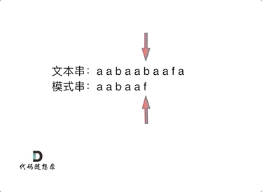
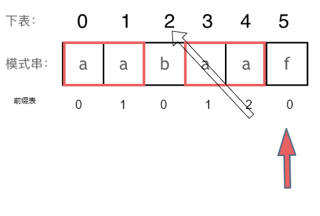
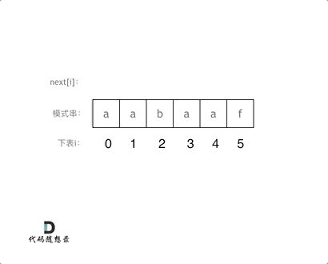

# KMP匹配算法



## 1. KMP由来

说到KMP，先说一下KMP这个名字是怎么来的，这是因为KMP算法是由这三位学者发明的：Knuth，Morris和Pratt，所以取了三位学者名字的首字母，所以叫做KMP

KMP算法主要解决两个问题，一是当比较出现不等时，确定P应该右移多少字符，其二是右移后，P中的哪个字符与刚刚T中比较时不相等的那个字符处继续开始比较，解决了这两个问题，也就消除了**回溯**

 

## 2. 前缀表

next数组就是一个前缀表（prefix table），它**记录了模式串pattern与主串(文本串)text不匹配的时候，模式串应该从哪里开始重新匹配，即在匹配失败的时候，p中可以跳过的匹配字符个数**

* 前缀：不包含尾字符的所有以首字符开头的连续字串
* 后缀：不包含首字符的所有以尾字符结尾的连续字串
* 前/后缀式都是从左往右看


### （1）最长相等前后缀

```
a 0
aa 1
aab 0
aaba 1
aabaa 2
aabaaf 0
故a a b a a f的前缀表为
  0 1 0 1 2 0
```

**当与T匹配冲突时，找到冲突前一位对应的前缀表中的数，再去对应的模式串中下标为该数的字符**



### （2）前缀表与next数组

很多KMP算法的实现都是使用next数组来做回退操作，那么next数组与前缀表有什么关系呢？

next数组就可以是前缀表，但是很多实现都是把前缀表统一减一（右移一位，初始位置为-1）之后作为next数组

其实**这并不涉及到KMP的原理，而是具体实现，next数组既可以就是前缀表，也可以是前缀表统一减一（右移一位，初始位置为-1）**

**以下以前缀表统一减一之后的next数组来做演示**


## 3. 构造next数组



定义两个指针i和j，j指向前缀末尾位置，i指向后缀末尾位置，next[i]为j值，指针i永不走回头路
