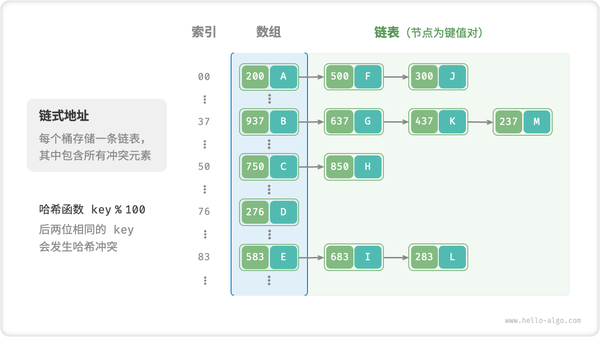

# 哈希冲突

> 尽管我们可以每遇到哈希冲突时就进行哈希表扩容，直到冲突消失为止，虽然该方法简单粗暴有效，但是效率太低，我们可以改良哈希表数据结构，使得哈希表可以在存在哈希冲突时正常工作

## 1.链式地址

在原始哈希表中，每个桶仅能存储一个键值对。「链式地址 separate chaining」将单个元素转换为链表，将键值对作为链表节点，将所有发生冲突的键值对都存储在同一链表中

故操作方法也发生了以下变化（都是先访问链表头节点）：

* 查询元素：输入key，通过哈希函数得到桶索引，即可访问链表头节点，然后遍历链表对比key查找
* 添加元素
* 删除元素

局限性：

* 占用空间增大：链表包含节点指针，比数组更加耗费内存空间
* 查找效率降低：要线性遍历链表来查找对应元素

## 2.开放寻址

开放寻址 open addressing 不引入额外的数据结构，而是通过“多次探测”来处理哈希冲突，探测方式主要包括线性探测、平方探测、多次哈希等

### （1）线性探测

线性探测采用固定步长的线性搜索来进行探测

* 插入元素：哈希函数计算索引，若发现桶内有元素，则从冲突位置向后线性遍历，直至找到空桶，将元素插入其中
* 查找元素：若发现哈希冲突，则使用相同步长（通常为1）向后线性遍历，直到找到对应元素

然而，线性探测容易产生聚集现象，导致恶性循环

### （2）平方探测

与线性探测类似，只是发生冲突时，平方探测不是简单的跳过一个固定的步数，而是跳过探测次数的平方的步数，即1，4，9...

### （3）多次哈希

多次哈希使用多个哈希函数进行探测