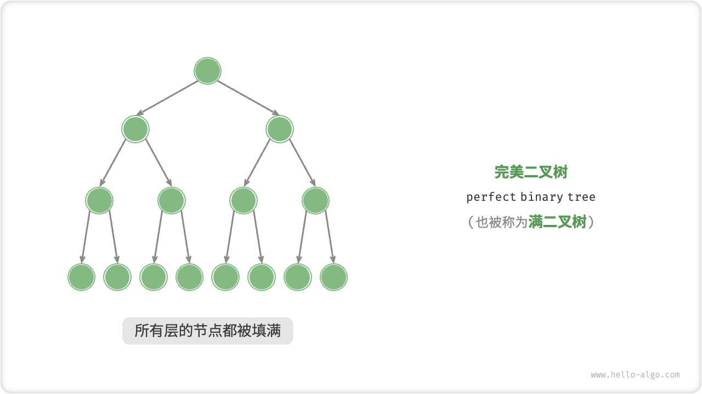
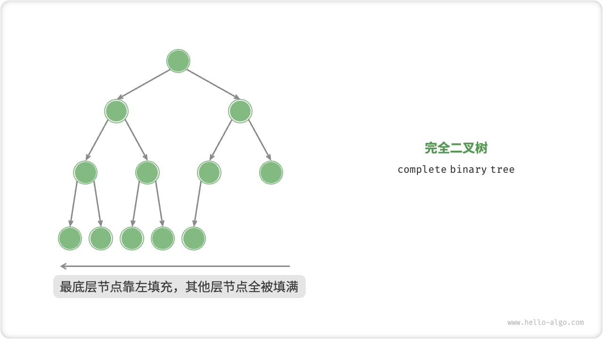
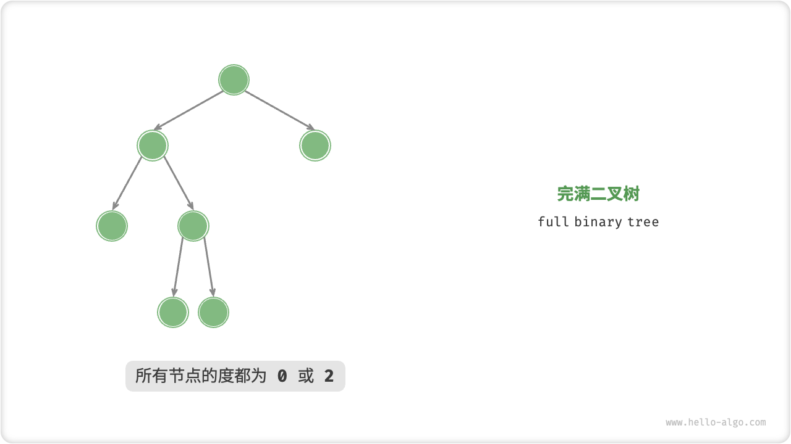
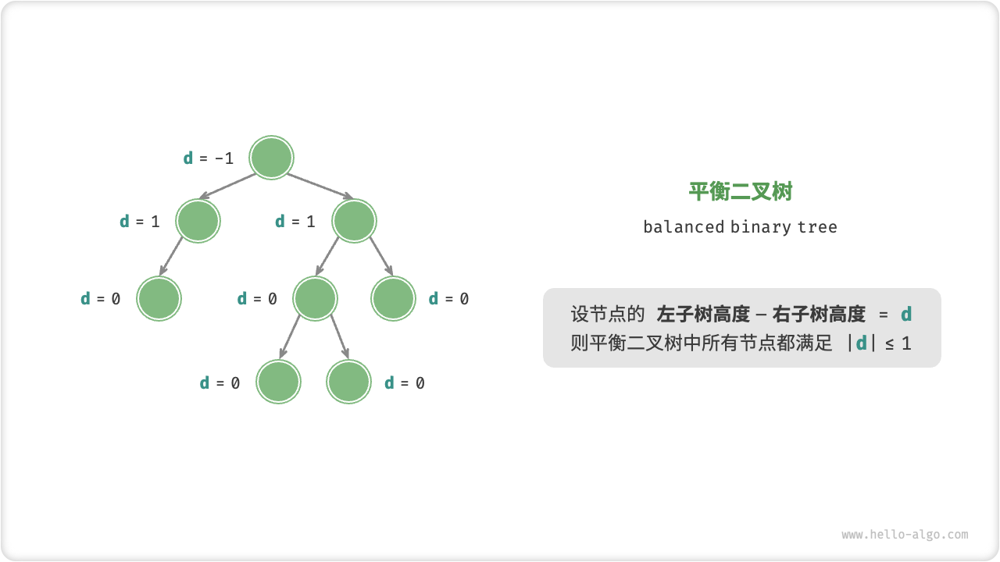
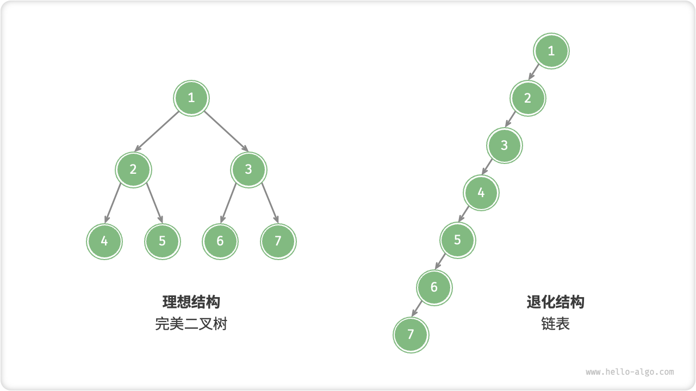

# 二叉树

> 「二叉树 binary tree」是一种非线性数据结构，代表着祖先与后代之间的派生关系，体现着“一分为二”的分治逻辑。与链表类似，二叉树的基本单元是节点，每个节点包含：值、左子节点引用、右子节点引用
>
> ```cpp
> /* 二叉树节点结构体 */
> struct TreeNode {
>     int val;          // 节点值
>     TreeNode *left;   // 左子节点指针
>     TreeNode *right;  // 右子节点指针
>     TreeNode(int x) : val(x), left(nullptr), right(nullptr) {}
> };
> ```
>
> 每个节点都有两个引用（指针），分别指向「左子节点 left-child node」和「右子节点 right-child node」，该节点被称为这两个子节点的「父节点 parent node」。当给定一个二叉树的节点时，我们将该节点的左子节点及其以下节点形成的树称为该节点的「左子树 left subtree」，同理可得「右子树 right subtree」


## 1.二叉树常见术语

> 类比楼的高度，和水的深度，从下往上看和从上往下看,从根节点到看叶节点（从顶看底）是深度，从叶节点看根节点（从底看顶）是高度

- 「根节点 root node」：位于二叉树顶层的节点，没有父节点。
- 「叶节点 leaf node」：没有子节点的节点，其两个指针均指向 None 。
- 「边 edge」：连接两个节点的线段，即节点引用（指针）。
- 节点所在的「层 level」：从顶至底递增，根节点所在层为 1 。
- 节点的「度 degree」：节点的子节点的数量。在二叉树中，度的取值范围是 0、1、2 。
- 二叉树的「高度 height」：从根节点到最远叶节点所经过的边的数量。
- 节点的「深度 depth」：从根节点到该节点所经过的边的数量。
- 节点的「高度 height」：从最远叶节点到该节点所经过的边的数量。


## 2.二叉树基本操作

### （1）初始化

```cpp
// 初始化节点
TreeNode* n1 = new TreeNode(1);
TreeNode* n2 = new TreeNode(2);
TreeNode* n3 = new TreeNode(3);
TreeNode* n4 = new TreeNode(4);
TreeNode* n5 = new TreeNode(5);
// 构建引用指向（即指针）
n1->left = n2;
n1->right = n3;
n2->left = n4;
n2->right = n5;
```

### （2）插入与删除

注意：插入节点可能会改变二叉树的原有逻辑结构，而删除节点通常意味着删除该节点及其所有子树。因此，在二叉树中，插入与删除操作通常是由一套操作配合完成的，以实现有实际意义的操作


## 3.常见二叉树类型

### （1）完美二叉树

「完美二叉树 perfect binary tree」或者称为「满二叉树」所有层的节点都被完全填满。在完美二叉树中，叶节点的度为 0 ，其余所有节点的度都为 2 ；若树高度为 ℎ ，则节点总数为 2^ℎ+1^−1 （等比数列求和），呈现标准的指数级关系，反映了自然界中常见的细胞分裂现象



### （2）完全二叉树

「完全二叉树 complete binary tree」只有最底层的节点未被填满，且最底层节点尽量靠左填充



### （3）完满二叉树

「完满二叉树 full binary tree」除了叶节点之外，其余所有节点都有两个子节点



### （4）平衡二叉树

「平衡二叉树 balanced binary tree」中任意节点的左子树和右子树的高度之差的绝对值不超过 1




## 4.二叉树的退化

当二叉树的每层节点都被填满时，达到“完美二叉树”；而当所有节点都偏向一侧时，二叉树退化为“链表”

- 完美二叉树是理想情况，可以充分发挥二叉树“分治”的优势。
- 链表则是另一个极端，各项操作都变为线性操作，时间复杂度退化至 $O(n)$ 。



二叉树的最佳与最差情况

|                         |     完美二叉树     |  链表   |
| :---------------------: | :----------------: | :-----: |
|   第 $i$ 层的节点数量   |     $2^{i-1}$      |   $1$   |
| 高度 $h$ 树的叶节点数量 |       $2^h$        |   $1$   |
|  高度 $h$ 树的节点总数  |   $2^{h+1} - 1$    | $h + 1$ |
|  节点总数 $n$ 树的高度  | $\log_2 (n+1) - 1$ | $n - 1$ |

