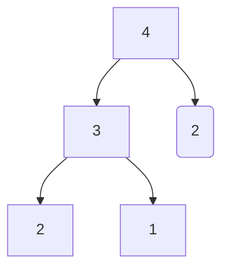

# 递归

[TOC]

## 1.递归入门

### 编写一个递归函数

* 递归就是在过程或函数中调用自己

* 为了避免出现死循环，在使用递归策略时，必须有一个明确的递归结束条件，即出口

  

### 		计算阶乘

```cpp
int fac(int x)
{
	if (x == 0 or x == 1)
		return 1;
	else
		return x * fac(x - 1);
}
```


### 		辗转相除法（欧几里得算法）

定理：两个正整数a和b，它们的最大公约数等于a除以b的余数c和b之间的最大公约数

```cpp
int gcd(int a, int b)
{
    if (a % b == 0) return b;
    else return gcd(b, a % b);
}
```

### 例题：走楼梯

```m
题目：
一个台阶一共有n级，如果一次可以跳1级，也可以跳2级，求总共有多少种总跳法
```

```cpp
int solve(int x)
{
    if (x == 1) return 1;
    if (x == 2) return 2;
    else
        return solve(x - 1) + solve(x - 2);//类似于斐波那契数列
}
```



