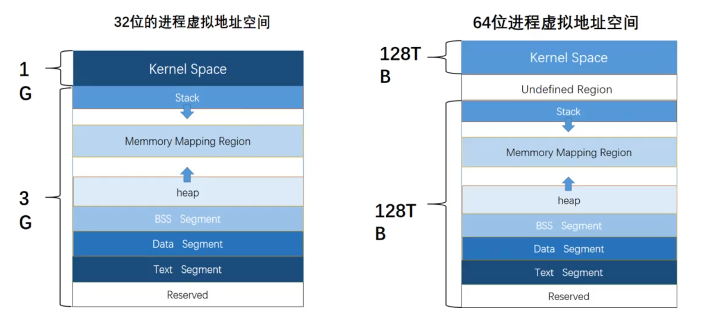

# 可执行文件

## 1.什么是可执行文件？

* 广义
  * 文件中的数据是可执行代码的文件
  * .out、.exe、.sh、.py
* 狭义
  * 文件中的数据是机器码的文件
  * .out、.exe、.dll、.so

## 2.可执行文件的分类

* Windows:PE (Portable Executable)
  * 可执行程序.exe
  * 动态链接库.dll
  * 静态链接库.lib
* Linux:ELF (Executable and Linkable Format)
  * 可执行程序.out
  * 动态链接库（共享库shared libery）.so
  * 静态链接库.a

