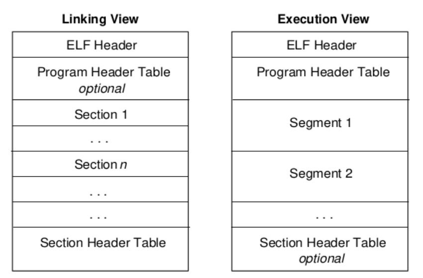
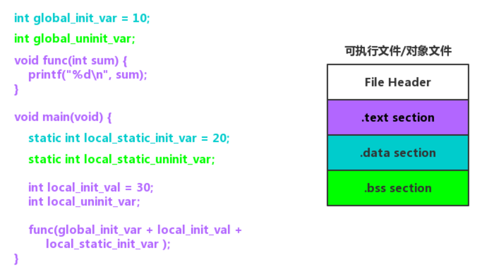

# ELF文件概述

## 1.ELF文件类型

ELF （Executable and Linkable Format）文件，也就是在 Linux 中的目标文件，主要有以下四种类型：

- 可执行文件（Executable File）.exec)：就是我们通常在 Linux 中执行的程序，一般都没有扩展名
- 可重定位文件（Relocatable File）.rel)：包含由编译器生成的代码以及数据 而且尚未链接的目标文件。链接器会将它与其它目标文件链接起来从而创建可执行文件或者共享目标文件。在 Linux 系统中，这种文件的后缀一般为 `.o` 。
- 共享目标文件（Shared Object File）.dyn)：包含代码和数据，这种文件是我们所称的库文件，一般以 `.so` 结尾。一般情况下，它有以下两种使用情景：
  - 链接器（Link eDitor, ld）可能会处理它和其它可重定位文件以及共享目标文件，生成另外一个目标文件
  - 动态链接器（Dynamic Linker）将它与可执行文件以及其它共享目标组合在一起生成进程镜像
- 内核转储(core dumps)，存放当前进程的执行上下文，用于dump信号触发，作为进程意外终止时进程地址空间的转储

## 2.ELF文件结构

ELF 结构相关信息在 `/usr/include/elf.h`（源文件在本目录下）

审视一个目标文件时，有两种视角可供选择:

* 链接视角，通过**节（section）**进行划分
* 运行视角，通过**段（segment）**进行划分

### 2.1链接视角

* 文件开始处是 ELF 头部（ **ELF Header**），它给出了整个文件的组织情况。

* 如果程序头部表（Program Header Table）存在的话，它会告诉系统如何创建进程。用于生成进程的目标文件必须具有程序头部表，但是重定位文件不需要这个表

* 节区部分包含在链接视图中要使用的大部分信息：指令、数据、符号表、重定位信息等等。通常目标文件都会包含3种节：
  * **代码（.text）：**保存可执行的机器指令（可执行指令的集合）
  * **数据（.data）：**保存已初始化的全局变量和局部静态变量（初始化后数据的集合）
  * **BSS (.bss) ：**保存未初始化的全局变量和局部静态变量（未初始化数据的集合）Block Started by Symbol
  
  从可执行文件的角度来讲，如果一个数据未被初始化那就不需要为其分配空间，所以.data和.bss一个重要的区别就是.bss并不占用可执行文件的大小（磁盘空间），它只是记载需要多少空间（内存空间）来存储这些未初始化数据，而不分配实际的空间

* 节区头部表（Section Header Table）包含了描述文件节区的信息，每个节区在表中都有一个表项，会给出节区名称、节区大小等信息。用于链接的目标文件必须有节区头部表，其它目标文件则无所谓，可以有，也可以没有。

> 将程序指令和程序数据分开来存放有许多好处，从安全的角度来看，当程序被加载后，数据和指令被分别映射到两个虚拟区域，对进程来说，数据区是可读写的，指令区是只读的，这样防止程序的指令被改写和利用
>
> **注意：** 尽管图中显示的各个组成部分是有顺序的，实际上除了 ELF 头部表以外， 其他节区和段都没有规定的顺序

### 2.2 执行视角

其主要的不同点在于没有了 section，而有了多个 segment。其实这里的 segment 大都是来源于链接视图中的 section

## 3.ELF文件相关参考

* https://ctf-wiki.org/executable/elf/structure/basic-info/#program-header-table
* https://www.cntofu.com/book/114/Theory/ELF.md
* https://firmianay.gitbooks.io/ctf-all-in-one/content/doc/1.5.3_elf.html
* https://zhuanlan.zhihu.com/p/544198038