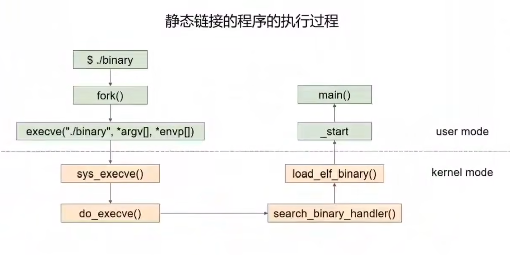
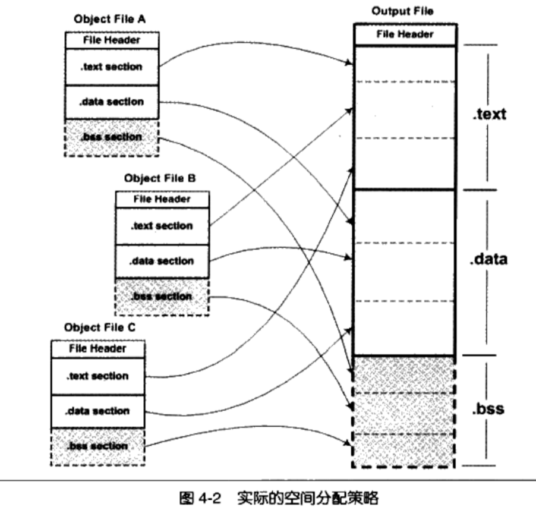
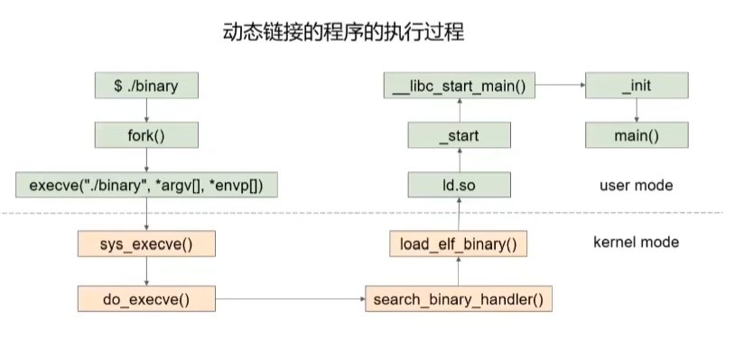
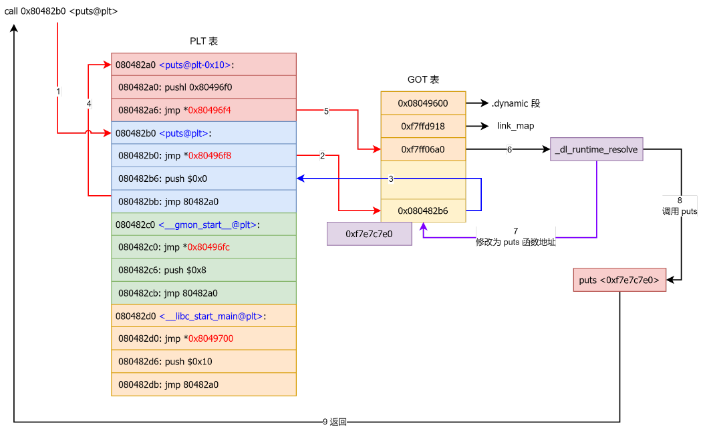
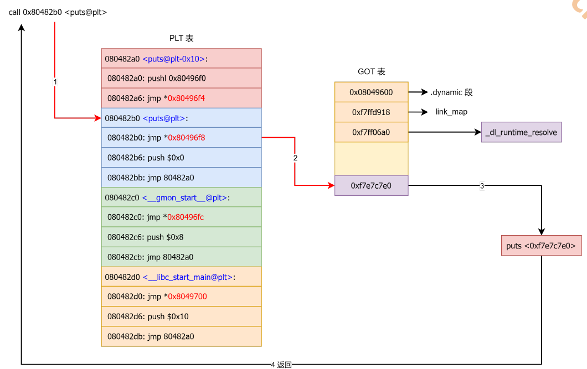

#  编译，链接，装载，执行


## 1.预编译

```shell
gcc -E hello.c -o hello.i
```

处理规则：

* 展开以`#`开始的预编译指令
* 删掉所有的注释
* 添加行号和文件标识，用于编译时产生编译的错误或警告时能显示行号
* 保留i所有的`#pragma`编译器指令


## 2.编译

```shell
gcc -S hello.i -o hello.s -masm=intel
```

编译过程就是把预处理完的文件进行一系列词法分析、语法分析、语义分析及优化后生产相应的汇编代码文件


## 3.汇编

```shell
gcc -c hello.s -o hello.o
```

将汇编代码转变成机器可执行的指令，只需要根据汇编指令和机器指令的对照表翻译就可以了


## 4.链接

### 4.1 静态链接



#### 4.1.1 空间与地址的分配

**相似段合并**的链接过程：

* **空间与地址分配**：扫描所有的输入目标文件，并获得它们的各个段的长度、属性和位置,  并且将输入目标文件中的符号表中所有的符号定义和符号引用收集起来，统一放到一个全局符号表。这一步中，链接器将能够获得所有输入目标文件的段长度，并且将它们合并，计算出输出文件中各个段合并后的长度与位置，并建立映射关系
* **符号解析与重定位** 使用上面第一步中收集到的所有信息，读取输入文件中段的数据、重定位信息，并且进行符号解析与重定位、调整代码中的地址等。事实上第二步是链接过程的核心，特别是重定位过程



目标文件链接之前，所有段的 VMA 都是 0，因为虚拟空间还没有被分配，所以它们默认都为 0。等到链接之后，可执行文件中的各个段都被分配到了相应的虚拟地址

VMA 表示Virtual Memory Address, 即虚拟地址，LMA 表示 Load Memory Address，即加载地址

#### 4.1.2 符号解析与重定位

* 重定位表说明哪个符号需要修复，符号表说明这些符号是在哪里
* `strip` 命令可取出文件符号表

#### 4.1.3 解析外部依赖关系

* 将外部库文件（如libc.a）链接到最终的可执行文件或静态库当中

#### 4.1.4 制作签名文件

* 可以用libc制作签名文件用来识别匹配ida里function的名字

### 4.2 动态链接

把链接过程推迟到运行时再进行



#### 4.2.1 动态链接相关段

* .interp 段
  在动态链接的 ELF 可执行文件中，有一个专门的段叫 .interp（“interp”是“interpreter”（解释器）的缩写）。.interp 的内容很简单，里面保存的就是一个字符串/lib64/ld-linux-x86-64.so.2 ，这个字符串就是可执行文件所需要的动态链接器的路径。通常系统通过判断一个 ELF 程序是否有 .interp 来判断该 ELF 文件是否为动态链接程序
* .dynamic 段
  动态链接 ELF 中最重要的结构是 .dynamic 段，这个段里面保存了动态链接器所需要的基本信息，比如依赖于哪些共享对象、动态链接符号表的位置、动态链接重定位表的位置、共享对象初始化代码的地址
  等
  * DT_SYMTAB ：指定了符号表的地址， d_ptr 表示 .dynsym 的地址
  * DT_STRTAB ：指定了字符串表的地址， d_ptr 表示 .synstr 的地址
  * DT_STRSZ ：指定了字符串表的大小， d_val 表示大小
  * DT_HASH ：指定了符号哈希表的地址，用于加快符号查找的速度， d_ptr 表示 .hash 的地址
  * DT_SONAME ：指定了共享库的名称
  * DT_RPATH ：指定了库搜索路径（已废弃，不推荐使用）
  * DT_INIT ：指定了初始化函数的地址，动态链接器在加载可执行文件或共享库时会调用该函数
  * DT_FINI ：指定了终止函数的地址，动态链接器在程序结束时会调用该函数
  * DT_NEEDED ：指定了需要的共享库的名称
  * DT_REL/DT_RELA ：指定了重定位表的地址
* 静态符号表（.symtab）（symbol table）,动态符号表（.dynsym）（dynamic symbol）,.symtab中保存了所有符号，包括.dynsym的符号。
* 静态链接——字符串表.strtab，动态字符串表.dynstr
* 动态链接下为了加速符号的查找往往还有辅助的符号哈希表.hash

#### 4.2.2 PLT与GOT表


- PLT : 程序链接表（PLT，Procedure Link Table）

  过程链接表的作用是将位置无关的符号转移到绝对地址。当一个外部符号被调用时，PLT 去引用 GOT 中的其符号对应的绝对地址，然后转入并执行

- GOT : 全局偏移表（GOT, Global Offset Table）

  记录在 ELF 文件中所用到的共享库中符号的`绝对(真实)地址`。在程序刚开始运行时，GOT 表项是空的，当符号`第一次被调用时`会动态解析符号的绝对地址然后转去执行，并将被解析符号的绝对地址记录在 GOT 中，第二次调用同一符号时，由于 GOT 中已经记录了其绝对地址，`直接`转去执行即可
  
  `.got`节保存全局变量偏移表，`.got.plt`节保存全局函数偏移表

#### 4.2.3 延迟绑定

在动态链接下，程序加载的模块中包含了大量的函数调用，因此动态链接器会耗费很多的时间用于解决模块之间的函数引用的符号查找以及重定位（Relocate），而实际上只有很少的一部分符号会被立刻访问。延迟绑定通过**将函数地址的绑定推迟到第一次调用这个函数时**，从而避免动态链接器在加载时处理大量函数引用的重定位。

**注意**，延迟绑定一般只出先在未开启 FULL RELRO 的时候，如果开启 FULL RELRO 则 got 表不可写，程序在装载时完成got表的重定位。当然特殊情况也有在开启 FULL RELRO 的时候进行重定位，比如ret2dlresolve

* 首先第一次调用 puts 时由于 puts@got 没有进行重定位，因此会调用 _dl_runtime_resolve 函数进行重定位， _dl_runtime_resolve 函数将查找到的 puts 函数地址填写到 puts@got 后会调用puts 函数。
* got[0]：address of .dynamic p 也就是本ELF动态段(.dynamic段）的装载地址
  got[1]：address of link_map object(编译时填充0）也就是本ELF的link_map数据结构描述符地址，作用：link_map结构，结合.rel.plt段的偏移量，才能真正找到该elf的.rel.plt表项。
  got[2]：address of _dl_runtime_resolve function (编译时填充为0) 也就是_dl_runtime_resolve函数的地址，来得到真正的函数地址，回写到对应的got表位置中。



* 再次调用 puts 函数时由于 puts@got 已经完成重定位，因此会直接调用 puts 函数

  采取的是`jmp    dword ptr [got表中的地址]`的形式



| section  | 所在 segment | section 属性       | 用途                                                         |
| :------- | :----------- | :----------------- | :----------------------------------------------------------- |
| .plt     | 代码段       | RE（可读，可执行） | .plt section 实际就是通常所说的过程链接表（Procedure Linkage Table, PLT） |
| .plt.got | 代码段       | RE                 | .plt.got section 用于存放 __cxa_finalize 函数对应的 PLT 条目 |
| .got     | 数据段       | RW（可读，可写）   | .got section 中可以用于存放全局变量的地址；.got section 中也可以用于存放不需要延迟绑定的函数的地址。 |
| .got.plt | 数据段       | RW                 | .got.plt section 用于存放需要延迟绑定的函数的地址            |

## 5.装载

bash进程先调用`fork()`调用创建一个新进程，然后调用` execve()`，linux内核开始真正的装载工作，开始判断文件类型（根据magic number），调用装载处理类型
