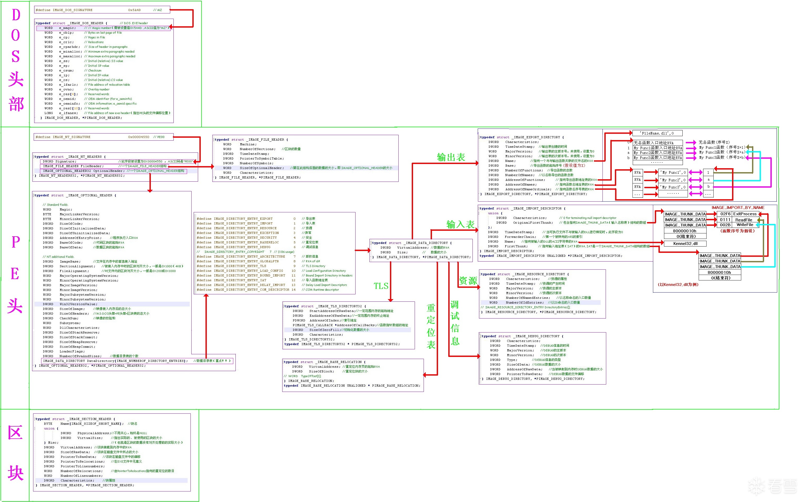
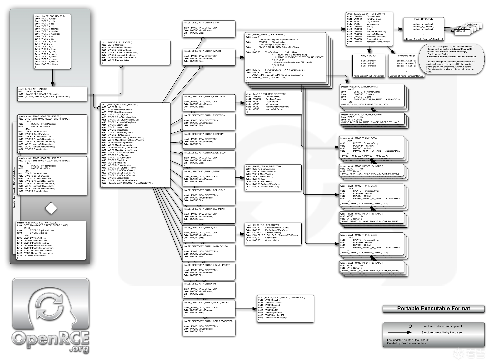
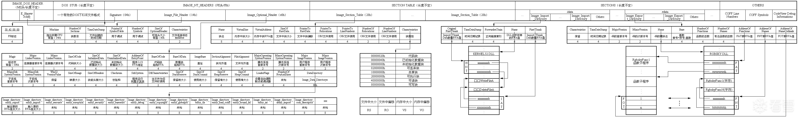
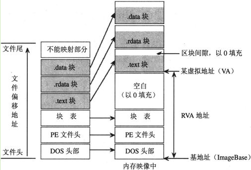

# PE文件

> Windows 操作系统下的可执行程序使用PE 文件格式。PE 文件是portable File Format Format（可移植文件）的简写，DLL 和exe 文件都是PE 文件
>
> PE文件是指 32 位可执行文件，也称为PE32。64位的可执行文件称为 PE+ 或 PE32+，是PE(PE32)的一种扩展形式（请注意不是PE64)，没有新的结构加入，只是简单地将以前32位字段扩展成64位

先给出三张全局性的图片，具体内容可放大查看：







## 1.基本概述

PE文件使用的是一个平面地址空间，所有代码和数据都被合并在一起，组成一个很大的结构。文件的内容被分割为不同的区块（Section，又称区段、节等），区块中包含代码或数据，各个区块按页边界来对齐，区块没有大小限制，是一个连续结构。每个块都有它自己在内存中的一套属性，比如：这个块是否包含代码、是否只读或可读/写等



PE文件的执行顺序：

* PE 装载器 首先检查 DOS header 里的 PE header 的偏移量。如果找到，则直接跳转到 PE header 的位置
* PE装载器 跳转到 PE header 后，第二步要做的就是检查 PE header 是否有效。如果该 PE header 有效，就跳转到 PE header 的尾部
* 紧跟 PE header 尾部的是节表。PE装载器执行完第二步后开始读取节表中的节段信息，并采用文件映射（ 在执行一个PE文件的时候，Windows并不在一开始就将整个文件读入内存，而是采用与内存映射的机制，也就是说，**Windows装载器在装载的时候仅仅建立好虚拟地址和PE文件之间的映射关系，只有真正执行到某个内存页中的指令或者访问某一页中的数据时，这个页面才会被从磁盘提交到物理内存**，这种机制使文件装入的速度和文件大小没有太大的关系 ）的方法将这些节段映射到内存，**同时附上节表里指定节段的读写属性**
* PE文件映射入内存后，PE装载器将继续处理PE文件中类似 import table （输入表）的逻辑部分

地址：

- **ImageBase**：映射基址，PE 文件在内存空间中的映射起始位置，是个 VA 地址
- **VA**：Virtual Address，基址，VA = ImageBase + RVA
- **RVA**：Relatively Virtual Address。偏移（又称“相对虚拟地址”）。相对镜像基址的偏移
- **FOA**：File Offset Address，文件偏移地址，是相对于文件起始位置的偏移量，用于定位可执行文件中的数据和代码在文件中的位置。通过将文件偏移地址和节表中的指定节的起始位置相加，可以计算出相应的FOA。
  - 差值偏移 = RVA - 节.VirtualAddress 
  - FOA = 差值偏移 + 节.PointerToRawData 


## 2.文件头

### 2.1 DOS头

重点关注的两个对象：

* e_magic：一个 WORD 类型，值是一个常数 0x4D5A，用文本编辑器查看该值位‘MZ’，可执行文件必须都是'MZ'开头
* e_lfanew：为 32 位可执行文件扩展的域，用来表示 DOS头之后的 NT头相对文件起始地址的偏移

### 2.2 NT头（PE头）

```c
typedef struct _IMAGE_NT_HEADERS {
    DWORD Signature;
    IMAGE_FILE_HEADER FileHeader;
    IMAGE_OPTIONAL_HEADER32 OptionalHeader;
} IMAGE_NT_HEADERS32, *PIMAGE_NT_HEADERS32;
```

#### 2.2.1 PE签名

类似于 DOS头中的 e_magic，其高16位是0，低16是0x4550，用字符表示是 PE

#### 2.2.2 PE文件头

```c
typedef struct _IMAGE_FILE_HEADER {
    WORD    Machine; //文件运行平台
    WORD    NumberOfSections; //节数量
    DWORD   TimeDateStamp; //PE文件创建时间
    DWORD   PointerToSymbolTable; //COFF文件符号表在文件中的偏移
    DWORD   NumberOfSymbols; //符号表数量
    WORD    SizeOfOptionalHeader; //可选头大小
    WORD    Characteristics; //可执行文件属性
} IMAGE_FILE_HEADER, *PIMAGE_FILE_HEADER;
```

#### 2.2.3 PE可选头

虽然叫可选头，但很丰富重要，但不同的平台下是不一样的，例如32位下是IMAGE_OPTIONAL_HEADER32，而在64位下是IMAGE_OPTIONAL_HEADER64

### 2.3 节头

| 节名       | 内容                                 |
| ---------- | ------------------------------------ |
| .bss       | 未初始化的数据                       |
| **.data**  | **代码节**                           |
| **.edata** | **导出表**                           |
| **.idata** | **导入表**                           |
| .idlsym    | 包含已注册的SEH，它们用以支持IDL属性 |
| .pdata     | 异常信息                             |
| **.rdata** | **只读的已初始化数据（用于常量）**   |
| **.reloc** | **重定位信息**                       |
| **.rsrc**  | **资源目录**                         |
| .sbss      | 与GP相关的未初始化数据               |
| .sdata     | 与GP相关的已初始化数据               |
| .srdata    | 与GP相关的只读数据                   |
| **.text**  | **默认代码节**                       |
