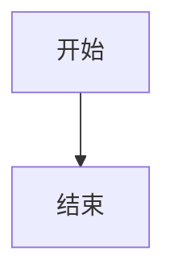
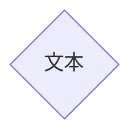

# 流程图（float chart）

> 流程图（flow chart）是体现封闭系统运动状态的有效展示形式，可以让管理者、实现者清晰的认识系统运转流程，也可以直观的描述工作过程。


[TOC]


## 1.基本的流程图

流程图由几何图形节点及连接线组成。几何图形节点是流程图内的各元素的载体，通常用形状来区分其属性，例如圆形代表开始或结束、菱形代表判断等。连接线用于描述几何图形节点之间的联系，可能是有向线段，也可能是无向线段等。

在 Markdown 中添加 Mermaid 图形，需要声明 Mermaid 类型的代码块，代码如下：

~~~
```mermaid
<!-- 此处的内容会被渲染成 mermaid 图形 -->
```
代码块123
~~~

基本的流程图包含：流程图布局方向、几何图形和连接线三个部分组成。


### 基本竖向流程图

````

````


### 基本横向流程图

````

````


### 支持的方向

| 标志 |         方向         |
| :--: | :------------------: |
|  TB  | （top bottom）上到下 |
|  BT  | （bottom top）下到上 |
|  RL  |        右到左        |
|  LR  |        左到右        |
|  TD  |       等同于TD       |


## 2.几何图形结点

结点是流程图的核心元素，其要素包括形状和内容

### 默认的结点

````

````


### 分离结点ID与内容

````

````


### 结点的形状

* 圆角形结点

````

````


* 圆形结点

````

````


* 非对称形结点

````

````


* 菱形结点

````

````


* 六角形结点

````

````


## 3.连接线

在流程图中，不同结点之间需要通过连接线来描述其相关性

### 基本连接线

````

````

```mermaid
graph LR
	A-->B
```

### 无向线段连接线

````
```mermaid
graph LR
	A---B--带文字连接线---C
```
````

```mermaid
graph LR
	A---B--带文字连接线---C
```

### 点状连接性线

````
```mermaid
graph LR
	A-.-B-.带文字连接线.->c
```
````

```mermaid
graph LR
	A-.-B-.带文字连接线.->c
```

### 粗实连接线

````
```mermaid
graph LR
	A==>B==带文字连接线==>C
```
````

```mermaid
graph LR
	A==>B==带文字连接线==>C
```

## 4.视图分组

````
```mermaid
graph TB
	c1-->a2
	subgraph 第一组
	a1-->a2
	end
	subgraph 第二组
	c1-->c2
	end
```
````

```mermaid
graph TB
	c1-->a2
	subgraph 第一组
	a1-->a2
	end
	subgraph 第二组
	c1-->c2
	end
```


