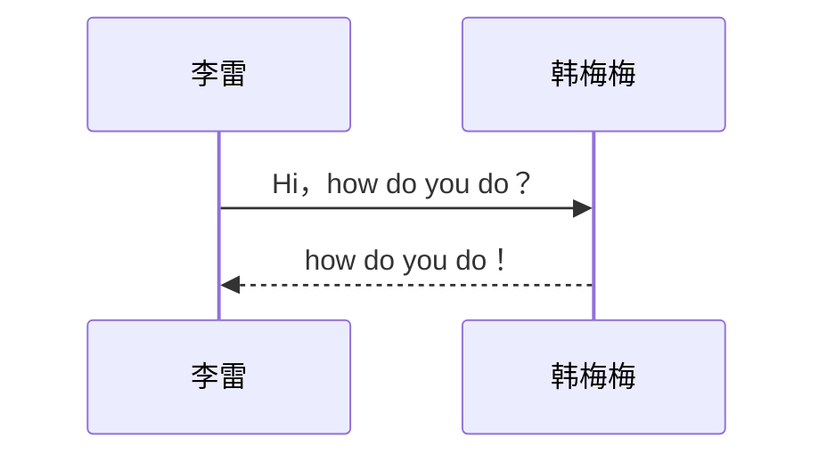
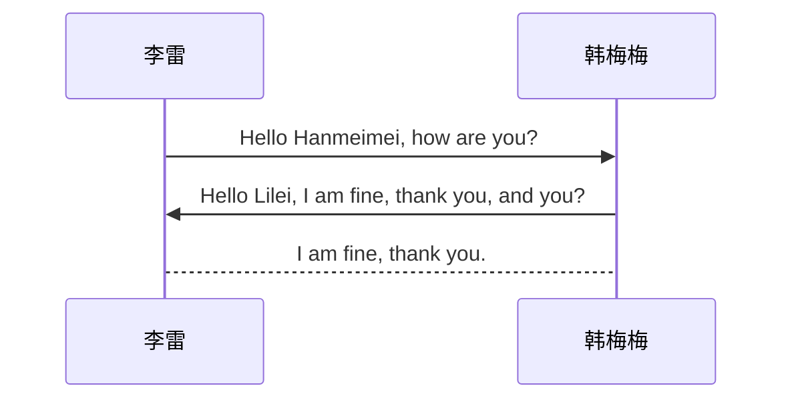

# 时序图


## 基本时序图

时序图以矩形代表参与者，参与者下方代表生存期间的长实线，连接线之间代表消息的箭头和控制焦点组成

````

````


以别名形式定义对象：

```
[发起者][连线类型][接收者]:消息内容。
```

````


````


连线类型：

| 类型 | 描述             |
| :--- | :--------------- |
| ->   | 没有箭头的实线   |
| –>   | 没有箭头的虚线   |
| ->>  | 有箭头的实线     |
| –>>  | 有箭头的虚线     |
| -x   | 有交叉箭头的实线 |
| –x   | 有交叉箭头的虚线 |