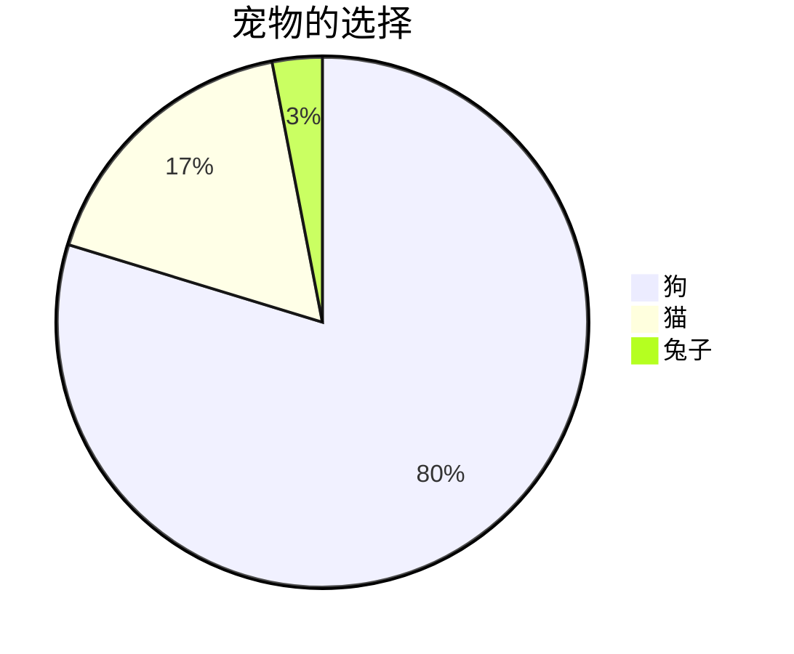

# 饼图

> 饼图（Pie chart）是将一个圆形，分成面积相同或不同的若干区域，用来表示不同内容占比的图形。

语法：
饼图的定义包含「标题」、「内容名称」和「内容权重」三项，其中「内容权重」会在渲染时，自动转换为百分比并显示在饼图上。

````

```mermaid
pie title 宠物的选择
	"狗":393
	"猫":85
	"兔子":15
```
````


```mermaid
pie title 宠物的选择
	"狗":393
	"猫":85
	"兔子":15
```

