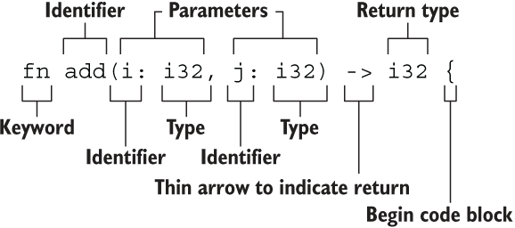

# 基础

## 1.变量

- 变量绑定：let 声明，变量归属所有权
- 变量默认不可变，关键字 mut 可变（类型不可变）
- 下划线忽略未使用的变量：let _hello = "hi";
- 变量遮蔽：后声明的变量会遮蔽前面声明的变量
- 解构：使用 `let` 关键字配合模式，可以将一个复合类型的值拆解，直接绑定到多个变量上


## 2.常量

* const 声明
* 必须类型标注
* 命名规则：单词之间使用下划线，并且全部大写

```rust
const MAX_POINTS: u32 = 100_000;
```


## 3.基本类型

rust 属于静态类型语言，也就是编译器在编译的时候需要确定变量类型，但这并不意味着需要为每一个变量指定类型，rust 编译器有时可以根据上下文自动推断出变量类型

- 数值类型：有符号整数 (`i8`, `i16`, `i32`, `i64`, `isize`)、 无符号整数 (`u8`, `u16`, `u32`, `u64`, `usize`) 、浮点数 (`f32`, `f64`)、以及有理数、复数
- 字符串：字符串字面量（其实也是一个切片）和字符串切片 `&str`，用 `""`，UTF-8 编码，也就是字符串中的字符所占的字节数是变化的(1 - 4)
- 布尔类型：`true` 和 `false`，占 1 字节
- 字符类型：表示单个 Unicode 字符，存储为 4 个字节，用 `''`
- 单元类型 Unit：即 `()` ，其唯一的值也是 `()`，内存占用大小 0 字节

只有同样类型，才能进行计算

计算类型的大小：`use std::mem::size_of_val;`

序列 range（只允许用于数字或字符）：例如 `1..5`，生成从 1 到 4 的连续数字，不包含 5 ；`1..=5`，生成从 1 到 5 的连续数字，包含 5

使用 as 可以实现类型转换


## 4.语句和表达式

语句是执行某些操作且不返回值的指令；表达式计算并得出一个结果值

Rust 的函数体是由一系列语句组成，最后由一个表达式来返回值，表达式最后不能包含分号

表达式如果不返回任何值，会隐式地返回一个 `()`


## 5.函数



由于 Rust 是静态类型语言，因此需要为每一个函数参数都标识出它的具体类型

Rust 中表达式就是函数的返回值，也可以使用 return 提前返回

特殊返回类型：

- 无返回值()：
  - 函数没有返回值，那么返回一个 `()`
  - 通过 `;` 结尾的语句返回一个 `()`
- 永不返回的发散函数：! 作为返回类型


## 6.所有权

所有权是 Rust 最独特的特性，它使得 Rust 可以在不需要垃圾回收器的情况下保证内存安全

- 所有权基本规则：
  - Rust 中每一个值都被一个变量所拥有，该变量被称为值的所有者
  - 一个值同时只能被一个变量所拥有，或者说一个值只能拥有一个所有者
  - 当所有者（变量）离开作用域范围时，这个值将被丢弃(drop)
- 可以想象一下，如果有两个变量同时拥有同一个指向堆的指针，那么 drop 时就会造成 double free
- Rust 永远也不会自动创建数据的 “深拷贝”（但可以使用 clone 方法）
- 浅拷贝只发生在栈上，因此性能很高
- 像整数，浮点数，字符这种简单的类型，不受所有权规则的约束，称为 Copy 类型


## 7.引用与借用

**reference 引用**：通过 & 创建，指向对象存储的内存地址，但并没有所有权（解决了每次调用函数使用变量时还需要返回所有权的问题）

* 可变引用：&mut，允许修改数据，但在同一时间只能有一个可变引用，且不可与不可变引用共存
* 不可变引用：只能读取数据，不能修改
* 解引用：*
* 同一时刻，只能拥有要么一个可变引用，要么任意多个不可变引用

**borrow 借用**：以引用作为函数参数叫为借用，指按引用传递对象的方式，即通过引用访问数据而不转移所有权

| 概念 | 说明                                   | 例子                         |
| :--- | :------------------------------------- | :--------------------------- |
| 引用 | 指向数据的指针，是一种类型             | `let r = &s;`                |
| 借用 | 获取引用的行为，借用数据而不转移所有权 | `fn foo(s: &String) { ... }` |


## 8.字符串

Struct String ：定义在标准库中的类型，分配在堆上，可以动态的增长。它的底层存储是动态字节数组的方式( Vec <u8> )，但是与字节数组不同，String 是 UTF-8 编码

字符串切片：不是对整个 String 的引用，而是对 String 的一部分的引用，格式为 [start, end]，start 是第一个位置，end 是最后一个位置加 1，长度为 end - start；同理，可以推广到其他类型的切片

* 创建：String:: from()
* 追加：push(), push_str()
* 插入：insert(), insert_str()
* 替换：replace(), replacen(), replace_range()
* 删除：pop(), remove(), truncate(), clear()
* 连接：
  * `+`，相当于调用了标准库中的 add() 方法，add() 方法的第二个参数是一个引用的类型，返回一个新的字符串
  * format!，适用于 String 和 &str ，用法与 print! 的用法类似
* 可以使用 String:: from 或 to_string 将 &str 转换成 String 类型


## 9.元组

元组是由多种类型组合到一起形成的，因此它是复合类型，元组的长度是固定的，元组中元素的顺序也是固定的

创建元组示例：`let tup: (i32, f64, u8) = (500, 6.4, 1);`

元组用 `.` 来访问


## 10.结构体

* 结构体声明为可变的，才可以修改里面的字段，不支持将某个字段声明为可变的

* 元组结构体：定义类似于元组的结构体，无字段名，只有字段的类型，注意：元组结构体后面要加分号

* 单元结构体：没有任何一个字段的结构体（也没有花括号）

* 如果代码中的参数名和结构体字段名完全相同，可以使用 **字段初始化简写语法**

* **结构体更新语法**：在实际场景中，有一种情况很常见，根据已有的结构体实例，创建新的结构体实例，`..已有结构体` 语法表明凡是我们没有显式声明的字段，全部从已有结构体中自动获取

* 对于结构体的打印：

  * 大括号内放置 `:?` 格式化符告诉 println! 我们希望使用一种称为 Debug 的输出格式

  * 结构体定义前加上注解 `#[derive(Debug)]`

  * 更加结构化的打印使用 `{:#?}`


## 11.枚举

枚举类型是一个类型，它会包含所有可能的枚举成员，而枚举值是该类型中的具体某个成员的实例，使用 `::` 该枚举类型的成员

任何类型的数据都可以放入枚举成员中：例如字符串、数值、结构体甚至另一个枚举

* Quit 完全没有关联的数据
* Move 包含了一个匿名结构体
* Write 包含一个 String
* ChangeColor 包含三个 i32 值

```rust
enum Message {
    Quit,
    Move { x: i32, y: i32 },
    Write(String),
    ChangeColor(i32, i32, i32),
}

```

标准库中的 Option 枚举，Option 枚举的 Some 变体可以容纳任意类型的一块数据，如果我们使用 None（空值），需要告诉 Rust 我们有哪些类型的 Option <T>，因为编译器无法通过仅查看 None 值来推断 Some 变体将持有的类型

```rust
enum Option<T> {
    Some(T),
    None,
}
```


## 12.数组

与元组不同，每个元素类型必须相同

* 长度固定：array，存储在栈上
* 动态数组：Vector，存储在堆上

声明示例：

```rust
fn main() {
    let a = [1, 2, 3, 4, 5];
    let b: [i32; 5] = [1, 2, 3, 4, 5]; // 类型;长度
    let a = [3; 5]; // 5次重复
}
```

数组切片：创建切片的代价非常小，因为切片只是针对底层数组的一个引用

```rust
let a: [i32; 5] = [1, 2, 3, 4, 5];
let slice: &[i32] = &a[1..3];
assert_eq!(slice, &[2, 3]);
```

`Vec::new` 创建动态数组，`vec!` 来创建数组在创建同时可以赋予初始化值


## 13.流程控制

代码中的条件结果必须为 bool 类型，每个分支的结果值必须具有相同的类型

```rust
if condition == true {
    // A...
} else {
    // B...
}
```

```rust
for item in &container {
  // ...
}
```

| 使用方法                      | 等价使用方式                                      | 所有权     |
| ----------------------------- | ------------------------------------------------- | ---------- |
| `for item in collection`      | `for item in IntoIterator::into_iter(collection)` | 转移所有权 |
| `for item in &collection`     | `for item in collection.iter()`                   | 不可变借用 |
| `for item in &mut collection` | `for item in collection.iter_mut()`               | 可变借用   |

`continue` 可以跳过当前当次的循环，开始下次的循环；`break` 可以直接跳出当前整个循环，同时 break 后还可以添加你想要返回的值，该值将从循环中返回

`while` 适用：当该条件为 `true` 时，继续循环，条件为 `false`，跳出循环

`loop` 一个简单的无限循环，可以在内部实现逻辑通过 `break` 关键字来控制循环何时结束


## 14.模式匹配

match 分支的另一个有用特性是它们可以绑定到与模式匹配的值的部分

```rust
match target {
    模式1 => 表达式1,
    模式2 => {
        语句1;
        语句2;
        表达式2
    },
    _ => 表达式3 // 通配符模式，匹配所有其他情况（类似 default）
}
```

if let 视为 match 的语法糖，在值匹配一种模式时运行代码，然后忽略所有其他值

可以在 if let 中包含一个 else，与 else 一起的代码块与 match 表达式中相当于 if let 和 else 的 _ 中的代码块相同

 	

## 15.方法

* 使用 impl（Implementation）定义方法，方法与函数不同，它们是在结构体（或枚举或特征对象）上下文中定义的，他们的第一个参数始终是 self；每个结构体都允许有多个 impl 块
* rust 语言对象定义与方法定义是分析的，也就是数据与使用时分离的
* rust 的可见性系统基于默认私有原则：除非显式声明为公有，否则所有项目都是私有的
* 关联函数：impl 中没有 self 的函数，通常用于返回结构体新实例的构造器，要调用关联函数，需要使用使用结构体名称和 :: 语法


## 16.泛型

泛型就是一种多态，用同一功能的函数处理不同类型的数据

rsut 中的泛型属于静多态，在编译期，所有的泛型都会被单态化，将泛型函数生成具体类型的对应函数，虽然性能好，没有运行开销，但是容易造成编译后的二进制文件膨胀

所有的泛型参数都要提前声明

const 泛型：针对值的泛型

常见应用场景：

~~~rust
```rust
// 函数中
fn largest<T>(list: &[T]) -> T {
    
}

// 结构体中
struct Point<T>{
    x: T,
    y: T,
}
struct Point<T, U> {
    x: T,
    y: U,
}

// 枚举中
enum Option<T> {
    Some(T),
    None,
}
enum Result<T, E> {
    Ok(T),
    Err(E),
}

// 结构体方法中
struct Point(T){
    x: T,
    y: T,
}
impl<T> Point<T> {
    fn x(&self) -> &T{
        &self.x
    }
}
```
~~~


## 17.特征

trait 类似于接口

where 约束

[^1]: 


## 18.常用集合


## 19.模块

* 查找方式：在编译时，编译器首先会在根文件（通常是 *src/lib.rs* 或 *src/main.rs*）中查找
* 声明模块：mod mod_name，编译器查找的位置：
  * 内联，紧跟在 mod_name 后面
  * 文件 src/mode_name.rs
  * 文件 src/mod_name/mod.rs
* 声明子模块：同上理
* 模块内的代码默认是对其父模块私有的。要使一个模块公开，使用 pub mod 进行声明
* use 关键字：创建快捷引用，减少路径的重复
