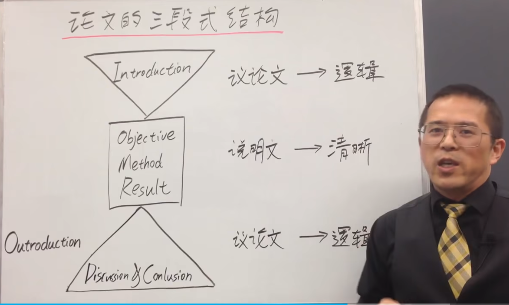
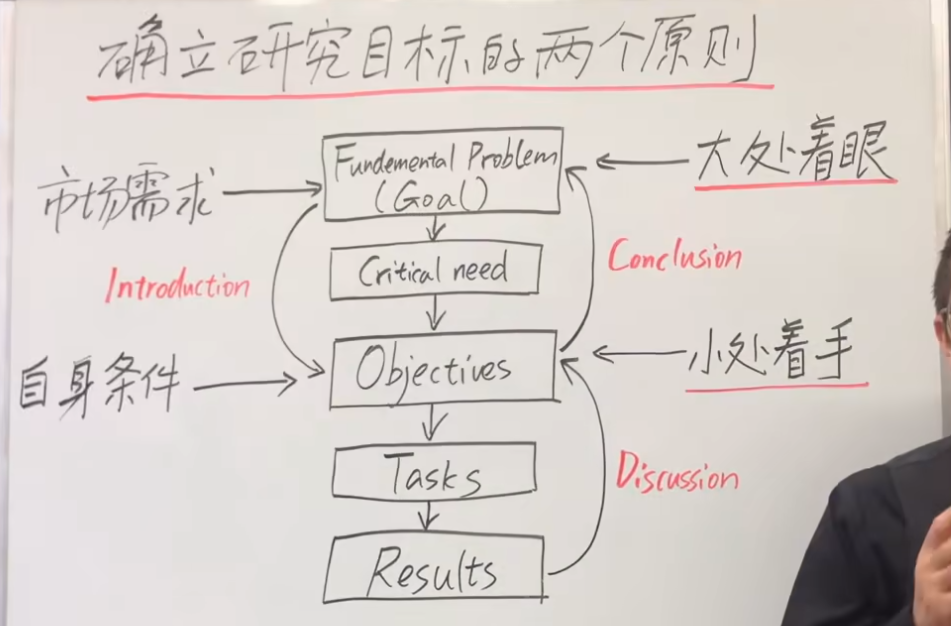
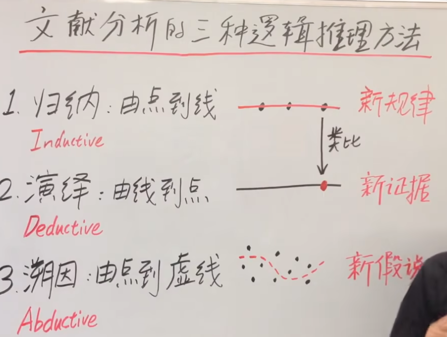

# 1.论文三段式

- 引言（议论文——逻辑）
  - 研究目标的合理
  - 普遍——特定，逐步深入

- 研究目标方法，结果（说明文——清晰）

- 讨论和结论（议论文——逻辑）
  - 研究有价值的
  - 特定——普遍，由特定结果给出普遍意义

# 2.引言的逻辑解析

* 确立研究机会
  * 从普遍的problem到具体的question
* 占领研究机会
  * 明确研究目标objective，长期目标goal

* question和objection，problem和goal相呼应
* 问题x重要性被学术界普遍认可，研究者a，b发现了...,基于这些理由，我们认为回答问题c对解决问题至关重要

# 3.研究选题

* 填补研究空白 old problem（重要性已被广泛认可，创新型）
* 延申现有研究 new problem （意义，长期目标）
* 复制成功的研究 （避免复制到错误）

# 4.确立研究目标

* 大处着眼

* 小处着手

  

# 5.文献

写的两个基本点：

* 学：包括所有相关的主要文献：全，新，客观
* 思：
  * 评判：有效性，可靠性，优势，劣势，重要性，相关性
  * 分析：
    * 归纳：找同
    * 演绎：找不同
    * 溯因：找gap

阅读的两个阶段：

* 泛读：由厚到薄，明确细化研究目标
* 精读：由薄到厚，搜集可用论据

用故事逻辑写文献综述：

* situation情景，背景，历史
* confliction冲突，挑战，现有解决方案，遗留问题
* question关键问题，改进方案
* answer解决方案

文献分析：
  