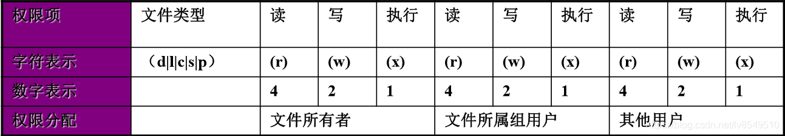

> `ls -l`后每行的第一个字符表示文件类型。`d`表示它是一个目录，`-`表示它是一个普通文件。
>
> 接下来的9个字符是文件或目录的实际访问权限，分成3个字符表示拥有文件的用户（称为“所有者”）对文件的权限，3个字符表示拥有文件的组（称为“组”）对文件的权限，并且3个字符表示所有其他访问（例如，由其他用户和其他组）必须添加到文件
>
> 文件类型：
>
> - 普通文件(-):存放数据、程序等信息的文件，一般为文本文件和二进制文件。
> - 目录文件(d):文件系统中一个目录所包含的目录文件，包括文件名和子目录名。
> - 链接文件I):可以在不同的文件系统之间建立链接关系来实现对文件的访问。
> - 设备文件(c):把IO设备映射为一个设备文件。
> - 管道文件(p):主要用于在进程间传递数据。
>
> 文件的权限针对三类对象进行定义
>
> owner 属主，缩写u
>
> group 属组，缩写g
>
> other 其他，缩写o
>
> 每个文件针对每类访问者定义了三种主要权限
>
> r：Read 读
>
> w：Write 写
>
> x：eXecute 执行
>
> 
>
> 除此之外，还有三种特殊权限为：suid权限，sgid权限，sticky权限
>
> 其中suid权限作用于文件属主，sgid权限作用于属组上，sticky权限作用于other其他上
>
> 设置使文件在执行阶段具有文件所有者的权限，相当于临时拥有文件所有者的身份

## w

显示目前登入系统的用户信息


## whoami

打印当前有效的用户名称


## id

打印真实以及有效的用户和所在组的信息

useradd

groupadd


## chown

用来变更文件或目录的拥有者或所属群组

```
chown [OPTION]... [OWNER][:[GROUP]] FILE
-R: 递归处理
```


## chgrp

用来变更文件或目录的所属群组


## chmod

用来变更文件或目录的权限


sudo

passwd

