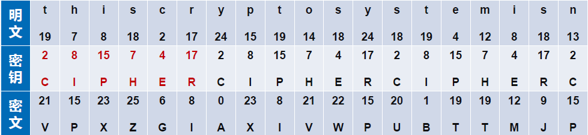

# 古典密码学

## 1.隐写技术

将秘密信息隐藏在某些宿主对象中，使信息传输或存储过程中不被发现和引起注意，接收者按照约定规则可读取秘密信息的技术

## 2.替换密码

* **凯撒密码**：对英文字母的典型逐字母加密的密码

* **仿射密码**：要求K1和26互素

  * 加密：

    $\begin{aligned}&K=(K_1,K_2)\\&\mathbf{E}_{\mathbf{K}}(\mathbf{p})=(\mathbf{p}\times\mathbf{K}_1+\mathbf{K}_2)\mathrm{~mod~}26=\mathbf{c}\end{aligned}$

  * 解密：

    $\begin{aligned}&\mathrm{K=(K_1,K_2)}\\&\mathbf{D_K(c)=(c-K_2)\times K_1^{-1}mod~26=p}\end{aligned}$

* **单表代换密码**：无法抵御频率攻击

* **多表代换密码**：密钥量太大

  ​	$\begin{aligned}&\text{明文}p\in(\mathbb{Z}_{26})^{\mathrm{m}}\text{,密文}c\in(\mathbb{Z}_{26})^{\mathrm{m}}\text{,密钥}k\in(\mathbb{Z}_{26})^{\mathrm{m}}\\&\text{加密}\\&c=(p_1+k_1,p_2+k_2,...,p_m+k_m)\bmod26;\\&\text{解密}\\&p=(c_1-k_1,c_2-k_2,...,c_m-k_m)\bmod26.\end{aligned}$

* 简化的多表代换密码----**维吉尼亚密码**(Vixenere Cipher,密钥是一个词的重复)

  

## 3.置换密码

对明文字符或字符组进行位置移动的密码,明文的字母保持相同，但顺序被打乱了