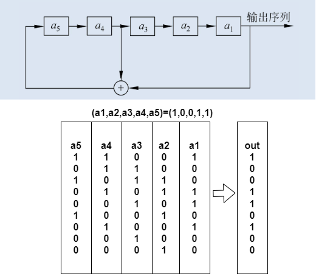
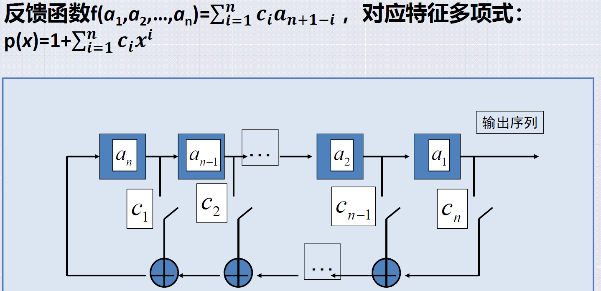
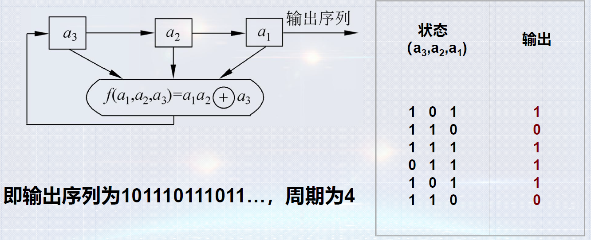

# 序列密码

## 1.现代密码概念

* 现代密码系统三个主要算法：

  * 密钥产生算法Gen

  * 加密算法E

  * 解密算法D

* **自信息量**：设A是一个随机事件，A 发生的概率为p

  ​    $I(A)=log\frac1p=-\log p\text{(比特)}$

* 事件集X的**熵**（标识事件出现的平均不确定性）：$X=\{x_{1},,x_{2}\cdots,x_{n}\},p(x_{i})\geq0,\sum_{i=1}^{n}p(x_{i})=1$

  ​    $H(X)=-\sum_{i=1}^np(x_i)logp(x_i)(0log0=0)$
  
* 密码分析：从密文推断出原来的明文或密钥

  * 惟密文攻击
  * 已知明文攻击
  * 选择明文攻击：敌手可以任意选择有利的明文获得对应密文（获得加密机）
  * 选择密文攻击：敌手可以任意选择有利的密文并获得对应明文（获得解密机）

* 密码体制：

  * 对称：加密密钥和解密密钥相同
    * 分组密码：将明文分成固定长度的组(通常是64、128或256比特)，用同一密钥和算法对每一块加密，输出也是固定长度的密文。如DES、IDEA、AES等
    * 序列密码（流密码）：每次通过输出密钥流序列加密(通常是模2加)一位或一字节的明文。如A5、E0 、RC4
      RC4
  * 非对称：加密密钥和解密密钥不同

## 2.序列密码基本概念

* 基本概念：序列密码，又称为流密码，属于对称密码体制，它一次只对明文消息的单个字符（通常是二进制位）进行加解密变换
* 思想：用一个较短的密钥来生成与明文同样长度的密钥流，使得密钥流看起来似乎是随机产生的
* 序列密码采用一个短的密钥产生的密钥流序列，这样的序列不是无限不重复的随机序列，而是一个**周期序列**。为了使得密码分析者无法对它进行预测，要求密钥流序列周期很大且具有很好的随机性，这样的序列通常也被称为**伪随机序列**
* 在序列的一个周期中，把连在一起的0或1称为游程，如果周期序列中有一段元素为1000..001，这里连在一起的0共有t个，那么就称100...001是一个长度为t的0游程，同样如果周期序列中有一段元素为011...110，这里连在一起的1共有t个，那么就称011...110是一个长度为t的1游程。

对于伪随机周期序列的3个随机性公设：

* 在序列一个周期内，0与1的个数相差至多为1
* 在序列的一个周期内，长为i的游程占游程总数的1/2^i(i=1,2,),且在等长的游程中0的游程个数和1的游程个数相等
* 自相关函数是一个常数

## 3.线性反馈移位寄存器

* LFSR, linear feedback shift register

  

  * n级LFSR周期由其特征多项式p(x)确定
  * 特征多项式p(x)为不可约多项式，且多项式p(x)周期为$2^{n-1}$时，则对应序列周期为$2^{n-1}$

缺点：

* 算法已知时，可由输出恢复密钥
* 算法未知，可由输出恢复算法

$\text{设敌手知道一段长为2n的的明密文对,即已知}\\x=x_1x_2...x_2n\\y=y_1y_2...y_{2n}\\\text{于是可求出一段长为2n的密钥序列}\\\text{其中}\\z_i=x_i\oplus y_i=x_i\oplus y_i=x_i\oplus(x_i\oplus z_i)$

## 4.LFSR改进

* Gaffe序列：使用了3个LFSR以非线性方式组合而成，2个LFSR作为复合器的输入，第3个LFSR控制复合器的输出

* NLFSR序列:

