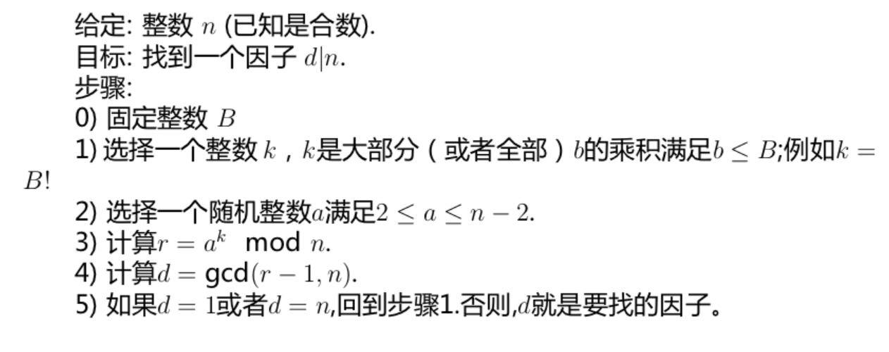
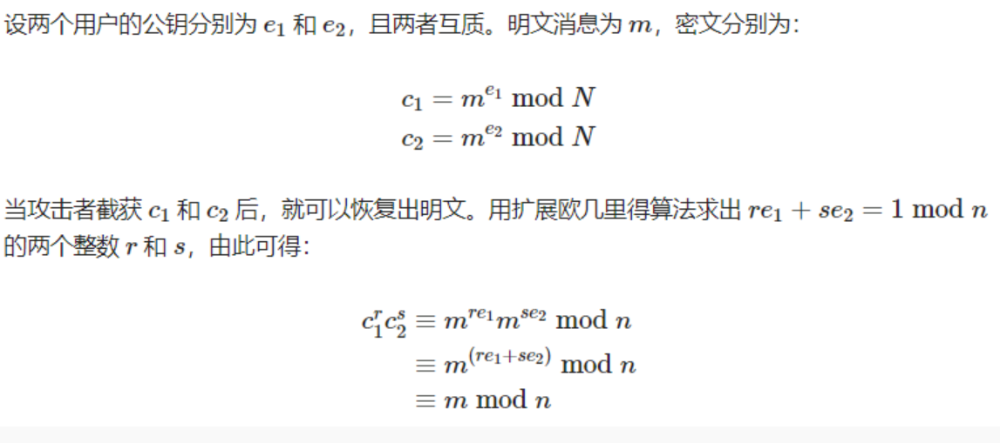

# RSA

## 1.基本原理

* 随机选择两个不同大质数 p 和 q，计算 n=p×q
* 根据欧拉函数，求得 φ(n)=φ(p)·φ(q)=(p−1)·(q−1)=pq-p-q+1
* 选择一个小于 φ(n) 的整数 e，1 < e < φ(n),且gcd(e,φ(n))=1
* 计算d，满足d·e≡1 mod φ(n),即d是e在模φ(n)下的乘法逆元
* 以{e, n}为公开钥,d为秘密钥

加密：

* $c \equiv m^emodn$

* 加密时首先将明文比特串分组，使得分组长度小于log2n。然后对每个明文分组m，作加密运算

解密：

* $\mathrm{m\equiv c^d~mod~n}$
* 对密文分组的解密运算

存在的计算问题：

* RSA的加密、解密过程都为求一个整数的整数次幂，再取模。如果按其含义直接计算，则中间结果非常大，有可能超出计算机所允许的整数取值范围
* 模运算的性质: $(a\times b)mod\ n=[(a\ mod\ n)\times(b\ mod\ n)]mod\ n$, 可减小中间结果
* $\begin{aligned}&\text{预处理: 求出}e\text{的二进制表示,即}\\&(e_{m-1},e_{m-2},\cdots,e_0)\text{且满足}e=\sum_{i=0}^{m-1}e_i2^i\\&\text{计算:}\\&x^e=((\cdots((((x^{e_{m-1}})^2)x^{e_{m-2}})^2x^{e_{m-3}})^2\cdots x^{e_2})^2x^{e_1}\end{aligned}$

$\begin{aligned}&\text{例:计算}{1520^{13}}({\mathrm{mod}}2539).\\&\text{解:}\quad13=2^3+1\times2^2+0\times2+1\quad(e_3,e_2,e_1,e_0)=(1,1,0,1)\\&1520^{13}({\mathrm{mod}}2539)\\&\equiv(((1520^{e_3})^2\cdot1520^{e_1})^2\cdot1520^{e_0})^2\cdot1520^{e_0}\:({\mathrm{mod}}\:2539)\\&\equiv((1520^2\cdot1520)^2\cdot1520^{e_0}\:({\mathrm{mod}}\:2539)\end{aligned}$

## 2.算法安全分析

### 2.1 基于大数分解

* 暴力破解：尝试找到所有的私钥
* Fermat 方法：|p-q|较小
  * 原理：$\text{n}=\mathrm{p}*\mathrm{q}=\frac{1}{4}(p+q)^{2}-\frac{1}{4}(p-q)^{2}$,又p，q相差不大，$\sqrt{\mathrm{n}}\approx（\mathrm{p}+\mathrm{q}）/2$
  * 步骤：
    * 顺序检查大于$\sqrt n$的每一整数𝒙，直到找到一个𝒙使得𝒙^𝟐^-𝒏是某一整数（记为𝒚）的平方
    * 由x^2^-n=y^2^，得𝒏 = (𝒙 + 𝒚)(𝒙 − 𝒚)
* Pollard rho 方法：生日攻击
  * 原理：随机p^(1/2)数里面，大概率(40%)有两个数的差是p的倍数
  * $\begin{aligned}&\text{假设要找因子为p,随机取}x_1\text{,由}x_n\text{构造}x_{n+1}=\mathrm{f(x_n)=~x_n^2+a,~使得p}\text{整除}x_n-x_{n+1}\text{不能整除n,则p=gcd(}x_n-\mathrm{x_{n+1},n)}\end{aligned}$
  * 
  
* rho p-1 方法

* 共模攻击：当两个用户使用相同的模数N、不同的私钥时，加密同一明文消息时即存在共模收击

  

* 中国剩余定理应用：低指数攻击