# DES

## 1.分组密码

* 分组密码是将明文数字序列按固定长度分组，并用一个密钥和同一加密算法逐组加密，从而将各明文分组变换成密文分组的密码
* 分组长度n：二进制明文的分组长度
* 密钥长度l：二进制密钥的长度

## 2.Feistel结构

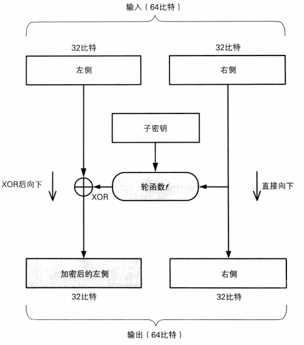

- 明文数据（64bit）被分成左右两部分（各32bit）
- 将输入的右侧使用轮函数处理
- 处理后得出的数据与左侧做异或得到加密后的左侧

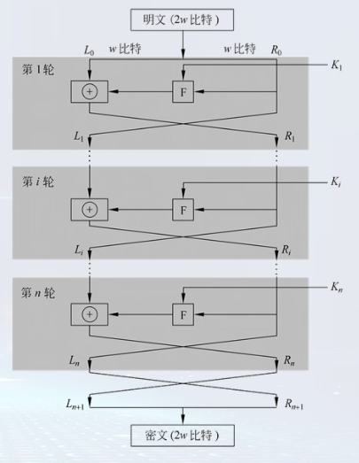

* 左右交叉处理的结构为feistel结构

* $\begin{aligned}&L_{i}=R_{i-1}\\&R_{i}=L_{i-1}\oplus F\left(R_{i-1},\:K_{i}\right)\end{aligned}$

## 3.DES算法

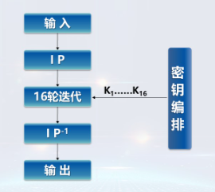

* DES算法是第一个公开的分组加密算法
* 明文、密文长度均为64bits，密钥长度56bits，每7bit后为一个奇偶校验位（第8bit），共64bits
* 轮函数采用混乱和扩散的组合，共16轮

### 3.1 IP置换

* 给定明文，通过一个固定的初始置换P来重排输入明文块P中的比特

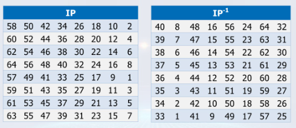

### 3.2 轮函数

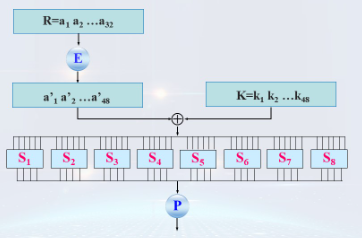

* E盒扩展，将R根据扩展规则扩展成48bits的串

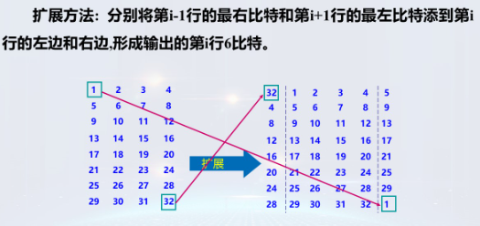

* S盒替换：使用8个S盒将输入的48比特数据压缩为32比特数据
* S盒是DES中唯一的非线性变换，在算法中起核心作用！

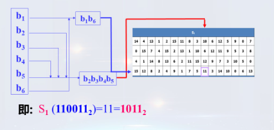

* P置换：

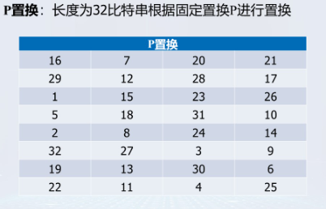

### 3.3 密钥编排算法

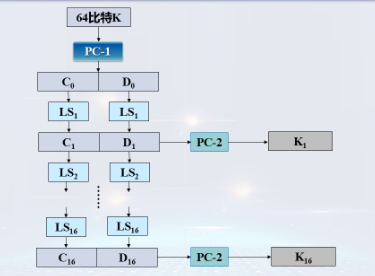

* 密钥是 64 位的，根据密钥置换表PC-1，将 64 位变成 56 位密钥。（去掉了奇偶校验位）
* 56 位密钥，分为前28位 C0 和后28位 D0，分别对它们进行**循环左移**，C0左移得到 C1，D0 左移得到 D1
* C1 和 D1 合并成 56 位，然后通过PC-2表进行压缩置换，得到当前这一轮的 48 位子密钥 K1
* 然后对 C1 和 D1 进行左移和压缩置换，获取下一轮的子密钥……一共进行16轮，得到 16 个 48 位的子密钥

## 4.DES改进算法

* 二重DES：两个加密密钥加密
* 二重DES缺陷：不能抵抗中间点匹配攻击法
* 三重DES

## 5.分组密码填充模式

* zeros填充：
  * 需要填充的字节全部填充为0，即使消息长度恰好是8的整数倍，仍需填充8字节的全0
  * 缺陷：只适用于消息最后不是00结尾的明文
* X923填充：
  * 填充字符串由一个字节序列组成，此字节序列的最后一个字节填充字节序列的长度，其余字节均填充数字零
* PKCS7填充：
  * 填充字符串由一个字节序列组成，每个字节填充该字节序列的长度
* ISO10126填充：
  * 填充字符串由一个字节序列组成，此字节序列的最后一个字节填充字节序列的长度，其余字节填充随机数据

## 6.分组密码运行模式

* ECB 电码本模式：将明文的各个分组独立的使用同一加密密钥k进行加密。无法抵抗替换攻击

* CBC 密码分组链接模式：输入是明文分组和前一个密文分组的异或，同样均使用相同的密钥进行加密，其中第一个明文加密时，需先与初始向量异或，再进入加密算法进行加密

  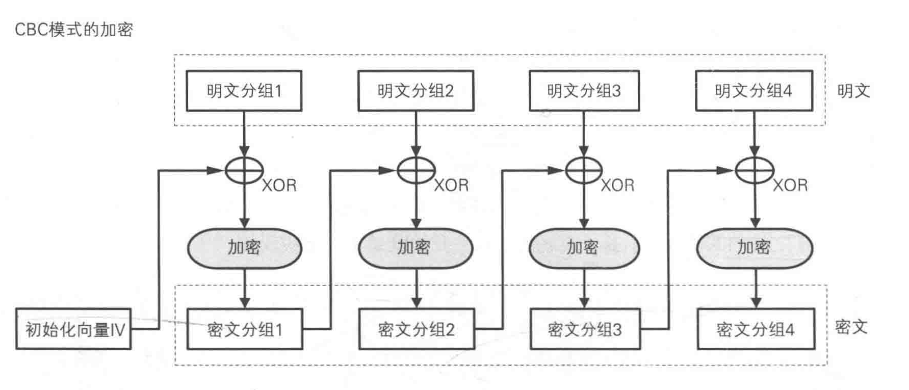

* CFB 密码反馈模式：将前一个密文分组进行加密后与明文分组进行 XOR 操作得到密文分组

  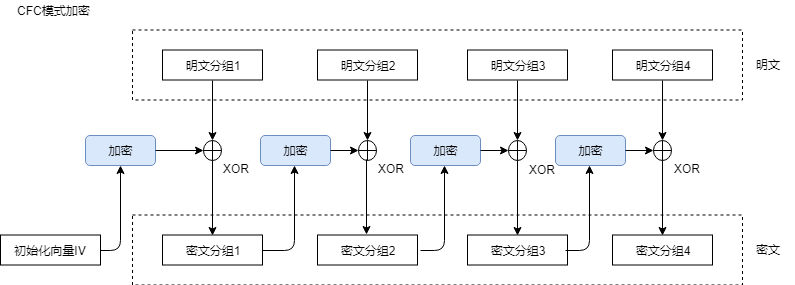

* OFB 输出反馈模式：上一次密码算法的输出会作为这次密码算法的输入，产生的结果与明文分组进行 XOR 操作，得到对应密文分组

  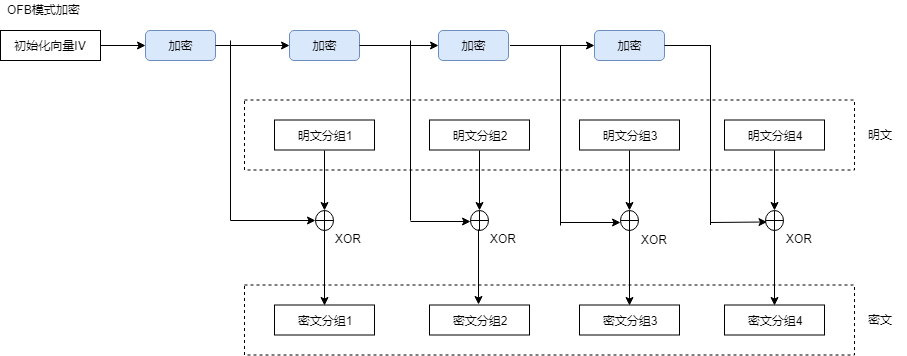

* CTR 计数器模式：通过逐次累加计数器进行加密来生成密钥流的流密码

  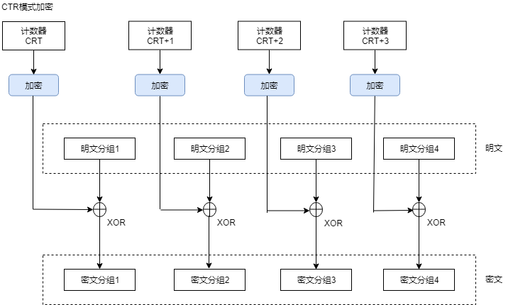

|  模式   | 名称                                          | 优点                                                         | 缺点                                                         | 备注       |
| :-----: | :-------------------------------------------- | :----------------------------------------------------------- | :----------------------------------------------------------- | :--------- |
| ECB模式 | Electronic CodeBook mode (电子密码本模式)     | 1、简单； 2、kuaisu； 3、支持并行计算(加密、解密)            | 1、明文中的重复排列会反映在密文中； 2、通过删除、替换密文分组对明文进行操作； 3、对包含某些比特错误的密文进行解密时，对应的分组会出错； 4、不能低于重放攻击。 | 不推荐使用 |
| CBC模式 | Cipher Block Chaining mode (密码分组链接模式) | 1、明文的重复排列不会反应在密文中； 2、支持并行运算(解密)； 3、能够解密任意密文分组。 | 1、对包含某些错误比特的密文进行解密时，第一个分组的全部比特以及后一个分组的相应比特会出错； 2、加密不支持并行计算。 | 推荐使用   |
| CFB模式 | Cipher FeedBack mode (密码反馈模式)           | 1、不需要填充(padding)； 2、支持并行计算(仅解密)； 3、能够揭秘任意密文分组。 | 1、加密不支持并行计算； 2、对包含某些错误比特的密文进行解密时，第一个分组的相应比特以及后一个分组的全部比特都会出错； 3、不能抵御重放攻击。 |            |
| OFB模式 | Output FeedBack mode (输出反馈模式)           | 1、不需要填充(padding)； 2、可事先进行加密、解密的准备； 3、加密、解密使用相同的结构； 4、对包含某些错误比特的密文进行解密时，只有铭文中的相对应的比特会出错。 | 1、不支持并行计算； 2、主动攻击者反转密文分组中的某些比特时，明文分组中相对应的比特也会被反转。 |            |
| CTR模式 | CounTeR mode (计数器模式)                     | 1、不需要填充(padding)； 2、可事先进行加密、解密的准备； 3、加密、解密使用相同的结构； 4、对包含某些错误比特的密文进行解密时，只有明文中对应的比特会出错； 5、支持并行计算(加密、解密)。 | 主动攻击者反转密文分组中的某些比特时，明文分组中相对应的比特也会被反转。 | 推荐使用   |

​	
