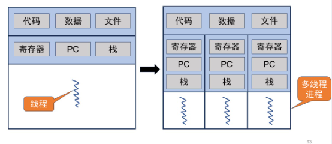

# 并发、线程api


## 1.并发基本概念



* 多个计算任务在同一个**时间段**内发生（交替执行）
* 编写多线程程序在单CPU上运行的目的是：使IO部件与CPU并行运行，系统使用时间片轮转调度算法，将CPU的时间片分配给不同的线程，使它们在不同的时间段内执行。当一个线程需要等待IO操作完成时，操作系统会将CPU的时间片分配给其他线程，从而避免CPU的浪费。这样，多个线程可以在单CPU上共享CPU资源，达到并行执行的效果
* 线程（thread）：进程的最小执行单元（OS调度的基本单元）
* 不同进程有独立的内存地址空间，通信共享复杂，同一进程不同线程共享同一地址空间（全局变量共享）
* 临界段/区：访问共享变量（临界资源）的程序段，访问相同临界区的代码应该互斥执行（数据竞争：多线程同时进入临界区）
* 竞争条件：多个线程同时进入临界区，也称数据竞争
* 利用锁lock来保证临界区的原子性


## 2.线程

* linux在进程中实现了线程————轻量级进程（light weight process，LWP），LWP与进程一起参与调度，在LWP基础上实现了线程库pthread

```c
int pthread_create(pthread_t *thread,
                   const pthread_attr_t *attr,
                   void *(*start_routine) (void *),
                   void *arg);
```

* 创建线程
* 参数：
  * thread：线程结构体指针
  * attr：属性，如调度优先级，栈大小
  * start_routine：线程运行的主函数
  * arg：主函数要用到的参数

```c
int pthread_join(pthread_t thread, void ** retval);
```

* 等待进程结束
* 参数：
  * thread：线程结构体对象
  * retval：返回值指针，可通过类型转换变成其他类型

注意：函数的局部变量在函数返回时被释放，之后不能再使用


## 3.锁

互斥锁指代相互排斥，它是最基本的同步方式。互斥锁用于保护临界区，以保证任何时刻只有一个线程在执行其中的代码（假设互斥锁由多个线程共享），或者任何时刻只有一个进程在执行其中的代码

```
pthread_mutex_lock(&lock); //加锁，若锁被占用，则等待
pthread_mutex_unlock(&lock); //解锁，只有已获得锁的线程才能解锁
int_pthread_mutex_trylock(pthread_mutex_t *mutex); //加锁，若已被锁住，则立即返回
int pthread_mutex_timelock(pthread_mutex_t *mutex,struct timespec *abs timeout); //若超时，则放弃、返回
```

