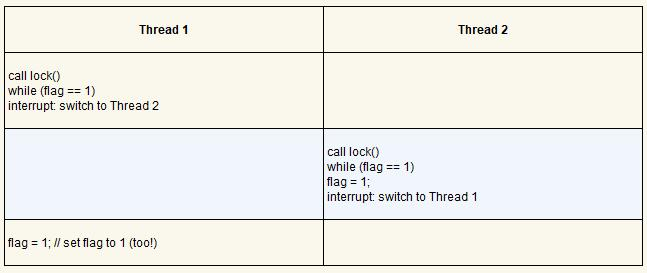

# 锁

## 1.锁的基本思想

评价思想：

* 有效性：只有一个线程能拿到锁
* 公平性：所有线程都能拿到锁不会被饿死
* 性能：时间开销小

锁的简单实现：用中断屏蔽指令（如 x86 的 CLI），但只适用于单处理器系统，需要在内核态运行（也就是临界区关闭中断，这是最早的解决方案之一，通过在进入临界区之前关闭中断（使用特殊的硬件指令），可以保证临界区的代码不会被中断，从而原子地执行。结束之后，我们重新打开中断（同样通过硬件指令），程序正常运行）

上述方法的缺点：

* 要求我们允许所有调用线程执行特权操作（打开关闭中断），即信任这种机制不会被滥用
* 不支持多处理器
* 效率低

## 2.自旋锁

通过忙等待的方式不断检查锁的状态

**一直自旋，利用 CPU 周期，直到锁可用**。在单处理器上，需要抢占式的调度器（preemptive scheduler，即不断通过时钟中断一个线程，运行其他线程）。否则，自旋锁在单 CPU 上无法使用，因为一个自旋的线程永远不会放弃 CPU

自旋锁不提供任何公平性保证。实际上，自旋的线程在竞争条件下可能会永远自旋。自旋锁没有公平性，可能会导致饿死

### 2.1 直观尝试

```c
// 第一次尝试：简单标志

typedef struct  lock_t { int flag; } lock_t;

void init(lock_t *mutex) {
    // 0 -> lock is available, 1 -> held
    mutex->flag = 0;
}

void lock(lock_t *mutex) {
    while (mutex->flag == 1) // TEST the flag
        ; // spin-wait (do nothing)
    mutex->flag = 1;         // now SET it!
}

void unlock(lock_t *mutex) {
    mutex->flag = 0;
}
```

用一个变量来标志锁是否被某些线程占用。第一个线程进入临界区，调用 lock()，检查标志是否为 1，为 1 时循环等待，否则往下执行，设置标志为 1，表明线程持有该锁。结束临界区时，线程调用 unlock()，清除标志，表示锁未被持有（已被释放）

存在的问题：(flag 初始值设置为 0)



通过适时的（不合时宜的）中断，我们很容易构造出两个线程都将标志设置为 1，都能进入临界区的场景。显然没有满足最基本的要求：互斥

性能问题主要是线程在等待已经被持有的锁时，采用了自旋等待（spin-waiting）的技术，就是不停地检查标志的值。自旋等待在等待其他线程释放锁的时候会浪费时间

### 2.2 TestAndSet 指令

测试并设置指令做了下述事情。它返回 old_ptr 指向的旧值，同时更新为 new 的新值。当然，关键是这些代码是使用硬件保证了指令 **原子地执行**

```c
int TestAndSet(int *old_ptr, int new) {
    int old = *old_ptr; // fetch old value at old_ptr
    *old_ptr = new;    // store 'new' into old_ptr
    return old;        // return the old value
}
```

```c
// 利用 test-and-set 的简单自旋锁

typedef struct lock_t {
    int flag;
} lock_t;

void init(lock_t *lock) {
    // 0 indicates that lock is available, 1 that it is held
    lock->flag = 0;
}

void lock(lock_t *lock) {
    while (TestAndSet(&lock->flag, 1) == 1)
        ; // spin-wait (do nothing)
}

void unlock(lock_t *lock) {
    lock->flag = 0;
}
```

首先假设一个线程在运行，调用 lock()，没有其他线程持有锁，所以 flag 是 0。当调用 TestAndSet(flag, 1)  方法，返回 0，线程会跳出 while 循环，获取锁。同时也会原子的设置 flag 为 1，标志锁已经被持有。当线程离开临界区，调用  unlock() 将 flag 清理为 0。

第二种场景是，当某一个线程已经持有锁（即 flag 为 1）。本线程调用 lock()，然后调用 TestAndSet(flag,  1)，这一次返回 1。只要另一个线程一直持有锁，TestAndSet() 会重复返回 1，本线程会一直自旋。当 flag 终于被改为 0，本线程会调用 TestAndSet()，返回 0 并且原子地设置为 1，从而获得锁，进入临界区

### 2.3 LL/SC 指令对（MIPS）

```c
int LoadLinked(int *ptr) {
    return *ptr;
}

int StoreConditional(int *ptr, int value) {
    if (no one has updated *ptr since the LoadLinked to this address) {
        *ptr = value;
        return 1; // success!
    } else {
       return 0; // failed to update
    }
}   
```

```c
void lock(lock_t *lock) {
    while (1) {
        while (LoadLinked(&lock->flag) == 1)
            ; // spin until it's zero
        if (StoreConditional(&lock->flag, 1) == 1)
            return; // if set-it-to-1 was a success: all done
                    // otherwise: try it all over again
    }
}

void unlock(lock_t *lock) {
   lock->flag = 0;
}

// lock 更简洁的实现
void lock(lock_t *lock) {
    while (LoadLinked(&lock->flag) || !StoreConditional(&lock->flag, 1))
        ; // spin
}
```

一个线程调用 lock()，执行了链接的加载指令，返回 0。在执行条件式存储之前，中断产生了，另一个线程进入 lock 的代码，也执行链接式加载指令，同样返回 0。现在，两个线程都执行了链接式加载指令，将要执行条件存储。重点是只有一个线程能够成功更新标志为 1，从而获得锁；第二个执行条件存储的线程会失败（因为另一个线程已经成功执行了条件更新），必须重新尝试获取锁

### 2.3 FetchAndAdd 指令

原子地增加一个内存单元的值，返回旧的值

```c
int FetchAndAdd(int *ptr) {
    int old = *ptr;
    *ptr = old + 1;
    return old;
}
```

ticket lock：可避免饿死

```c
typedef struct lock_t {
    int ticket;
    int turn;
} lock_t;

void lock_init(lock_t *lock) {
    lock->ticket = 0;
    lock->turn   = 0;
}

void lock(lock_t *lock) {
   int myturn = FetchAndAdd(&lock->ticket);
   while (lock->turn != myturn)
       ; // spin
}

void unlock(lock_t *lock) {
    FetchAndAdd(&lock->turn);
}
```

使用了 ticket 和 turn 变量来构建锁。基本操作也很简单：如果线程希望获取锁，首先对一个 ticket 值执行一个原子的获取并相加指令。这个值作为该线程的 “turn”（顺位，即 myturn）。根据全局共享的 lock-> turn 变量，当某一个线程的（myturn == turn）时，则轮到这个线程进入临界区。unlock 则是增加 turn，从而下一个等待线程可以进入临界区

本方法能够保证所有线程都能抢到锁。只要一个线程获得了 ticket 值，它最终会被调度。之前的方法则不会保证。比如基于测试并设置的方法，一个线程有可能一直自旋，即使其他线程在获取和释放锁

## 3.非自旋锁

> 以两个线程运行在单处理器上为例，当一个线程（线程 0）持有锁时，被中断。第二个线程（线程 1）去获取锁，发现锁已经被持有。因此，它就开始自旋。接着自旋。
> 然后它继续自旋。最后，时钟中断产生，线程 0 重新运行，它释放锁。最后（比如下次它运行时），线程 1 不需要继续自旋了，它获取了锁。因此，类似的场景下，一个线程会一直自旋检查一个不会改变的值，浪费掉整个时间片！如果有 N 个线程去竞争一个锁，情况会更糟糕。同样的场景下，会浪费 N−1 个时间片，只是自旋并等待一个线程释放该锁
>
> 只有硬件支持是不够的。我们还需要操作系统支持

简单友好的方法就是，在要自旋的时候，放弃 CPU

依然低效：频繁上下文切换，依然可能饿死

```c
void init() {
	flag = 0;
}

void lock() {
	while (TestAndSet(&flag, 1) == 1)
    	yield(); // give up the CPU
}

void unlock() {
	flag = 0;
}
```

 

使用队列：休眠代替自旋：

主动放弃 CPU，休眠替代自旋，决定锁释放时，谁能抢到锁

```
park() 能够让调用线程休眠
unpark(threadID) 则会唤醒 threadID 标识的线程
```

```c
typedef struct lock_t {
    int flag;
    int guard;
    queue_t *q;
} lock_t;

void lock_init(lock_t *m) {
    m->flag = 0;
    m->guard = 0;
    queue_init(m->q);
}

void lock(lock_t *m) {
   while (TestAndSet(&m->guard, 1) == 1)
       ; //acquire guard lock by spinning
   if (m->flag == 0) {
       m->flag = 1; // lock is acquired
       m->guard = 0;
   } else {
       queue_add(m->q, gettid());
       m->guard = 0;
       park();
   }
}

void unlock(lock_t *m) {
   while (TestAndSet(&m->guard, 1) == 1)
       ; //acquire guard lock by spinning
   if (queue_empty(m->q))
       m->flag = 0; // let go of lock; no one wants it
   else
       unpark(queue_remove(m->q)); // hold lock (for next thread!)
   m->guard = 0;
}
```

* guard 基本上起到了自旋锁的作用，围绕着 flag 和队列操作。因此，这个方法并没有完全避免自旋等待。线程在获取锁或者释放锁时可能被中断，从而导致其他线程自旋等待。但是，这个自旋等待时间是很有限的（不是用户定义的临界区，只是在 lock 和 unlock 代码中的几个指令），因此，这种方法也许是合理的
* lock()函数中，如果线程不能获取锁（它已被持有），线程会把自己加入队列，将 guard 设置为 0，然后让出 CPU
* 当要唤醒另一个线程时，flag 并没有设置为 0。线程被唤醒时，此时它没有持有 guard，所以也不能将 flag 设置为 1。因此，我们就直接把锁从释放的线程传递给下一个获得锁的线程，期间 flag 不必设置为 0


linux 提供 futex

```
futex_wait(address, expected) //使调用线程休眠，如果 address 处的值等于expected，就会让调线程睡眠；如果address不等于expected，则立即返回
futex_wake(address)  //唤醒队列里等待的一个线程
```


非自旋锁优点：

* 避免忙等待，不会占用CPU资源
* 适用场景：长期临界区，高并发环境

非自旋缺点：

* 上下文切换开销大
* 不适用场景：短期临界区


Linux 采用的一种锁方案（古老但一直被采用)：

* 第一阶段采用自旋一段时间
* 如果第一阶段没有获得锁，则会进入休眠状态
