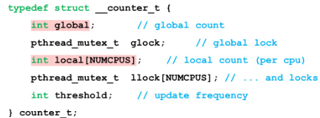

# 基于锁的并发数据结构

## 1.并发计数器

* 一个简单的计数器: （在调用函数操作该数据结构时获取锁，从调用返回时释放锁）可扩展性差,当线程数量变多时，性能下降明显
* 可扩展的计数器: 懒惰计数器（一个全局计数器和多个局部计数器（每个CPU核一个））
  * 一个全局锁，每个局部计数器一个锁
  * 局部计数器的值定期转移到全局计数器，取决于阈值S
    * S越大，可扩展性越强
    * S越小，全局计数器越精确
  * 为了保持全局计数器更新（以防某个线程要读取该值），局部值会定期转移给全局计数器，方法是获取全局锁，让全局计数器加上局部计数器的值，然后将局部计数器置零
  * 如果一个核心上的线程想增加计数器，那就增加它的局部计数器，访问这个局部计数器是通过对应的局部锁同步的。因为每个 CPU 有自己的局部计数器，不同 CPU 上的线程不会竞争，所以计数器的更新操作可扩展性好

## 2.并发链表

关注链表的插入，查找、删除等操作

让获取锁和释放锁只环绕插入代码的真正临界区。前面的方法有效是因为部分工作实际上不需要锁，假定 malloc()是线程安全的，每个线程都可以调用它，不需要担心竞争条件和其他并发缺陷

## 3.并发队列

* 队列的头部有一把锁（保护入队列操作）
* 队列的尾部有一把锁（保护出队列操作）
* 添加了一个假节点，在队列初始化代码里分配，该节点分开了头和尾操作
* 入队列只访问 tail 锁，而出队列只访问 head 锁

## 4.并发散列表（哈希表）

并发散列表中每一个bucket都是一个链表，相关的操作当作并发链表进行

其中每个散列桶都有一个锁