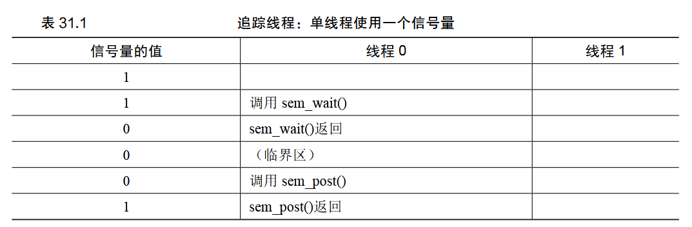
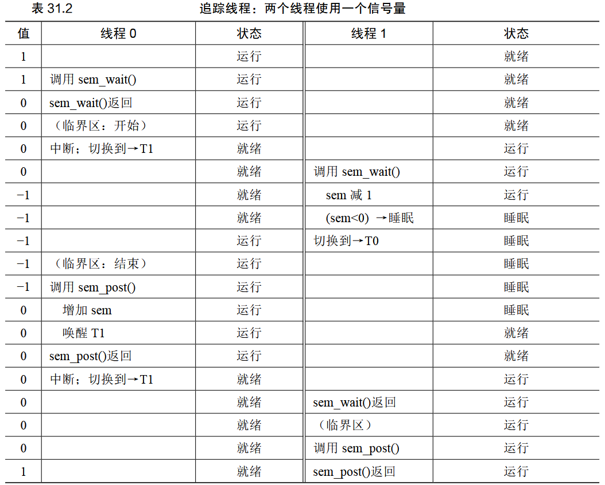
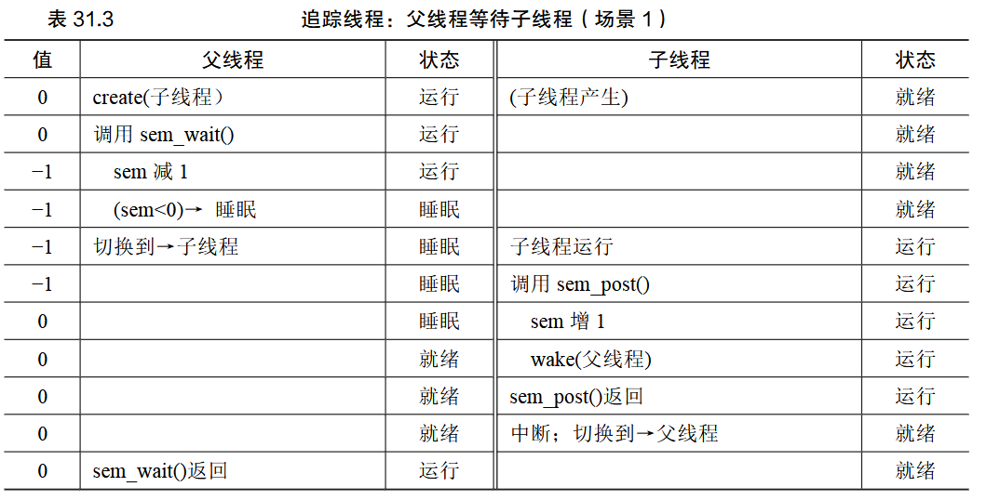
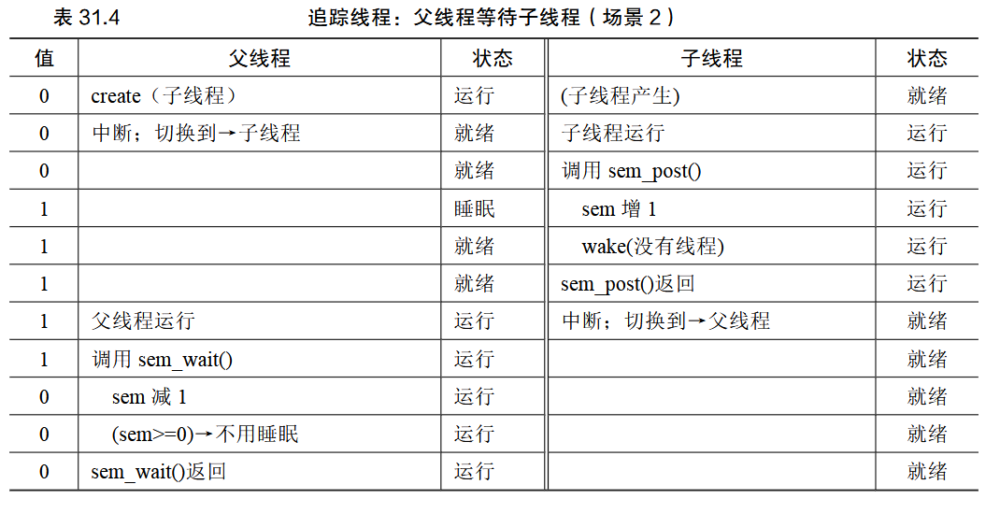

# 信号量

## 1.定义

* 信号量是一个整数值的对象
* 可以替代锁/条件变量
* 在并发过程中可以灵活控制资源使用情况
* 进程三个状态之间的转换就是靠 PV 操作来控制的。PV 操作主要就是 P 操作、V 操作和信号量

```c
sem_init(&s,0,1)//初始化为 1，0 标识为线程共享
sem_wait()//P 操作，请求资源，信号量的值减 1，如果结果小于 0，则使调用的线程挂起直到被其他线程调用 sem_post()
sem_post()//V 操作，释放资源，信号量的值加 1，如果有其他线程等待被唤醒，则唤醒其中一个
```

* 一般来说，信号量 S＞0 时，S 表示可用资源的数量。执行一次 P 操作意味着请求分配一个单位资源，因此 S 的值减 1；
* 当 S < 0 时，表示已经没有可用资源，其绝对值表示等待使用该资源的进程个数，请求者必须等待别的进程释放该类资源，它才能运行下去。而执行一个 V 操作意味着释放一个单位资源，因此 S 的值加 1 
* 若 S＝0，表示有某些进程正在等待该资源，因此要唤醒一个等待状态的进程，使之运行下去
  

## 2.二值信号量（锁）

二值：只有持有和没持有

因为锁只有两个状态（持有和没持有），所以这种用法有时也叫作二值信号量（binary semaphore）

```c
sem t m;
sem init (&m,0,X);
sem wait（&m)
//critical section here
sem post (&m);
```

上面 x 的初始值应该为 1





## 3.信号量作为条件变量

```
sem t s;
void child(void *arg){
	printf("child\n");
	sem post (&s)//signal here:child is done
	return NULL;
}

int main(int argc,char *argv[]){
	sem init (&s,0,X);//what should x be?
	printf ("parent:begin\n");
	pthread t c;
	Pthread create(c,NULL,child,NULL)
	sem wait (&s);//wait here for child
	printf ("parent:end\n");
	return 0;
}
```

上面x的值应该为0





## 4.生产者/消费者问题

2个信号量，分别描述空/满的缓冲块数量，不能同时放或取


## 5.读/写者锁

* 一个线程写的时候，其他线程不能读或写
* 一个线程读的时候，其他线程可以读

例：链表操作

* insert():插入节点(写)
* lookup():查找节点(读)