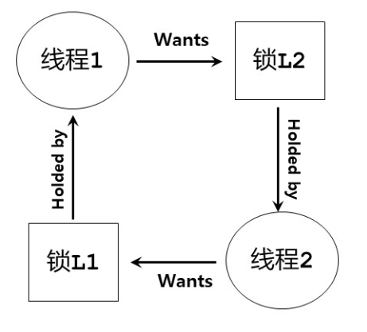

# 常见的并发问题

## 1.非死锁缺陷

### 1.1 违反原子性缺陷

访问临界区，未加锁，通过加锁解决

### 1.2 违反顺序缺陷

通过加条件变量保证执行顺序

## 2.死锁

* 概念：在一个进程集合中，每个进程都在等待另外的进程释放资源（资源也可以是锁），而这些释放事件又必须由这个进程集合中的进程运行来产生，就称该进程集合处于死锁状态
* 死锁的四个必要条件：
  * 互斥占用：存在必须互斥使用的资源
  * 持有并等待：存在占有资源而又等待其他资源的进程
  * 非抢占：进程占有的资源未释放时不可以被抢占
  * 循环等待：存在一个资源等待的依赖环
* 死锁的预防和避免：（破坏死锁的四个必要条件之一即可）
* 死锁的检查与恢复：允许死锁偶尔发生，出现问题后再行动（**重启**）
  * 定期运行死锁检测器
  * 检查资源图
  * 死锁时，重启系统

## 3.资源分配图

资源分配图G = (V, E):

* 顶点集V=P∪R
  * P为进程集合，P= {P1, P2, …, Pn}，圆圈表示
  * R为资源类集合，R= {R1, R2, …, Rn}，方框表示
  * 资源实例的数量则用方框内圆点表示
* 边集合E
  * 请求边(Pi, Ri)，表示进程Pi请求一个Ri资源
  * 分配边(Ri, Pi)，表示进程Pi占有一个Ri资源

资源分配图可以判断是否存在潜在死锁

警察人质问题：

图中有环就不一定就存在死锁：

如下图若P3释放后接下来再P2，P1，这样就不会存在死锁了：

