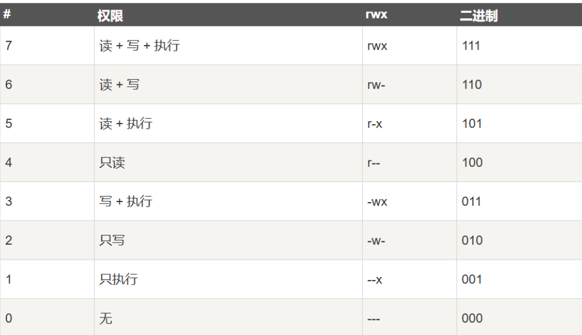

# 文件和目录

## 1.概念

目录可以看作一种特殊的文件，目录存在层次结构


## 2.文件目录结构

* 一级目录结构
* 二级目录结构
* 树形目录结构：
  * 任何一级目录中的FCB既可以描述次一级的子目录，又可以描述一个文件
  * 引入当前目录概念(‘.’)，提供相对于当前目录的相对路径名(“..”可以表示上一级目录)加速FCB查找
  * 绝对路径：从根目录开始
  * 相对路径：从当前目录开始
  
* 无环图目录结构：
  * 允许目录**共享**子目录和文件
  * 文件可以由多路径访问，便于共享
  * 如果让不同目录包含同一文件FCB的多副本，则一致性难保证，因此将FCB独立存放，引入<文件名/目录名，FCB号>的目录项
  * 引入共享计数器，删除文件时删除该用户的FCB,并使共享计数器减1，计数器为0时删除文件


## 3.文件目录操作

- 创建文件：touch filename
- 读写文件：cat filename
- 查看文件状态：stat filename
- 删除文件：rm filename
- 创建目录 mkdir()
- 删除目录 rmdir()
- 打开/关闭目录 opendir()/closedir()
- 读目录项 readdir()
- 改名 rename()

## 4.文件保护

文件保护系统决定了一个由 主体 对 对象 的特定 访问行为 是否可以执行

访问控制：ACL和Capability

用getfacl查看ACL，用chmod修改权限（rwx）




## 5.链接

### 5.1 硬链接

link 只是在要创建链接的目录中创建了另一个名称，并将其指向原有文件的相同 inode号（即低级别名称）。该文件不以任何方式复制。相反，现在就有了两个人类可读的名称（file 和 file2），都指向同一个文件

调用 unlink()时，会删除人类可读的名称（正在删除的文件）与给定inode 号之间的“链接”，并减少引用计数。只有当引用计数达到零时，文件系统才会释放inode 和相关数据块，从而真正“删除”该文件

### 5.2 符号链接

符号链接（symbolic link），有时称为软链接（softlink）

硬链接有点局限：你不能创建目录的硬链接（因为担心会在目录树中创建一个环）。你不能硬链接到其他磁盘分区中的文件（因为 inode 号在特定文件系统中是唯一的，而不是跨文件系统），等等

符号链接使用相同的程序 ln，但使用-s 标志

与硬链接的区别：

* 符号链接本身实际上是一个不同类型的文件

  ```shell
  prompt> stat file
  ... regular file ...
  prompt> stat file2
  ... symbolic link ...
  ```

  文件最左列中的第一个字符是“-”，目录是“d”，软链接是“l”

  ```
  prompt> ls -al
  drwxr-x--- 2 remzi remzi 29 May 3 19:10 ./
  drwxr-x--- 27 remzi remzi 4096 May 3 15:14 ../
  -rw-r----- 1 remzi remzi 6 May 3 19:10 file
  lrwxrwxrwx 1 remzi remzi 4 May 3 19:10 file2 -> file
  ```

* 形成符号链接的方式，即将链接指向文件的路径名作为链接文件的数据。因为我们链接到一个名为 file 的文件，所以我们的链接文件 file2 很小（4个字节）。如果链接到更长的路径名，链接文件会更大

* 悬空引用（dangling reference），删除名为 file 的原始文件会导致符号链接指向不再存在的路径名

