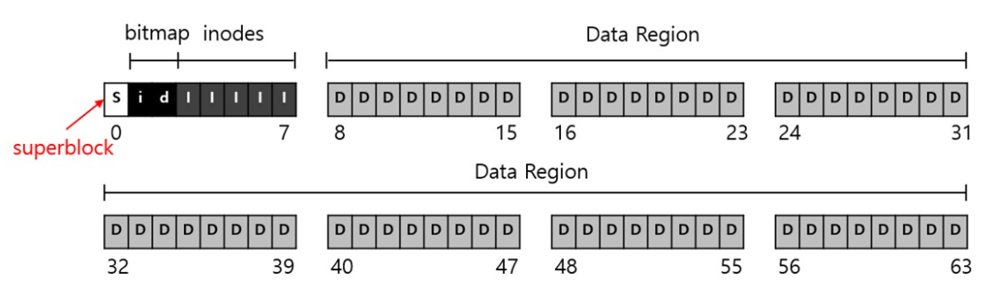
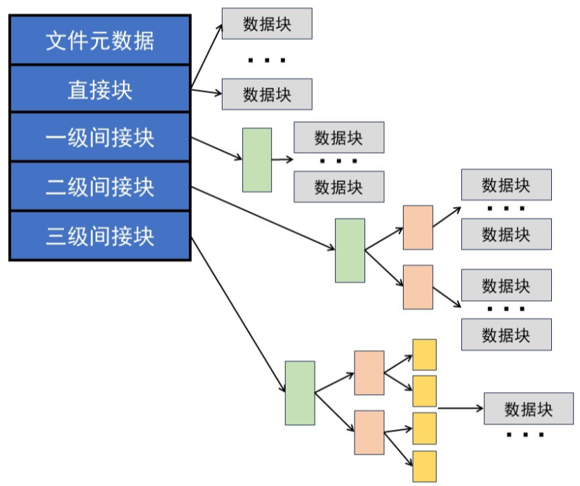
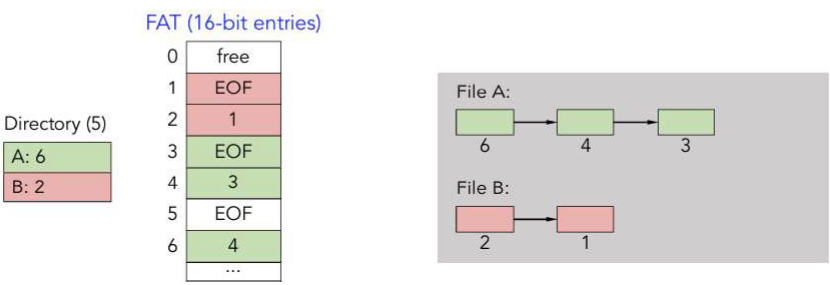
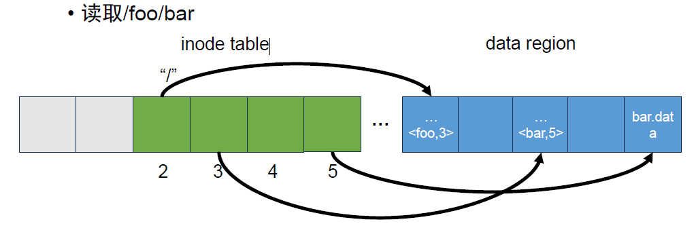

# 文件系统的实现

## 1.整体组织

* 将磁盘分成块（block）

* 分配**数据区域**（data region）存储用户数据

* 分配**inode表**（index node table）存储inode信息。（unix）利用inode存储元数据

  * 创建者
  * 文件物理位置信息：如链表或索引表
  * 创建、修改时间、保存时间
  * 口令：用于对文件访问进行验证
  * 访问权限：如读、写、执行等

* 利用分配结构（allocation structrue）记录inode和数据块是空闲还是已分配

  利用**位图**（bitmap）记录分配情况：每个bit以0（空闲），1（使用）来记录使用情况

* 利用**超级块**（superblock）记录文件系统信息：如文件系统类型，文件系统有多少inode和数据块

## 2.文件组织和目录组织

文件组织：inode（index node）

### 2.1 连续分配

- inode记录base addr和len
- 优点：实现简单，访问高效
- 缺点：文件难以动态增长；外部碎片

### 2.2 链接分配：

* inode指向文件第一块的指针
* 优点：可以动态增长，顺序访问块，减少碎片化
* 缺点：由于链表在磁盘上，访问开销大，随机访问非常耗时，指针额外占用空间，影响对齐

解决方案：FAT（file allocation table），将链接放在一个固定的表中，而不是放在每块中

### 2.3 索引分配（单级索引）

* inode记录块地址
* 优点：访问快，减少碎片化
* 缺点：索引表需要大块的连续空间

## 3.访问路径：读取和写入

## 4.性能优化

磁盘vs内存：

- 磁盘是非易失的存储
- 磁盘的访问(ms)比内存访问(ns)慢很多
- 磁盘的空间比内存大很多

性能优化：

file buffer cache

* 原理：利用程序访问文件的局部性原理
* 思路：将文件块缓存在内存中
* 实现：现代操作系统将虚拟内存缓存和文件系统缓存集成到统一页面缓存(unified page cache)中

写缓冲：

write buffering

* 原理：利用缓冲，分批次写入
* 思路：将一些更新编成一个批，然后一次性写入
* 实现：
  * 维护一个需要更新的块的队列
  * 确定一个固定的时间间隔(e.g,30s)，将队列刷新(fush)到磁盘
    * 如果30s内有频繁的更新，只需要一次I/O
    * 如果30s之内更新被取消了，则不需要I/O了(lazy也是一种重要思想)
* 可靠性无法得到保障，但是很实用，当出现crash,近30s的数据修改都会丢失，当前OS均把写缓冲作为默认选项，不然会使I/O非常慢，可以用系统调用(fsync)强制写回磁盘

预读：

read ahead

* 原理：使IO和计算重叠
* 思路：文件系统预测下一个要读的块，并提前放入cache 