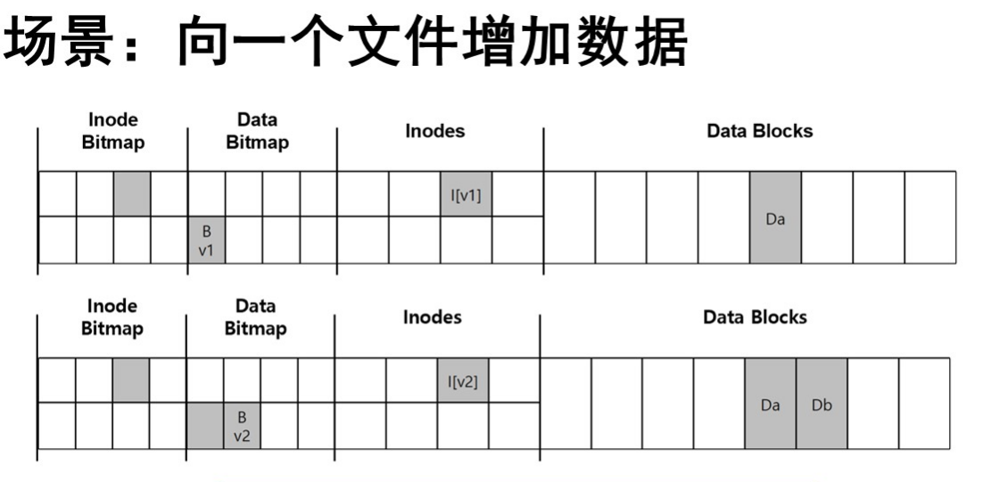
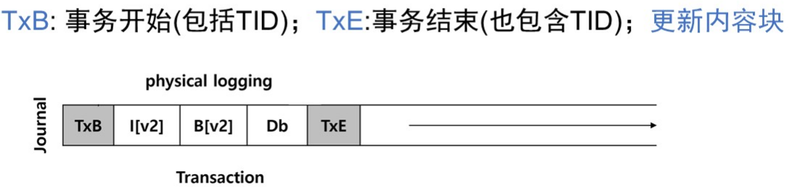
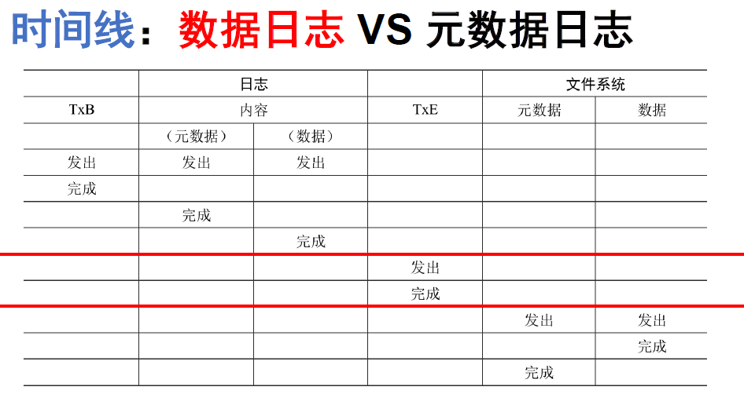
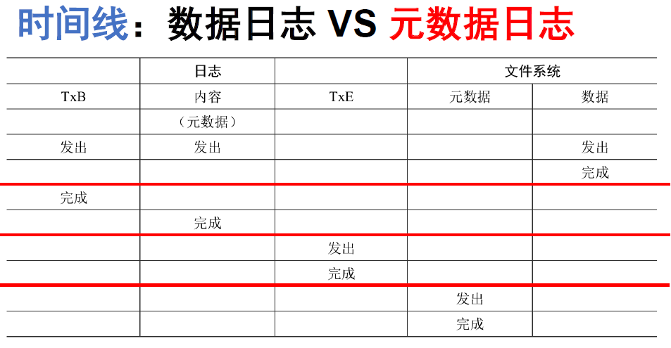

# 崩溃一致性

## 1.案例场景

发生故障：只有下列一个块写入了磁盘：

* 数据块(Db)：写入好像并未发生（从一致性角度危害性不大）
* inode(l [v2])：从磁盘读取垃圾数据（旧的数据）
* 位图(B [2])：空间泄露(space leak)

有两个块写入了磁盘，剩下的一个丢失：

* inode 和位图：元数据一致，但存储的是垃圾数据
* inode 和数据块：inode 和位图存在不一致，之后的写入需要解决
* 位图和数据块：inode 和位图存在不一致，不知道块属于哪个文件

背景：数据存储在磁盘上，磁盘的 IO 操作不是原子的

原因：I/O 过程中可能出现崩溃

可能后果：

* 数据丢失
* 部分数据写入，导致各数据块不一致
* 文件元数据不一致

## 2.解决方案 1：FSCK

file system check 是文件系统检查程序，一款 unix 工具，用来检查不一致性并且进行修复

目标是一致性问题，无法检查垃圾数据的问题

最大的问题：性能太差：

* 总是需要扫描整个磁盘（几分钟甚至几小时）
* 可以用作磁盘的定期性检查

## 3.解决方案 2：预写日志

核心思路：在真正更新磁盘之前，先在一个地方写下一点注记（日志），描述将要做的事情

数据日志格式

增加 Checkpoint: 当这个事务被存在磁盘上后，则会将具体更新的内容块写到磁盘上

* 如果崩溃发生在事务没有被完整的写入日志前？：简单的跳过这一次更新
* 如果崩溃发生在检查点之前？重启系统后，扫描已经提交(commit)到磁盘的事务按照顺序重放(replay)这些事务

磁盘上存储日志的空间是有限的：

* 重复使用这些空间：循环日志(circular log
* 在日志超级块中记录最旧和最新的事务
* 增加释放的过程：当日志被加检查点后

## 4.解决方案 3：元数据日志

数据预写日志基本需要使写入流量翻倍，故在日志中只记录元数据，而数据在元数据日志写到磁盘前写入磁盘，减少一次数据的写入

即先将数据写入磁盘，写完后再将元数据写入日志

* 数据写入：将数据写到磁盘最终位置
* 日志元数据写入：将元数据写入日志
* 日志提交：将 TxE 写入日志，等待完成
* 加检查点元数据：将日志内容写到磁盘
* 释放：将 superblock 对应的部分释放

## 5.日志结构文件系统LFS

写入策略：

* 按顺序写入磁盘：简单的按顺序写入磁盘并不足以保证高效，磁盘是会旋转的->在两次顺序写入之间磁盘可能已经旋转了
* 顺序而高效的写入：利用写缓冲(write buffering)：按段(segment)写入
* 查找inode：
  * inode的位置分散在整个磁盘，并且不断移动
  * 解决方案：利用inode映射
    * imap存储最新的inode的地址(通过inode号)
    * imap本身也要持久化存储：存储在新信息之后
* 查找imap：
  * FS必须有一块固定且已知的区域，才能开始文件查找
  * 检查点区域: checkpoint region(CR)

垃圾回收：

* 磁盘上存在大量的旧版本的文件数据(垃圾)
* 旧版本的块如何处理？
  * 版本控制：用户有机会恢复旧的文件
  * LFS定期清理这些垃圾
    * LFS定期读入许多旧的段
    * 确定哪些块是活的，然后写出一组新段（只包含这些活块）
    * 将新的段写入磁盘的新位置，释放旧的段
* 何时进行清理：周期性的/当系统空闲时/当磁盘满时
* 清理哪些块
  * 热段：经常覆盖内容
  * 冷段：内容相对稳定
  * 一种简单的思路：尽快清理冷段，延迟清理热段
