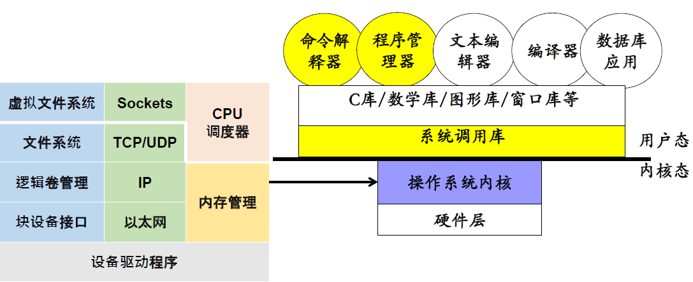
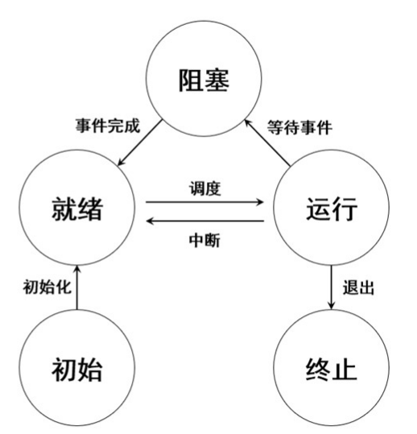

# 进程process


## 1.OS重要思想



资源共享：

* 时分共享：每次由一个实体使用一小段时间
* 空分共享：每个实体同时使用一小部分资源

典型应用：进程共享CPU


## 2.基本概念

进程基本概念：

* **进程是操作系统对运行程序的抽象**
* 操作系统每次选择一个进程在CPU上运行一段时间，利用时分共享的思想对CPU进行虚拟化

多进程的引入：

* 提升系统资源利用率，减少延迟，为多任务处理和调度创造条件
* 提升系统可靠性（避免单个进程出错影响系统）
* 简化编程模型


## 3.进程基础

创建过程：

* 代码和静态数据加载到进程的内存空间
* 为堆栈分配内存
* 操作系统执行一些其他初始化任务
* 运行程序，将CPU控制权转移到新创建的进程，进程以PID唯一标识

状态：

* 初始态：进程创建状态
* 运行态：正在运行
* 就绪态：可以运行，还未被调度
* 阻塞态：如进程发出IO操作请求
* 终止态：结束运行



控制进程运行的数据结构：进程控制块（PCB）

* 进程标识信息（如pid等）
* 执行现场信息（CPU现场）
* 进程映像信息（地址空间）
* 进程资源信息
* 其他信息


## 4.进程的API

`fork()`创建进程

* 在一个父进程中创建子进程（PID不同）
* 子进程得到父进程的资源拷贝，指令也一样，子进程获得父进程数据空间、堆和栈的复制，所以变量的地址（当然是虚拟地址）也是一样的
* 父子进程有独立的地址空间
* **fork函数在父进程、子进程中都返回（一次调用两次返回）父子进程返回值不同，父进程返回值是子进程PID,子进程返回值是0**
* 父子进程的运行顺序/时间有差异，导致**不确定性**

`wait()`用于等待任一子进程结束

* 返回值：成功，返回子进程pid，若有错误返回-1

  ```c
  int wc = wait(NULL);
  ```

`exec()`将当前进程映像替换成新的程序文件并执行

* exec的成功调用不会返回
* exec从可执行程序中加载代码和静态数据，覆盖自己的代码和静态数据，堆栈也会被重新初始化
* 子进程调用exec，从而执行和父进程不同的程序