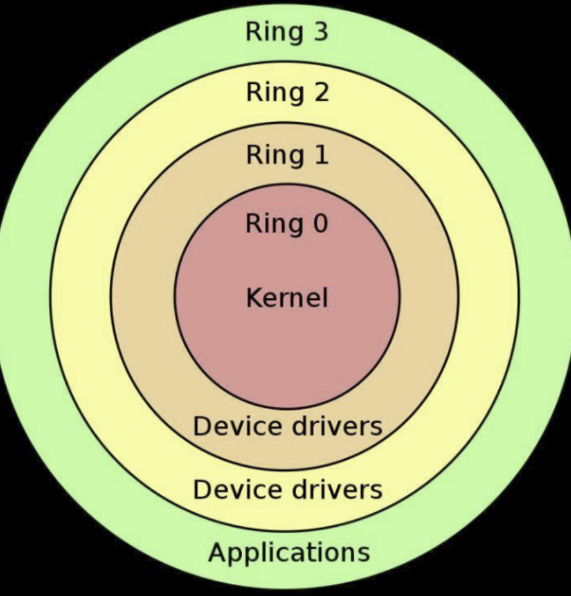
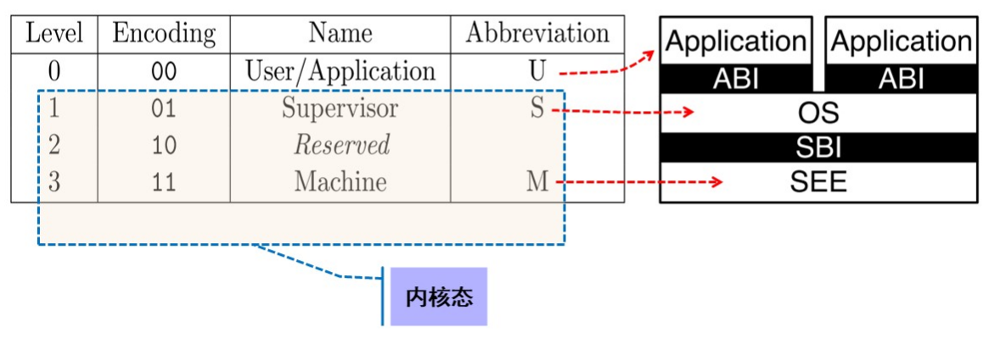
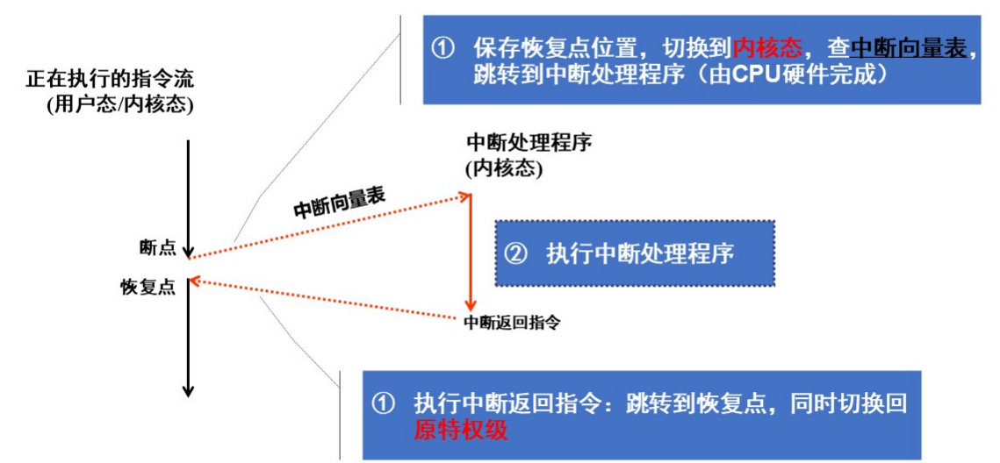
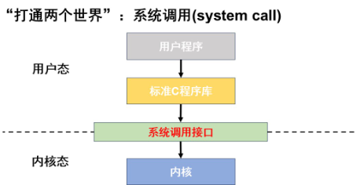
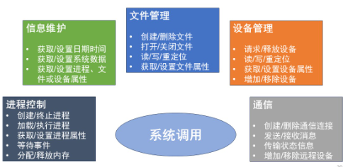
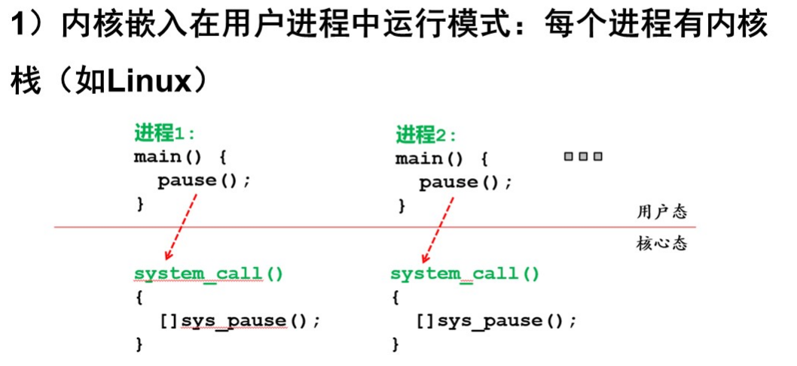
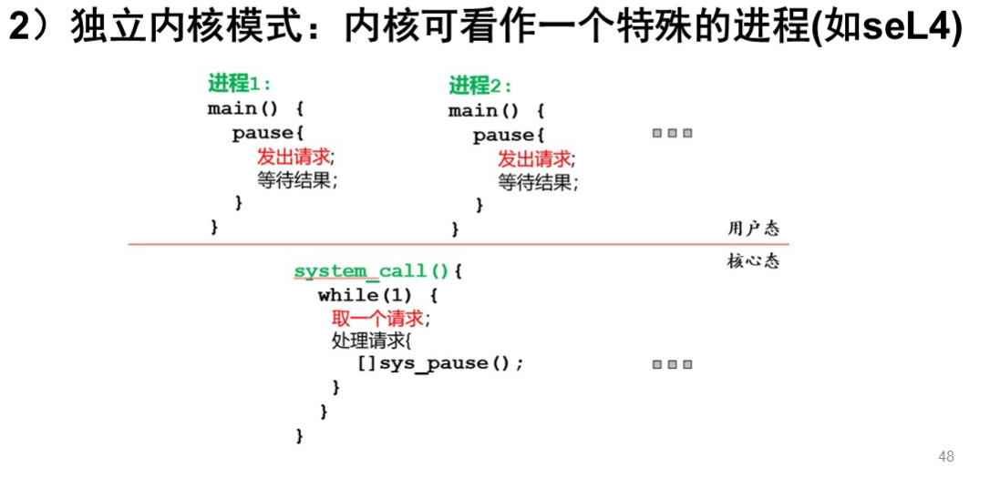
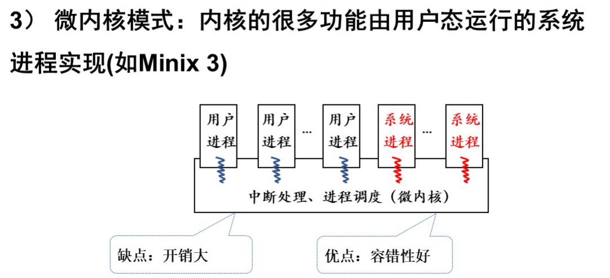

# 受限直接执行

## 1.基本概念

受保护的控制权转移：

- 用户模式(用户态):应用程序不能访问所有硬件资源
- 内核模式(内核态):0S可以访问机器的所有资源
- 

RISC-V特权级：

- ABI:程序二进制接口
- SB1:内核与硬件接口
- SEE:安全执行环境

## 2.中断和异常

* 中断和异常是事件，当OS启动后，所有对内核的访问都是由于事件导致的，事件发生后，转换为内核态，并且调用处理程序（控制程序保存程序状态、执行内核功能、恢复程序状态，继续执行）
* 中断
  * 是异步的（与CPU当前指令无关），一般可以屏蔽
  * 所有中断来的信号都是记录在中断寄存器中的，CPU在执行完一道指令之后，如果enable interrupt，就会检查中断寄存器中有没有中断，如果有中断，就会选择一个中断优先级比较高的中断先处理，等到处理完中断再继续执行；如果是disable interrupt，就不会检查是否有中断，而是直接执行下一条指令
  * 常见的中断：IO中断，时钟中断
* 异常
  * 是同步的，不可屏蔽
  * 异常发生的时候，CPU立即处理本次异常，直到异常处理结束之后才能继续进行接下来的任务。例如在进行程序调试的时候，添加一个断点，就必须在断点出发生异常，CPU立即处理，先暂停其工作，否则就无法查看断点处的程序运行信息。
  * 常见的异常：除0错，算数溢出

中断向量表:一片存放中断处理程序入口地址的内存单元，中断向量在内存中连续存放，起始地址一般记录在某特定寄存器，硬件按中断号的不同通过中断向量表跳转到相应处理程序中

## 3.系统调用

系统调用的实现：使用陷阱（trap）指令 （会产生一种异常）

xv6陷阱指令：ecall，对应的异常号8（u-mode）或9（s-mode），a7寄存器传递系统调用号

系统调用跟踪工具：strace

## 4.操作系统运行模式

进入内核只有态的切换没有进程的切换

优点：便于保证内核的正确性

缺点：内核的并发运行困难

