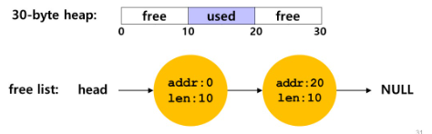
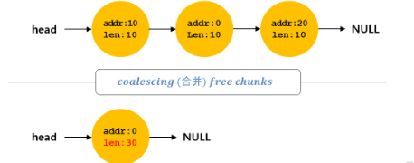
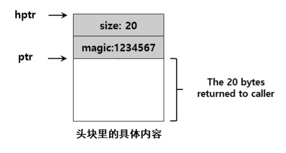
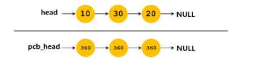
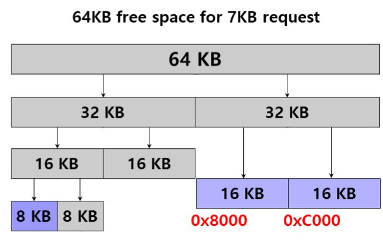

# 分段、空闲空间管理

## 1.分段地址转换

* 段是虚拟地址空间中的一个连续的片段(代码段，栈段，堆段)，对于每个段来说，都有它的基址和界限
* 物理地址 = 段基址 + 段内偏移
* 非法内存访问，超出了界限，就会报段错误（segmentation fault），陷入内核态
* 段的标识：
  * 显示：用虚拟地址的高位表示
  * 隐式：不放在CPU地址中，放在段寄存器，寄存器预留一位记录增长方向
* 段的共享与保护：为了节省内存，例如代码共享。需要硬件提供支持，段的保护位
* OS需要处理的事项：
  * 上下文切换时，所有的段寄存器都要保护和恢复
  * 需要应对碎片化问题
  * 紧致化处理：停止进程运行，拷贝数据，修改段寄存器的值


## 2.空闲空间管理

### 2.1 底层机制

分隔与合并：





使用free(void *ptr)释放已申请的内存空间时，会发现该接口没有块大小的参数。因此它假定对于给定的指针，内存分配库可以很快确定要释放空间的大小，从而将它放回空闲列表。要完成这个任务，大多数分配程序都会在头块（存在于返回的内存块之前）中保存一些额外的信息。在下面这个例子中，我们调用int *ptr = malloc(20)申请20字节的空间，并将结果保存在ptr中



```c
void free(void *ptr) { 
 header_t *hptr = (void *)ptr - sizeof(header_t); 
}
```

```c
空闲块列表节点
typedef struct _node_t {
    int size;
    struct_node_t *next;
} node_t;

申请内存的节点
typedef struct header_t {
    int size;
    int magic; //用来检查完整性
} header_t;
```

### 2.2 空闲内存分配策略

评价指标：速度快，碎片少，分配成功率高

* 最优匹配：首先遍历整个空闲列表，找到和请求大小一样或更大的空闲块，然后返回这组候选者中最小的一块。最优匹配选择最接近用户请求大小的块，从而尽量避免空间浪费。然而，简单的实现在遍历查找正确的空闲块时，要付出较高的性能代价
* 最差匹配：与最优匹配相反，它尝试找最大的空闲块，分割并满足用户需求后，将剩余的块（很大）加入空闲列表。最差匹配同样需要遍历整个空闲列表，更糟糕的是，大多数研究表明它的表现非常差，会导致过量的碎片，同时还有很高的开销。
* 首次匹配：找到第一个足够大的块，将请求的空间返回给用户。首次匹配有速度优势，但有时会让空闲列表开头的部分有很多小块
* 下次匹配：不同于首次匹配每次都从列表的开始查找，下次匹配算法多维护一个指针，指向上一次查找结束的位置。其想法是将对空闲空间的查找操作扩散到整个列表中去，避免对列表开头频繁的分割。这种策略的性能与首次匹配很接近，同样避免了遍历查找

改进策略：

* 分离空闲列表：如果某个应用程序经常申请一种（或几种）大小的内存空间，那就用一个独立的列表，只管理这样大小的对象。其他大小的请求都交给更通用的内存分配程序。这种方法的好处显而易见。通过拿出一部分内存专门满足某种大小的请求，碎片就不再是问题了。而且，由于没有复杂的列表查找过程，这种特定大小的内存分配和释放都很快

  

* 伙伴系统：空闲空间首先从概念上被看成大小为2^N的大空间。当有一个内存分配请求时，空闲空间被递归地一分为二，直到刚好可以满足请求的大小。这种分配策略只允许分配2的整数次幂大小的空闲块，因此会有内部碎片的麻烦。伙伴系统的漂亮之处在于块被释放时。如果将这个8KB的块归还给空闲列表，分配程序会检查“伙伴”8KB是否空闲。如果是，就合二为一，变成16KB的块。然后会检查这个16KB块的伙伴是否空闲，如果是，就合并这两块。这个递归合并过程继续上溯，直到合并整个内存区域，或者某一个块的伙伴还没有被释放。伙伴系统运转良好的原因，在于很容易确定某个块的伙伴。每对互为伙伴的块只有一位不同，这一位就决定了它们在整个伙伴树中的层次（**合并简单**）。

  
