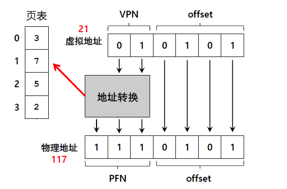

# 分页、TLB

## 1.分页地址转换

### 1.1 基本原理

* 分页(paging)是将地址空间划分成固定大小的分片单元，称为页/页面(page)
* 相对应的，物理内存同样也要分为相同大小的单元，叫做页帧(page frame)
* 通过页表（page table）来完成虚拟地址到物理地址的映射

虚拟地址位数n，2^n^ = 虚拟地址空间（字节）:

* 虚拟页号（VPN）：virtual page number
* 页内偏移（Offset）：offset within the page

虚拟地址‘21’的转换过程：



### 1.2 页表存放位置

存在的问题：页表存在内存当中，而页表可能很大

例如：32位地址空间(4GB)，带有4KB的页：20位的VPN，12位的offset
     单个页表大小： 4𝑀𝐵 = 2^20^ 𝑒𝑛𝑡𝑟𝑖𝑒𝑠 ∗ 4 𝐵𝑦𝑡𝑒𝑠

寻找到页表的位置：页表基址寄存器（PTBR）

### 1.3 页表内容

页表就是一种数据结构：

* 最简单的形式：线性页表，就是一个数组
* OS通过虚拟页号(VPN)检索数组，并在该索引处查找页表项(PTE)，进一步找到物理页帧号(PFN)
* 一些记录位：
  * 有效位(Valid Bit): 表明特定地址转换是否有效
  * 保护位(Protection Bit): 表明页的权限(读，写，执行)
  * 存在位(Present Bit): 表明该页是在内存里还是磁盘上
  * 脏位(Dirty Bit): 表明页面进入内存后是否修改过
  * 参考位/访问位(Reference Bit): 表明追踪页是否被访问

### 1.4 访问示例

```c
VPN = （VirtualAddress & VPN_MASK）>> SHIFT
PTEAddr = PTBR + (VPN * sizeof(PTE))
PTE = AccessMemory(PTEAddr)
    
offset = VirtualAddress & OFFSET_MASK
PhysAddr = (PTE.PFN << SHIFT) | offset
Register = AccessMemory(PhysAddr)
```


## 2.分页中的快速地址转换TLB

地址转换旁路缓冲存储器(translation lookaside buffer)：

* 是一种硬件，是芯片上MMU（Memory Management Unit）的一部分
* 核心思想是缓存频繁发生的地址转换

### 2.1 TLB未命中的处理

* CISC上,硬件全权处理：
  * 硬件知道页表在内存中的具体位置
  * 硬件遍历页表，找到页表项
  * 取出转换映射，更新TLB，然后重试指令
* RISC上，软件处理：
  * 出现TLB miss，硬件抛出异常
  * 暂停指令，提升特权级
  * 跳转到陷阱处理程序

### 2.2 TLB的内容

* TLB是全相联的
* 典型的TLB可能有32，64或128项
* 硬件并行搜索整个TLB
* other bits：有效位，保护位，地址空间标识符（ASID），脏位

### 2.3 TLB的替换策略

替换最少使用（LRU，least recently used）
